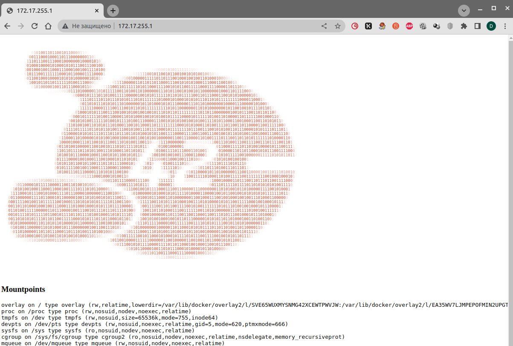

# **Лекция №2: Знакомство с Kubernetes, основные понятия и архитектура // ДЗ**
> _kubernetes-intro_

  
Знакомство с Kubernetes

## **Задание:**
Знакомство с решениями для запуска локального Kubernetes кластера, создание первого pod

Цель:
В данном дз студенты научатся формировать локальное окружение, запустят локальную версию kubernetes при помощи minikube, научатся использовать CLI утилиту kubectl для управления kubernetes.

Описание/Пошаговая инструкция выполнения домашнего задания:
Все действия описаны в методическом указании.

Критерии оценки:
0 б. - задание не выполнено
1 б. - задание выполнено
2 б. - выполнены все дополнительные задания

---

## **Выполнено:**
1. Настройка локального окружения. Запуск первого контейнера. Работа с kubectl

- Установка в macOS
> [https://kubernetes.io/ru/docs/tasks/tools/install-kubectl/](https://kubernetes.io/ru/docs/tasks/tools/install-kubectl/)
~~~bash
curl -LO "https://storage.googleapis.com/kubernetes-release/release/$(curl -s https://storage.googleapis.com/kubernetes-release/release/stable.txt)/bin/darwin/amd64/kubectl"
chmod +x ./kubectl
sudo mv ./kubectl /usr/local/bin/kubectl
kubectl version --client

WARNING: This version information is deprecated and will be replaced with the output from kubectl version --short.  Use --output=yaml|json to get the full version.
Client Version: version.Info{Major:"1", Minor:"24", GitVersion:"v1.24.2", GitCommit:"f66044f4361b9f1f96f0053dd46cb7dce5e990a8", GitTreeState:"clean", BuildDate:"2022-06-15T14:22:29Z", GoVersion:"go1.18.3", Compiler:"gc", Platform:"darwin/amd64"}
Kustomize Version: v4.5.4

#Настройка автозаполнения для kubectl
source <(kubectl completion zsh)  # настройка автодополнения в текущую сессию zsh
echo "[[ $commands[kubectl] ]] && source <(kubectl completion zsh)" >> ~/.zshrc # add autocomplete permanently to your zsh shell
~~~

- Установка Minikube

> [https://minikube.sigs.k8s.io/docs/start/](https://minikube.sigs.k8s.io/docs/start/)

~~~bash
curl -LO https://storage.googleapis.com/minikube/releases/latest/minikube-darwin-amd64
sudo install minikube-darwin-amd64 /usr/local/bin/minikube
#Start your cluster
minikube start

➜  ~ kubectl cluster-info
Kubernetes control plane is running at https://127.0.0.1:49819
CoreDNS is running at https://127.0.0.1:49819/api/v1/namespaces/kube-system/services/kube-dns:dns/proxy

To further debug and diagnose cluster problems, use 'kubectl cluster-info dump'.
~~~

- Установка k9s
~~~bash
 # Via Homebrew
 brew install derailed/k9s/k9s
~~~

При установке кластера с использованием Minikube будет создана виртуальная машина в которой будут работать все системные компоненты
кластера Kubernetes. Можем убедиться в этом, зайдем на ВМ по SSH и посмотрим запущенные Docker контейнеры:
~~~bash
➜  Deron-D_platform git:(kubernetes-prepare) minikube ssh
                         _             _
            _         _ ( )           ( )
  ___ ___  (_)  ___  (_)| |/')  _   _ | |_      __
/' _ ` _ `\| |/' _ `\| || , <  ( ) ( )| '_`\  /'__`\
| ( ) ( ) || || ( ) || || |\`\ | (_) || |_) )(  ___/
(_) (_) (_)(_)(_) (_)(_)(_) (_)`\___/'(_,__/'`\____)

$ docker ps
CONTAINER ID   IMAGE                  COMMAND                  CREATED         STATUS         PORTS     NAMES
4367e7733391   6e38f40d628d           "/storage-provisioner"   2 minutes ago   Up 2 minutes             k8s_storage-provisioner_storage-provisioner_kube-system_23828c8f-5a23-4822-b6e1-35cd6dc6c441_5
2994e51037da   a4ca41631cc7           "/coredns -conf /etc…"   3 minutes ago   Up 3 minutes             k8s_coredns_coredns-6d4b75cb6d-thwlk_kube-system_3de7b505-5edc-4589-92e0-ae3ad0312aa1_1
6515a97abfbe   k8s.gcr.io/pause:3.6   "/pause"                 3 minutes ago   Up 3 minutes             k8s_POD_storage-provisioner_kube-system_23828c8f-5a23-4822-b6e1-35cd6dc6c441_1
9e1db89d5a8d   beb86f5d8e6c           "/usr/local/bin/kube…"   3 minutes ago   Up 3 minutes             k8s_kube-proxy_kube-proxy-vfrll_kube-system_bf91d977-9730-4da6-9dd3-d73b79853df7_1
235089a738b2   k8s.gcr.io/pause:3.6   "/pause"                 3 minutes ago   Up 3 minutes             k8s_POD_coredns-6d4b75cb6d-thwlk_kube-system_3de7b505-5edc-4589-92e0-ae3ad0312aa1_1
9805d05f9c51   k8s.gcr.io/pause:3.6   "/pause"                 3 minutes ago   Up 3 minutes             k8s_POD_kube-proxy-vfrll_kube-system_bf91d977-9730-4da6-9dd3-d73b79853df7_1
32073e618efa   18688a72645c           "kube-scheduler --au…"   3 minutes ago   Up 3 minutes             k8s_kube-scheduler_kube-scheduler-minikube_kube-system_bab0508344d11c6fdb45b1f91c440ff5_1
76120dd3e8cb   aebe758cef4c           "etcd --advertise-cl…"   3 minutes ago   Up 3 minutes             k8s_etcd_etcd-minikube_kube-system_8d8cf2f9b1560093847362b0de0732b1_1
09e004bac218   b4ea7e648530           "kube-controller-man…"   3 minutes ago   Up 3 minutes             k8s_kube-controller-manager_kube-controller-manager-minikube_kube-system_852f03e6fe9ac86ddd174fb038c47d74_1
5060e14e576d   e9f4b425f919           "kube-apiserver --ad…"   3 minutes ago   Up 3 minutes             k8s_kube-apiserver_kube-apiserver-minikube_kube-system_580b07225e2af5ec59c4baba2ce979ad_1
70de051d10fc   k8s.gcr.io/pause:3.6   "/pause"                 3 minutes ago   Up 3 minutes             k8s_POD_etcd-minikube_kube-system_8d8cf2f9b1560093847362b0de0732b1_1
a31befb2ca73   k8s.gcr.io/pause:3.6   "/pause"                 3 minutes ago   Up 3 minutes             k8s_POD_kube-apiserver-minikube_kube-system_580b07225e2af5ec59c4baba2ce979ad_1
4a4606d8c42c   k8s.gcr.io/pause:3.6   "/pause"                 3 minutes ago   Up 3 minutes             k8s_POD_kube-scheduler-minikube_kube-system_bab0508344d11c6fdb45b1f91c440ff5_1
d248cd4c3fce   k8s.gcr.io/pause:3.6   "/pause"                 3 minutes ago   Up 3 minutes             k8s_POD_kube-controller-manager-minikube_kube-system_852f03e6fe9ac86ddd174fb038c47d74_1

~~~

Проверим, что Kubernetes обладает некоторой устойчивостью к отказам, удалим все контейнеры:
~~~bash
$ docker rm -f $(docker ps -a -q)
4367e7733391
d8724203c11b
2994e51037da
6515a97abfbe
9e1db89d5a8d
235089a738b2
9805d05f9c51
32073e618efa
76120dd3e8cb
09e004bac218
5060e14e576d
70de051d10fc
a31befb2ca73
4a4606d8c42c
d248cd4c3fce
5c45c6bf6ee7
98c5e5d8e4bc
468cbd9b71ff
c8dacc1a6050
9d35080f5aba
1f26520e3672
a9cfb20bf985
a9b93506987d
aaa8fcbd744a
5eabe1443a2c
f11bf2cbed0c
f354c43f910f
$ docker ps
CONTAINER ID   IMAGE                  COMMAND                  CREATED          STATUS          PORTS     NAMES
63d2bb3d80f4   6e38f40d628d           "/storage-provisioner"   9 seconds ago    Up 8 seconds              k8s_storage-provisioner_storage-provisioner_kube-system_23828c8f-5a23-4822-b6e1-35cd6dc6c441_6
18df4ef00fdc   a4ca41631cc7           "/coredns -conf /etc…"   10 seconds ago   Up 9 seconds              k8s_coredns_coredns-6d4b75cb6d-thwlk_kube-system_3de7b505-5edc-4589-92e0-ae3ad0312aa1_2
3fcfbf889141   18688a72645c           "kube-scheduler --au…"   10 seconds ago   Up 9 seconds              k8s_kube-scheduler_kube-scheduler-minikube_kube-system_bab0508344d11c6fdb45b1f91c440ff5_2
281d6ca541f5   aebe758cef4c           "etcd --advertise-cl…"   11 seconds ago   Up 9 seconds              k8s_etcd_etcd-minikube_kube-system_8d8cf2f9b1560093847362b0de0732b1_2
4ef73095c330   beb86f5d8e6c           "/usr/local/bin/kube…"   11 seconds ago   Up 9 seconds              k8s_kube-proxy_kube-proxy-vfrll_kube-system_bf91d977-9730-4da6-9dd3-d73b79853df7_2
3928ab5bebe9   b4ea7e648530           "kube-controller-man…"   11 seconds ago   Up 9 seconds              k8s_kube-controller-manager_kube-controller-manager-minikube_kube-system_852f03e6fe9ac86ddd174fb038c47d74_2
68791bce9710   e9f4b425f919           "kube-apiserver --ad…"   11 seconds ago   Up 10 seconds             k8s_kube-apiserver_kube-apiserver-minikube_kube-system_580b07225e2af5ec59c4baba2ce979ad_2
427e41162d31   k8s.gcr.io/pause:3.6   "/pause"                 12 seconds ago   Up 8 seconds              k8s_POD_storage-provisioner_kube-system_23828c8f-5a23-4822-b6e1-35cd6dc6c441_0
b55b541aefde   k8s.gcr.io/pause:3.6   "/pause"                 12 seconds ago   Up 10 seconds             k8s_POD_kube-controller-manager-minikube_kube-system_852f03e6fe9ac86ddd174fb038c47d74_0
36e639085225   k8s.gcr.io/pause:3.6   "/pause"                 12 seconds ago   Up 10 seconds             k8s_POD_kube-scheduler-minikube_kube-system_bab0508344d11c6fdb45b1f91c440ff5_0
11a402b3fcdd   k8s.gcr.io/pause:3.6   "/pause"                 12 seconds ago   Up 9 seconds              k8s_POD_coredns-6d4b75cb6d-thwlk_kube-system_3de7b505-5edc-4589-92e0-ae3ad0312aa1_0
9af30614c407   k8s.gcr.io/pause:3.6   "/pause"                 12 seconds ago   Up 10 seconds             k8s_POD_kube-apiserver-minikube_kube-system_580b07225e2af5ec59c4baba2ce979ad_0
406bc07241c3   k8s.gcr.io/pause:3.6   "/pause"                 12 seconds ago   Up 10 seconds             k8s_POD_kube-proxy-vfrll_kube-system_bf91d977-9730-4da6-9dd3-d73b79853df7_0
d7ef6a27f210   k8s.gcr.io/pause:3.6   "/pause"                 12 seconds ago   Up 10 seconds             k8s_POD_etcd-minikube_kube-system_8d8cf2f9b1560093847362b0de0732b1_0
$ exit
logout
~~~~

Эти же компоненты, но уже в виде pod можно увидеть в namespace kube-system
~~~bash
kubectl get pods -n kube-system
NAME                               READY   STATUS    RESTARTS   AGE
coredns-6d4b75cb6d-thwlk           1/1     Running   2          47h
etcd-minikube                      1/1     Running   2          47h
kube-apiserver-minikube            1/1     Running   2          47h
kube-controller-manager-minikube   1/1     Running   2          47h
kube-proxy-vfrll                   1/1     Running   2          47h
kube-scheduler-minikube            1/1     Running   2          47h
storage-provisioner                1/1     Running   6          47h
~~~

Можно устроить еще одну проверку на прочность и удалить все pod с системными компонентами (все поды из namespace kube-system):
~~~bash
kubectl delete pod --all -n kube-system
pod "coredns-6d4b75cb6d-thwlk" deleted
pod "etcd-minikube" deleted
pod "kube-apiserver-minikube" deleted
pod "kube-controller-manager-minikube" deleted
pod "kube-proxy-vfrll" deleted
pod "kube-scheduler-minikube" deleted
pod "storage-provisioner" deleted
~~~

Проверим, что кластер находится в рабочем состоянии
~~~bash
kubectl get cs
Warning: v1 ComponentStatus is deprecated in v1.19+
NAME                 STATUS    MESSAGE                         ERROR
scheduler            Healthy   ok
controller-manager   Healthy   ok
etcd-0               Healthy   {"health":"true","reason":""}
~~~

### Задание
Разберитесь почему все pod в namespace kube-system восстановились после удаления. Укажите причину в описании PR

~~~bash
kubectl get pods -n kube-system
NAME                               READY   STATUS    RESTARTS   AGE
coredns-6d4b75cb6d-ktz9x           1/1     Running   0          5m1s
etcd-minikube                      1/1     Running   2          5m1s
kube-apiserver-minikube            1/1     Running   2          5m1s
kube-controller-manager-minikube   1/1     Running   2          5m1s
kube-proxy-jzsjn                   1/1     Running   0          4m59s
kube-scheduler-minikube            1/1     Running   2          5m

kubectl describe pods coredns-6d4b75cb6d-ktz9x -n kube-system
Name:                 coredns-6d4b75cb6d-ktz9x
Namespace:            kube-system
Priority:             2000000000
Priority Class Name:  system-cluster-critical
Node:                 minikube/192.168.59.100
Start Time:           Tue, 12 Jul 2022 22:05:30 +0300
Labels:               k8s-app=kube-dns
                      pod-template-hash=6d4b75cb6d
Annotations:          <none>
Status:               Running
IP:                   172.17.0.3
IPs:
  IP:           172.17.0.3
Controlled By:  ReplicaSet/coredns-6d4b75cb6d
...
~~~

`core-dns` управляется контроллером ReplicaSet, т.е. при удалении poda, ReplicaSet обнаруживает его отсутствие и создаёт новый.

~~~bash
kubectl describe pods kube-apiserver-minikube -n kube-system
Name:                 kube-apiserver-minikube
Namespace:            kube-system
Priority:             2000001000
Priority Class Name:  system-node-critical
Node:                 minikube/192.168.59.100
Start Time:           Tue, 12 Jul 2022 21:57:32 +0300
Labels:               component=kube-apiserver
                      tier=control-plane
Annotations:          kubeadm.kubernetes.io/kube-apiserver.advertise-address.endpoint: 192.168.59.100:8443
                      kubernetes.io/config.hash: 580b07225e2af5ec59c4baba2ce979ad
                      kubernetes.io/config.mirror: 580b07225e2af5ec59c4baba2ce979ad
                      kubernetes.io/config.seen: 2022-07-12T18:57:32.194070041Z
                      kubernetes.io/config.source: file
                      seccomp.security.alpha.kubernetes.io/pod: runtime/default
Status:               Running
IP:                   192.168.59.100
IPs:
  IP:           192.168.59.100
Controlled By:  Node/minikube
...
~~~

`etcd-minikube`,`kube-apiserver`,`kube-controller-manager-minikube`,`kube-scheduler-minikube` управляются Node/minikube, т.е. самим minikube.

~~~bash
kubectl describe pods kube-proxy -n kube-system
Name:                 kube-proxy-jzsjn
Namespace:            kube-system
Priority:             2000001000
Priority Class Name:  system-node-critical
Node:                 minikube/192.168.59.100
Start Time:           Tue, 12 Jul 2022 22:05:32 +0300
Labels:               controller-revision-hash=58bf5dfbd7
                      k8s-app=kube-proxy
                      pod-template-generation=1
Annotations:          <none>
Status:               Running
IP:                   192.168.59.100
IPs:
  IP:           192.168.59.100
Controlled By:  DaemonSet/kube-proxy
~~~

`kube-proxy` управляется контроллером DaemonSet, т.е. при удалении poda, DaemonSet обнаруживает его отсутствие и создаёт новый.

### 2. Dockerfile
Для выполнения домашней работы необходимо создать Dockerfile, в котором будет описан образ:
  1. Запускающий web-сервер на порту 8000 (можно использовать любой способ);
  2. Отдающий содержимое директории /app внутри контейнера (например, если в директории /app лежит файл homework.html , то при запуске контейнера данный файл должен быть доступен по URL http://localhost:8000/homework.html);
  3. Работающий с UID 1001.

Создаем Dockerfile cо следующим содержимым:
~~~Dockerfile
FROM nginx:1.23.0-alpine

ENV UID=1001 \
    GID=1001 \
    USER=nginx \
    GROUP=nginx

RUN apk add --no-cache shadow
RUN usermod -u ${UID} ${USER} \
	&& groupmod -g ${GID} ${GROUP} \
    && chown -R ${USER}:${GROUP} /var/cache/nginx \
    && chown -R ${USER}:${GROUP} /var/log/nginx \
    && touch /var/run/nginx.pid \
    && chown -R ${USER}:${GROUP} /var/run/nginx.pid \
    && sed -i '/^user[[:space:]]*nginx;$/d' /etc/nginx/nginx.conf

WORKDIR /app/
COPY ./app .

COPY ./default.conf /etc/nginx/conf.d/default.conf

EXPOSE 8000/tcp
USER ${UID}:${GID}

CMD ["nginx", "-g", "daemon off;"]
~~~

Собираем образ, запускаем, проверяем работу и выкладываем в Docker Hub:
~~~bash
docker build -t deron73/my-nginx-image:0.2 --no-cache .

docker run -d -p 8000:8000 deron73/my-nginx-image:0.2
f633b4b4def7c09e15a5de2c7c976bd053d2c947fab6e02b0046c61c3eb6e44a
➜  web git:(kubernetes-prepare) ✗ curl http://localhost:8000
<html>
<head><title>Index of /</title></head>
<body>
<h1>Index of /</h1>
<pre><a href="../">../</a>
<a href="homework.html">homework.html</a>                                      17-Jul-2022 06:28                 112
</pre>
</body>
</html>
➜  web git:(kubernetes-prepare) ✗ docker ps
CONTAINER ID   IMAGE                        COMMAND                  CREATED          STATUS          PORTS                                               NAMES
f633b4b4def7   deron73/my-nginx-image:0.2   "/docker-entrypoint.…"   37 seconds ago   Up 36 seconds   80/tcp, 0.0.0.0:8000->8000/tcp, :::8000->8000/tcp   ecstatic_swanson
➜  web git:(kubernetes-prepare) ✗ docker exec -it f633b4b4def7 sh
/app $ ps aux
PID   USER     TIME  COMMAND
    1 nginx     0:00 nginx: master process nginx -g daemon off;
   23 nginx     0:00 nginx: worker process
   24 nginx     0:00 nginx: worker process
   25 nginx     0:00 nginx: worker process
   26 nginx     0:00 nginx: worker process
   27 nginx     0:00 nginx: worker process
   28 nginx     0:00 nginx: worker process
   29 nginx     0:00 nginx: worker process
   30 nginx     0:00 nginx: worker process
   31 nginx     0:00 nginx: worker process
   32 nginx     0:00 nginx: worker process
   33 nginx     0:00 nginx: worker process
   34 nginx     0:00 nginx: worker process
   35 nginx     0:00 sh
   41 nginx     0:00 ps aux
/app $ id
uid=1001(nginx) gid=1001(nginx)
/app $ whoami
nginx
~~~

### 3. Манифест pod
Напишем манифест web-pod.yaml для создания pod web c меткой app со значением web, содержащего один контейнер с названием web.

~~~bash
kubectl apply -f web-pod.yaml

kubectl get pods
NAME   READY   STATUS    RESTARTS   AGE
web    1/1     Running   0          12s

kubectl logs  web
/docker-entrypoint.sh: /docker-entrypoint.d/ is not empty, will attempt to perform configuration
/docker-entrypoint.sh: Looking for shell scripts in /docker-entrypoint.d/
/docker-entrypoint.sh: Launching /docker-entrypoint.d/10-listen-on-ipv6-by-default.sh
10-listen-on-ipv6-by-default.sh: info: can not modify /etc/nginx/conf.d/default.conf (read-only file system?)
/docker-entrypoint.sh: Launching /docker-entrypoint.d/20-envsubst-on-templates.sh
/docker-entrypoint.sh: Launching /docker-entrypoint.d/30-tune-worker-processes.sh
/docker-entrypoint.sh: Configuration complete; ready for start up
2022/07/17 11:41:24 [notice] 1#1: using the "epoll" event method
2022/07/17 11:41:24 [notice] 1#1: nginx/1.23.0
2022/07/17 11:41:24 [notice] 1#1: built by gcc 11.2.1 20220219 (Alpine 11.2.1_git20220219)
2022/07/17 11:41:24 [notice] 1#1: OS: Linux 5.10.57
2022/07/17 11:41:24 [notice] 1#1: getrlimit(RLIMIT_NOFILE): 1048576:1048576
2022/07/17 11:41:24 [notice] 1#1: start worker processes
2022/07/17 11:41:24 [notice] 1#1: start worker process 23
2022/07/17 11:41:24 [notice] 1#1: start worker process 24
~~~

В Kubernetes есть возможность получить манифест уже запущенного в кластере pod.
~~~bash
kubectl get pod web -o yaml
apiVersion: v1
kind: Pod
metadata:
  annotations:
    kubectl.kubernetes.io/last-applied-configuration: |
      {"apiVersion":"v1","kind":"Pod","metadata":{"annotations":{},"labels":{"app":"web"},"name":"web","namespace":"default"},"spec":{"containers":[{"image":"deron73/my-nginx-image:0.2","imagePullPolicy":"Always","livenessProbe":{"tcpSocket":{"port":8000}},"name":"web","readinessProbe":{"httpGet":{"path":"/","port":8000}},"startupProbe":{"failureThreshold":30,"httpGet":{"path":"/","port":8000},"periodSeconds":10}}]}}
  creationTimestamp: "2022-07-17T11:42:24Z"
  labels:
    app: web
  name: web
...
~~~

Другой способ посмотреть описание pod
~~~bash
kubectl get pod web -o yaml
apiVersion: v1
kind: Pod
metadata:
  annotations:
    kubectl.kubernetes.io/last-applied-configuration: |
      {"apiVersion":"v1","kind":"Pod","metadata":{"annotations":{},"labels":{"app":"web"},"name":"web","namespace":"default"},"spec":{"containers":[{"image":"deron73/my-nginx-image:0.2","imagePullPolicy":"Always","livenessProbe":{"tcpSocket":{"port":8000}},"name":"web","readinessProbe":{"httpGet":{"path":"/","port":8000}},"startupProbe":{"failureThreshold":30,"httpGet":{"path":"/","port":8000},"periodSeconds":10}}]}}
  creationTimestamp: "2022-07-17T11:42:24Z"
...
Events:
  Type    Reason     Age    From               Message
  ----    ------     ----   ----               -------
  Normal  Scheduled  4m10s  default-scheduler  Successfully assigned default/web to minikube
  Normal  Pulling    4m9s   kubelet            Pulling image "deron73/my-nginx-image:0.2"
  Normal  Pulled     4m6s   kubelet            Successfully pulled image "deron73/my-nginx-image:0.2" in 3.537665473s
  Normal  Created    4m6s   kubelet            Created container web
  Normal  Started    4m6s   kubelet            Started container web
~~~

Шатаем pod, указав в манифесте несуществующий тег образа web
~~~bash
kubectl apply -f web-pod.yaml
pod/web configured
➜  kubernetes-intro git:(kubernetes-prepare) ✗ kubectl describe pod web
Events:
  Type     Reason     Age   From               Message
  ----     ------     ----  ----               -------
  Normal   Scheduled  11m   default-scheduler  Successfully assigned default/web to minikube
  Normal   Pulling    11m   kubelet            Pulling image "deron73/my-nginx-image:0.2"
  Normal   Pulled     11m   kubelet            Successfully pulled image "deron73/my-nginx-image:0.2" in 3.537665473s
  Normal   Created    11m   kubelet            Created container web
  Normal   Started    11m   kubelet            Started container web
  Normal   Killing    6s    kubelet            Container web definition changed, will be restarted
  Normal   Pulling    6s    kubelet            Pulling image "deron73/my-nginx-image:0.3"
  Warning  Failed     1s    kubelet            Failed to pull image "deron73/my-nginx-image:0.3": rpc error: code = Unknown desc = Error response from daemon: manifest for deron73/my-nginx-image:0.3 not found: manifest unknown: manifest unknown
  Warning  Failed     1s    kubelet            Error: ErrImagePull
  Warning  Unhealthy  1s    kubelet            Readiness probe failed: Get "http://172.17.0.3:8000/": dial tcp 172.17.0.3:8000: connect: connection refused
  Warning  Unhealthy  1s    kubelet            Liveness probe failed: dial tcp 172.17.0.3:8000: connect: connection refused
  Normal   BackOff    1s    kubelet            Back-off pulling image "deron73/my-nginx-image:0.3"
  Warning  Failed     1s    kubelet            Error: ImagePullBackOff
~~~

### 4. Init контейнеры & Volumes

Добавим в наш pod [init container](https://kubernetes.io/docs/concepts/workloads/pods/init-containers/), генерирующий страницу index.html
Для того, чтобы файлы, созданные в init контейнере, были доступны основному контейнеру в pod нам понадобится использовать volume типа emptyDir.
~~~yaml
...
    volumeMounts:
    - name: app
      mountPath: /app
  initContainers:
  - name: init-web
    image: busybox:1.34.1
    imagePullPolicy: IfNotPresent
    volumeMounts:
    - name: app
      mountPath: /app
    command: ['sh', '-c', 'wget -O- https://tinyurl.com/otus-k8s-intro | sh']
  volumes:
    - name: app
      emptyDir: {}
~~~

Перезапускам pod

~~~bash
kubectl delete -f web-pod.yaml
pod "web" deleted

➜  kubernetes-intro git:(kubernetes-prepare) ✗ kubectl apply -f web-pod.yaml
pod/web created

➜  kubernetes-intro git:(kubernetes-prepare) ✗ kubectl get pods -w
NAME   READY   STATUS            RESTARTS   AGE
web    0/1     PodInitializing   0          3s
web    0/1     Running           0          8s
web    0/1     Running           0          10s
web    1/1     Running           0          11s
~~~

### 5. Проверка работы приложения

~~~bash
kubectl port-forward --address 0.0.0.0 pod/web 8000:8000 &

curl http://localhost:8000
Handling connection for 8000
<html>
<head/>
<body>
<!-- IMAGE BEGINS HERE -->

...
::1	localhost ip6-localhost ip6-loopback
fe00::0	ip6-localnet
fe00::0	ip6-mcastprefix
fe00::1	ip6-allnodes
fe00::2	ip6-allrouters
172.17.0.3	web</pre>
</body>
</html>
~~~

### 6. Hipster Shop

Начнем с микросервиса frontend. Его исходный код доступен по адресу [https://github.com/GoogleCloudPlatform/microservices-demo/tree/master/src/frontend](https://github.com/GoogleCloudPlatform/microservices-demo/tree/master/src/frontend)
Склонируем и соберем собственный образ для frontend  (используя готовый Dockerfile)

~~~bash
cd microservices-demo/src/frontend
docker build -t deron73/hipster-frontend:0.1 .
~~~

Запустим через ad-hoc режим:
~~~bash
kubectl run frontend --image deron73/hipster-frontend:0.1 --restart=Never
~~~

Один из распространенных кейсов использования ad-hoc режима - генерация манифестов средствами kubectl:
~~~bash
kubectl run frontend --image deron73/hipster-frontend:0.1 --restart=Never --dry-run=client -o yaml > frontend-pod.yaml
~~~

Выяснение причины, по которой pod frontend находится в статусе Error
~~~bash
kubectl get pods
NAME       READY   STATUS    RESTARTS   AGE
frontend   0/1     Error     0          37s
web        1/1     Running   0          66m

kubectl logs frontend
{"message":"Tracing enabled.","severity":"info","timestamp":"2022-07-17T13:28:04.634511032Z"}
{"message":"Profiling enabled.","severity":"info","timestamp":"2022-07-17T13:28:04.634606765Z"}
panic: environment variable "PRODUCT_CATALOG_SERVICE_ADDR" not set

goroutine 1 [running]:
main.mustMapEnv(0xc0000cef20, {0xccfc12, 0x1c})
	/src/main.go:259 +0xb9
main.main()
	/src/main.go:117 +0x57e
~~~

Добавим небходимый блок `env` в `frontend-pod-healthy.yaml` из [https://raw.githubusercontent.com/GoogleCloudPlatform/microservices-demo/main/kubernetes-manifests/frontend.yaml](https://raw.githubusercontent.com/GoogleCloudPlatform/microservices-demo/main/kubernetes-manifests/frontend.yaml) и проверяем:
~~~bash
kubectl delete pod frontend
kubectl apply -f frontend-pod-healthy.yaml
kubectl get pods
NAME       READY   STATUS    RESTARTS   AGE
frontend   1/1     Running   0          14s
web        1/1     Running   0          77m
~~~

# **Полезное:**
[Kube Forwarder](https://kube-forwarder.pixelpoint.io/)

# **Лекция №3: Механика запуска и взаимодействия контейнеров в Kubernetes // ДЗ**
> _kubernetes-controllers_

  
Kubernetes controllers.ReplicaSet, Deployment,DaemonSet

## **Задание:**
Kubernetes controllers. ReplicaSet, Deployment, DaemonSet

Цель:
В данном дз студенты научатся формировать Replicaset, Deployment для своего приложения. Научатся управлять обновлением своего приложения. Так же научатся использовать механизм Probes для проверки работоспособности своих приложений.

Описание/Пошаговая инструкция выполнения домашнего задания:
Все действия описаны в методическом указании.

Критерии оценки:
0 б. - задание не выполнено
1 б. - задание выполнено
2 б. - выполнены все дополнительные задания

---

## **Выполнено:**

### 1. Подготовка

- Установка kind

Linux
~~~bash
curl -Lo ./kind https://kind.sigs.k8s.io/dl/v0.14.0/kind-linux-amd64
chmod +x ./kind
mv ./kind ~/bin/
~~~

MacOs
~~~bash
brew install kind
~~~

Создадим `kind-config.yaml` со следующим содержимым:
~~~yaml
kind: Cluster
apiVersion: kind.x-k8s.io/v1alpha4
nodes:
- role: control-plane
- role: worker
- role: worker
- role: worker
~~~

- Запуск кластера
~~~bash
kind create cluster --config kind-config.yaml

kubectl get nodes
NAME                 STATUS   ROLES           AGE   VERSION
kind-control-plane   Ready    control-plane   15m   v1.24.0
kind-worker          Ready    <none>          14m   v1.24.0
kind-worker2         Ready    <none>          14m   v1.24.0
kind-worker3         Ready    <none>          14m   v1.24.0
~~~

### 2. ReplicaSet

- Создадим `frontend-replicaset.yaml` со следующим содержимым:
~~~yaml
apiVersion: apps/v1
kind: ReplicaSet
metadata:
  name: frontend
  labels:
    app: frontend
spec:
  replicas: 1
  selector:
    matchLabels:
      app: frontend
  template:
    metadata:
      labels:
        app: frontend
    spec:
      containers:
      - name: server
        image: deron73/hipster-frontend:0.1
        env:
          - name: PORT
            value: "8080"
          - name: PRODUCT_CATALOG_SERVICE_ADDR
            value: "productcatalogservice:3550"
          - name: CURRENCY_SERVICE_ADDR
            value: "currencyservice:7000"
          - name: CART_SERVICE_ADDR
            value: "cartservice:7070"
          - name: RECOMMENDATION_SERVICE_ADDR
            value: "recommendationservice:8080"
          - name: SHIPPING_SERVICE_ADDR
            value: "shippingservice:50051"
          - name: CHECKOUT_SERVICE_ADDR
            value: "checkoutservice:5050"
          - name: AD_SERVICE_ADDR
            value: "adservice:9555"
~~~

- Деплоим и проверяем:

~~~bash
kubectl apply -f frontend-replicaset.yaml

kubectl get replicaset
NAME       DESIRED   CURRENT   READY   AGE
frontend   1         1         1       2m58s

kubectl get pods -l app=frontend
NAME             READY   STATUS    RESTARTS   AGE
frontend-4tbc9   1/1     Running   0          23s
~~~

- Пробуем увеличить количество реплик сервиса ad-hoc командой:
~~~bash
kubectl scale replicaset frontend --replicas=3

kubectl get rs frontend
NAME       DESIRED   CURRENT   READY   AGE
frontend   3         3         3       35m
~~~

Проверим, что благодаря контроллеру pod’ы действительно восстанавливаются после их ручного удаления:
~~~bash
kubectl delete pods -l app=frontend | kubectl get pods -l app=frontend -w
NAME             READY   STATUS    RESTARTS   AGE
frontend-4tbc9   1/1     Running   0          38m
frontend-m7d4j   1/1     Running   0          3m20s
frontend-wnc59   1/1     Running   0          3m20s
frontend-4tbc9   1/1     Terminating   0          38m
frontend-m7d4j   1/1     Terminating   0          3m20s
frontend-wnc59   1/1     Terminating   0          3m20s
frontend-ngbxg   0/1     Pending       0          0s
frontend-ngbxg   0/1     Pending       0          0s
frontend-nvvb8   0/1     Pending       0          0s
frontend-b5px5   0/1     Pending       0          0s
frontend-ngbxg   0/1     ContainerCreating   0          0s
frontend-nvvb8   0/1     Pending             0          0s
frontend-b5px5   0/1     Pending             0          0s
frontend-nvvb8   0/1     ContainerCreating   0          0s
frontend-b5px5   0/1     ContainerCreating   0          0s
frontend-wnc59   0/1     Terminating         0          3m21s
frontend-4tbc9   0/1     Terminating         0          38m
frontend-m7d4j   0/1     Terminating         0          3m21s
frontend-wnc59   0/1     Terminating         0          3m21s
frontend-wnc59   0/1     Terminating         0          3m21s
frontend-m7d4j   0/1     Terminating         0          3m21s
frontend-4tbc9   0/1     Terminating         0          38m
frontend-4tbc9   0/1     Terminating         0          38m
frontend-m7d4j   0/1     Terminating         0          3m21s
frontend-ngbxg   1/1     Running             0          1s
frontend-b5px5   1/1     Running             0          1s
frontend-nvvb8   1/1     Running             0          1s
~~~

~~~bash
kubectl apply -f frontend-replicaset.yaml
replicaset.apps/frontend configured
➜  kubernetes-controllers git:(kubernetes-controllers) ✗  kubectl get pods -l app=frontend -w
NAME             READY   STATUS    RESTARTS   AGE
frontend-b5px5   1/1     Running   0          80s
~~~

- Обновление ReplicaSet

~~~bash
docker tag deron73/hipster-frontend:0.1 deron73/hipster-frontend:0.2
docker push deron73/hipster-frontend:0.2

kubectl apply -f frontend-replicaset.yaml | kubectl get pods -l app=frontend -w

# Давайте проверим образ, указанный в ReplicaSet:
kubectl get replicaset frontend -o=jsonpath='{.spec.template.spec.containers[0].image}'
deron73/hipster-frontend:0.2%

# И образ из которого сейчас запущены pod, управляемые контроллером:
kubectl get pods -l app=frontend -o=jsonpath='{.items[0:3].spec.containers[0].image}'
deron73/hipster-frontend:0.1 deron73/hipster-frontend:0.1 deron73/hipster-frontend:0.1%

# Удаляем и пересоздадим поды
kubectl delete -f frontend-replicaset.yaml
kubectl apply -f frontend-replicaset.yaml

# Проверим опять образ из которого сейчас запущены pod, управляемые контроллером:
kubectl get pods -l app=frontend -o=jsonpath='{.items[0:3].spec.containers[0].image}'
deron73/hipster-frontend:0.2 deron73/hipster-frontend:0.2 deron73/hipster-frontend:0.2%

# Образ обновился!
~~~

> Руководствуясь материалами лекции опишите произошедшую ситуацию, почему обновление ReplicaSet не повлекло обновление запущенных pod?

ReplicaSet гарантирует только факт заданного числа запущенных экземпляров подов в кластере Kubernetes в момент времени. Т.о. ReplicaSet не перезапускает поды при обновлении спецификации пода, в отличие от Deployment.

- Повторим действия, проделанные с микросервисом 'frontend' для микросервиса 'paymentService'. Используем label 'app: paymentservice'.

~~~bash
cd microservices-demo/src/paymentservice
docker build -t deron73/hipster-paymentservice:v0.0.1 .
docker build -t deron73/hipster-paymentservice:v0.0.2 .
docker push deron73/hipster-paymentservice:v0.0.1
docker push deron73/hipster-paymentservice:v0.0.2

kubectl run paymentservice --image deron73/hipster-paymentservice:v0.0.1 --restart=Never

kubectl run paymentservice --image deron73/hipster-paymentservice:v0.0.1 --restart=Never --dry-run=client -o yaml > paymentservice-replicaset.yaml

~~~

  ### 3. Deployment

Скопируйте содержимое файла `paymentservice-replicaset.yaml` в файл `paymentservice-deployment.yaml`
Изменим поле `kind` с `ReplicaSet` на `Deployment` и  проверим:
~~~bash
kubectl apply -f paymentservice-deployment.yaml

kubectl get pods
NAME                              READY   STATUS    RESTARTS   AGE
paymentservice-58867c4d8d-5nr2w   1/1     Running   0          23s
paymentservice-58867c4d8d-n6qxw   1/1     Running   0          23s
paymentservice-58867c4d8d-qvkcj   1/1     Running   0          23s

#помимо Deployment...
kubectl get deployments
NAME             READY   UP-TO-DATE   AVAILABLE   AGE
paymentservice   3/3     3            3           82s

#появился новый ReplicaSet
kubectl get rs
NAME                        DESIRED   CURRENT   READY   AGE
paymentservice-58867c4d8d   3         3         3       91s
~~~

#### Обновление Deployment

Пробуем обновить наш Deployment на версию образа v0.0.2:
~~~bash
kubectl apply -f paymentservice-deployment.yaml | kubectl get pods -l app=paymentservice -w
NAME                              READY   STATUS    RESTARTS   AGE
paymentservice-58867c4d8d-8686q   1/1     Running   0          3m
paymentservice-58867c4d8d-c9flt   1/1     Running   0          3m
paymentservice-58867c4d8d-jj45k   1/1     Running   0          3m
paymentservice-5f757978f5-6wslc   0/1     Pending   0          0s
paymentservice-5f757978f5-6wslc   0/1     Pending   0          0s
paymentservice-5f757978f5-6wslc   0/1     ContainerCreating   0          0s
paymentservice-5f757978f5-6wslc   1/1     Running             0          4s
paymentservice-58867c4d8d-c9flt   1/1     Terminating         0          3m4s
paymentservice-5f757978f5-thktf   0/1     Pending             0          0s
paymentservice-5f757978f5-thktf   0/1     Pending             0          0s
paymentservice-5f757978f5-thktf   0/1     ContainerCreating   0          0s
paymentservice-5f757978f5-thktf   1/1     Running             0          4s
paymentservice-58867c4d8d-8686q   1/1     Terminating         0          3m8s
paymentservice-5f757978f5-n4b8l   0/1     Pending             0          0s
paymentservice-5f757978f5-n4b8l   0/1     Pending             0          0s
paymentservice-5f757978f5-n4b8l   0/1     ContainerCreating   0          0s
paymentservice-5f757978f5-n4b8l   1/1     Running             0          4s
paymentservice-58867c4d8d-jj45k   1/1     Terminating         0          3m12s
paymentservice-58867c4d8d-c9flt   0/1     Terminating         0          3m35s
~~~

По умолчанию применяется стратегия 'Rolling Update':
- Создание одного нового pod с версией образа v0.0.2;
- Удаление одного из старых pod;
- Создание еще одного нового pod;
- …

Убедимся что:
- Все новые pod развернуты из образа v0.0.2;
- Создано два ReplicaSet:
- Один (новый) управляет тремя репликами pod с образом v0.0.2;
- Второй (старый) управляет нулем реплик pod с образом v0.0.1;
~~~bash
kubectl describe pods | grep -i 'pulling image'
  Normal  Pulling    6m13s  kubelet           Pulling image "deron73/hipster-paymentservice:v0.0.2"
  Normal  Pulling    6m5s  kubelet            Pulling image "deron73/hipster-paymentservice:v0.0.2"
  Normal  Pulling    6m9s  kubelet            Pulling image "deron73/hipster-paymentservice:v0.0.2"

kubectl describe rs
Name:           paymentservice-58867c4d8d
Namespace:      default
Selector:       app=paymentservice,pod-template-hash=58867c4d8d
Labels:         app=paymentservice
                pod-template-hash=58867c4d8d
Annotations:    deployment.kubernetes.io/desired-replicas: 3
                deployment.kubernetes.io/max-replicas: 4
                deployment.kubernetes.io/revision: 1
Controlled By:  Deployment/paymentservice
Replicas:       0 current / 0 desired
Pods Status:    0 Running / 0 Waiting / 0 Succeeded / 0 Failed
Pod Template:
  Labels:  app=paymentservice
           pod-template-hash=58867c4d8d
  Containers:
   server:
    Image:      deron73/hipster-paymentservice:v0.0.1
    Port:       <none>
    Host Port:  <none>
    Environment:
      PORT:              50051
      DISABLE_TRACING:   1
      DISABLE_PROFILER:  1
      DISABLE_DEBUGGER:  1
    Mounts:              <none>
  Volumes:               <none>
Events:
  Type    Reason            Age    From                   Message
  ----    ------            ----   ----                   -------
  Normal  SuccessfulCreate  10m    replicaset-controller  Created pod: paymentservice-58867c4d8d-8686q
  Normal  SuccessfulCreate  10m    replicaset-controller  Created pod: paymentservice-58867c4d8d-c9flt
  Normal  SuccessfulCreate  10m    replicaset-controller  Created pod: paymentservice-58867c4d8d-jj45k
  Normal  SuccessfulDelete  7m37s  replicaset-controller  Deleted pod: paymentservice-58867c4d8d-c9flt
  Normal  SuccessfulDelete  7m33s  replicaset-controller  Deleted pod: paymentservice-58867c4d8d-8686q
  Normal  SuccessfulDelete  7m29s  replicaset-controller  Deleted pod: paymentservice-58867c4d8d-jj45k

Name:           paymentservice-5f757978f5
Namespace:      default
Selector:       app=paymentservice,pod-template-hash=5f757978f5
Labels:         app=paymentservice
                pod-template-hash=5f757978f5
Annotations:    deployment.kubernetes.io/desired-replicas: 3
                deployment.kubernetes.io/max-replicas: 4
                deployment.kubernetes.io/revision: 2
Controlled By:  Deployment/paymentservice
Replicas:       3 current / 3 desired
Pods Status:    3 Running / 0 Waiting / 0 Succeeded / 0 Failed
Pod Template:
  Labels:  app=paymentservice
           pod-template-hash=5f757978f5
  Containers:
   server:
    Image:      deron73/hipster-paymentservice:v0.0.2
    Port:       <none>
    Host Port:  <none>
    Environment:
      PORT:              50051
      DISABLE_TRACING:   1
      DISABLE_PROFILER:  1
      DISABLE_DEBUGGER:  1
    Mounts:              <none>
  Volumes:               <none>
Events:
  Type    Reason            Age    From                   Message
  ----    ------            ----   ----                   -------
  Normal  SuccessfulCreate  7m41s  replicaset-controller  Created pod: paymentservice-5f757978f5-6wslc
  Normal  SuccessfulCreate  7m37s  replicaset-controller  Created pod: paymentservice-5f757978f5-thktf
  Normal  SuccessfulCreate  7m33s  replicaset-controller  Created pod: paymentservice-5f757978f5-n4b8l
~~~

#### Deployment | Rollback

Представим, что обновление по каким-то причинам произошло неудачно и нам необходимо сделать откат. Kubernetes предоставляет такую возможность:
~~~bash
kubectl rollout undo deployment paymentservice --to-revision=1 | kubectl get rs -l app=paymentservice -w
kubectl rollout undo deployment paymentservice --to-revision=1 | kubectl get rs -l app=paymentservice -w
NAME                        DESIRED   CURRENT   READY   AGE
paymentservice-58867c4d8d   0         0         0       15m
paymentservice-5f757978f5   3         3         3       12m
paymentservice-58867c4d8d   0         0         0       15m
paymentservice-58867c4d8d   1         0         0       15m
paymentservice-58867c4d8d   1         0         0       15m
paymentservice-58867c4d8d   1         1         0       15m
paymentservice-58867c4d8d   1         1         1       15m
paymentservice-5f757978f5   2         3         3       12m
paymentservice-5f757978f5   2         3         3       12m
paymentservice-58867c4d8d   2         1         1       15m
paymentservice-5f757978f5   2         2         2       12m
paymentservice-58867c4d8d   2         1         1       15m
paymentservice-58867c4d8d   2         2         1       15m
paymentservice-58867c4d8d   2         2         2       15m
paymentservice-5f757978f5   1         2         2       12m
paymentservice-5f757978f5   1         2         2       12m
paymentservice-58867c4d8d   3         2         2       15m
paymentservice-5f757978f5   1         1         1       12m
paymentservice-58867c4d8d   3         2         2       15m
paymentservice-58867c4d8d   3         3         2       15m
paymentservice-58867c4d8d   3         3         3       15m
paymentservice-5f757978f5   0         1         1       12m
paymentservice-5f757978f5   0         1         1       12m
paymentservice-5f757978f5   0         0         0       12m
~~~

#### Deployment | Задание со ⭐

С использованием параметров 'maxSurge' и 'maxUnavailable' реализованы два следующих сценария развертывания:

##### 'Аналог blue-green:' [./kubernetes-controllers/paymentservice-deployment-bg.yaml](./kubernetes-controllers/paymentservice-deployment-bg.yaml)
1. Развертывание трех новых pod;
2. Удаление трех старых pod;
~~~yaml
...
spec:
  replicas: 3
  strategy:
  rollingUpdate:
    maxSurge: 3
    maxUnavailable: 3
...
~~~
##### 'Аналог Reverse Rolling Update:'[./kubernetes-controllers/paymentservice-deployment-reverse.yaml](./kubernetes-controllers/paymentservice-deployment-reverse.yaml)
1. Удаление одного старого pod;
2. Создание одного нового pod;
3. …
~~~yaml
...
spec:
  replicas: 3
  strategy:
  rollingUpdate:
    maxSurge: 0
    maxUnavailable: 1
...
~~~

### 4.Probes

Создадим манифест 'frontend-deployment.yaml' из которого можно развернуть три реплики pod с тегом образа '0.1'
Добавим туда описание 'readinessProbe'
~~~yaml
...
        image: deron73/hipster-frontend:0.1
        ports:
        - containerPort: 8080
        readinessProbe:
          initialDelaySeconds: 10
          httpGet:
            path: "/_healthz"
            port: 8080
            httpHeaders:
            - name: "Cookie"
              value: "shop_session-id=x-readiness-probe"
...
~~~

Развернем и проверим:
~~~bash
kubectl apply  -f frontend-deployment.yaml
deployment.apps/frontend created

➜  kubernetes-controllers git:(kubernetes-controllers) ✗ kubectl get pods
NAME                        READY   STATUS    RESTARTS   AGE
frontend-66777f8dcb-frt5n   0/1     Running   0          17s
frontend-66777f8dcb-p9xgj   0/1     Running   0          17s
frontend-66777f8dcb-rcxfj   0/1     Running   0          17s

kubectl describe pod -l app=frontend | grep 'Readiness'
kubectl describe pod -l app=frontend | grep 'Readiness'
    Readiness:      http-get http://:8080/_healthz delay=10s timeout=1s period=10s #success=1 #failure=3
    Readiness:      http-get http://:8080/_healthz delay=10s timeout=1s period=10s #success=1 #failure=3
    Readiness:      http-get http://:8080/_healthz delay=10s timeout=1s period=10s #success=1 #failure=3
~~~

Попробуем сымитировать некорректную работу приложения и посмотрим, как будет вести себя обновление:
Исправим описание 'readinessProbe'
~~~yaml
...
        image: deron73/hipster-frontend:0.2 # Развернем версию 0.2.
        ports:
        - containerPort: 8080
        readinessProbe:
          initialDelaySeconds: 10
          httpGet:
            path: "/_health" # Заменим в описании пробы URL /_healthz на /_health ;
            port: 8080
            httpHeaders:
            - name: "Cookie"
              value: "shop_session-id=x-readiness-probe"
...
~~~

Деплоим и проверяем:
~~~bash
kubectl apply -f frontend-deployment.yaml
deployment.apps/frontend configured

kubectl get pods
NAME                        READY   STATUS    RESTARTS   AGE
frontend-66777f8dcb-p9xgj   1/1     Running   0          15m
frontend-66777f8dcb-rcxfj   1/1     Running   0          15m
frontend-6d4b5f67c-wqjmj    0/1     Running   0          29s
frontend-9b975485f-klzrj    1/1     Running   0          58s

kubectl describe pod -l app=frontend | grep 'Readiness'
    Readiness:      http-get http://:8080/_healthz delay=10s timeout=1s period=10s #success=1 #failure=3
    Readiness:      http-get http://:8080/_healthz delay=10s timeout=1s period=10s #success=1 #failure=3
    Readiness:      http-get http://:8080/_health delay=10s timeout=1s period=10s #success=1 #failure=3
  Warning  Unhealthy  3s (x11 over 93s)  kubelet            Readiness probe failed: HTTP probe failed with statuscode: 404
    Readiness:      http-get http://:8080/_healthz delay=10s timeout=1s period=10s #success=1 #failure=3
~~~

Как автоматически отследить успешность выполнения Deployment (например для запуска в CI/CD).
~~~bash
kubectl rollout status deployment/frontend
Waiting for deployment "frontend" rollout to finish: 1 out of 3 new replicas have been updated...
~~~

Исправляем `readinessProbe` и проверяем:
~~~bash
kubectl apply -f frontend-deployment.yaml
deployment.apps/frontend configured
➜  kubernetes-controllers git:(kubernetes-controllers) ✗ kubectl rollout status deployment/frontend
Waiting for deployment "frontend" rollout to finish: 2 out of 3 new replicas have been updated...
Waiting for deployment "frontend" rollout to finish: 2 out of 3 new replicas have been updated...
Waiting for deployment "frontend" rollout to finish: 2 out of 3 new replicas have been updated...
Waiting for deployment "frontend" rollout to finish: 1 old replicas are pending termination...
Waiting for deployment "frontend" rollout to finish: 1 old replicas are pending termination...
deployment "frontend" successfully rolled out
~~~

Таким образом описание pipeline, включающее в себя шаг развертывания и шаг отката, в самом простом случае может выглядеть так (синтаксис GitLab CI):
~~~gitlab
deploy_job:
 stage: deploy
 script:
 - kubectl apply -f frontend-deployment.yaml
 - kubectl rollout status deployment/frontend --timeout=60s
rollback_deploy_job:
 stage: rollback
 script:
 - kubectl rollout undo deployment/frontend
 when: on_failure
~~~

### 5. DaemonSet

Отличительная особенность DaemonSet в том, что при его применении на каждом физическом хосте создается по одному экземпляру pod, описанного в спецификации.
Типичные кейсы использования DaemonSet:
- Сетевые плагины;
- Утилиты для сбора и отправки логов (Fluent Bit, Fluentd, etc…);
- Различные утилиты для мониторинга (Node Exporter, etc…);
- ...

Задание со ⭐

Гуглим и берем манифест 'nodeexporter-daemonset.yaml' для развертывания DaemonSet с Node Exporter
[https://github.com/intuit/foremast/blob/master/deploy/prometheus-operator/node-exporter-daemonset.yaml](https://github.com/intuit/foremast/blob/master/deploy/prometheus-operator/node-exporter-daemonset.yaml);

~~~bash
kubectl apply -f node-exporter-daemonset.yaml
daemonset.apps/node-exporter created

kubectl get ds
NAME            DESIRED   CURRENT   READY   UP-TO-DATE   AVAILABLE   NODE SELECTOR            AGE
node-exporter   4         4         0       4            0           kubernetes.io/os=linux   16s

kubectl get pods
NAME                       READY   STATUS    RESTARTS   AGE
frontend-9b975485f-8f5km   1/1     Running   0          11m
frontend-9b975485f-bv42g   1/1     Running   0          11m
frontend-9b975485f-klzrj   1/1     Running   0          25m
node-exporter-4g8cs        2/2     Running   0          4m4s
node-exporter-dszln        2/2     Running   0          4m4s
node-exporter-k5fdg        2/2     Running   0          4m4s
node-exporter-tjccw        2/2     Running   0          4m4s

kubectl port-forward --address 0.0.0.0 pod/node-exporter-4g8cs  9100:9100
~~~

curl localhost:9100/metrics

curl localhost:9100/metrics .
# HELP go_gc_duration_seconds A summary of the GC invocation durations.
# TYPE go_gc_duration_seconds summary
go_gc_duration_seconds{quantile="0"} 0
go_gc_duration_seconds{quantile="0.25"} 0
go_gc_duration_seconds{quantile="0.5"} 0
go_gc_duration_seconds{quantile="0.75"} 0
go_gc_duration_seconds{quantile="1"} 0
go_gc_duration_seconds_sum 0
go_gc_duration_seconds_count 0
# HELP go_goroutines Number of goroutines that currently exist.
# TYPE go_goroutines gauge
go_goroutines 6
# HELP go_info Information about the Go environment.
# TYPE go_info gauge
go_info{version="go1.12.5"} 1
# HELP go_memstats_alloc_bytes Number of bytes allocated and still in use.
# TYPE go_memstats_alloc_bytes gauge
go_memstats_alloc_bytes 1.082736e+06
# HELP go_memstats_alloc_bytes_total Total number of bytes allocated, even if freed.
# TYPE go_memstats_alloc_bytes_total counter
go_memstats_alloc_bytes_total 1.082736e+06
# HELP go_memstats_buck_hash_sys_bytes Number of bytes used by the profiling bucket hash table.
# TYPE go_memstats_buck_hash_sys_bytes gauge
go_memstats_buck_hash_sys_bytes 1.443321e+06
# HELP go_memstats_frees_total Total number of frees.
# TYPE go_memstats_frees_total counter
go_memstats_frees_total 665
# HELP go_memstats_gc_cpu_fraction The fraction of this program's available CPU time used by the GC since the program started.
# TYPE go_memstats_gc_cpu_fraction gauge
go_memstats_gc_cpu_fraction 0
# HELP go_memstats_gc_sys_bytes Number of bytes used for garbage collection system metadata.
# TYPE go_memstats_gc_sys_bytes gauge
go_memstats_gc_sys_bytes 2.240512e+06
# HELP go_memstats_heap_alloc_bytes Number of heap bytes allocated and still in use.
# TYPE go_memstats_heap_alloc_bytes gauge
go_memstats_heap_alloc_bytes 1.082736e+06
# HELP go_memstats_heap_idle_bytes Number of heap bytes waiting to be used.
# TYPE go_memstats_heap_idle_bytes gauge
go_memstats_heap_idle_bytes 6.4602112e+07
# HELP go_memstats_heap_inuse_bytes Number of heap bytes that are in use.
# TYPE go_memstats_heap_inuse_bytes gauge
go_memstats_heap_inuse_bytes 2.179072e+06
# HELP go_memstats_heap_objects Number of allocated objects.
# TYPE go_memstats_heap_objects gauge
go_memstats_heap_objects 6425
# HELP go_memstats_heap_released_bytes Number of heap bytes released to OS.
# TYPE go_memstats_heap_released_bytes gauge
go_memstats_heap_released_bytes 0
# HELP go_memstats_heap_sys_bytes Number of heap bytes obtained from system.
# TYPE go_memstats_heap_sys_bytes gauge
go_memstats_heap_sys_bytes 6.6781184e+07
# HELP go_memstats_last_gc_time_seconds Number of seconds since 1970 of last garbage collection.
# TYPE go_memstats_last_gc_time_seconds gauge
go_memstats_last_gc_time_seconds 0
# HELP go_memstats_lookups_total Total number of pointer lookups.
# TYPE go_memstats_lookups_total counter
go_memstats_lookups_total 0
# HELP go_memstats_mallocs_total Total number of mallocs.
# TYPE go_memstats_mallocs_total counter
go_memstats_mallocs_total 7090
# HELP go_memstats_mcache_inuse_bytes Number of bytes in use by mcache structures.
# TYPE go_memstats_mcache_inuse_bytes gauge
go_memstats_mcache_inuse_bytes 20832
# HELP go_memstats_mcache_sys_bytes Number of bytes used for mcache structures obtained from system.
# TYPE go_memstats_mcache_sys_bytes gauge
go_memstats_mcache_sys_bytes 32768
# HELP go_memstats_mspan_inuse_bytes Number of bytes in use by mspan structures.
# TYPE go_memstats_mspan_inuse_bytes gauge
go_memstats_mspan_inuse_bytes 26640
# HELP go_memstats_mspan_sys_bytes Number of bytes used for mspan structures obtained from system.
# TYPE go_memstats_mspan_sys_bytes gauge
go_memstats_mspan_sys_bytes 32768
# HELP go_memstats_next_gc_bytes Number of heap bytes when next garbage collection will take place.
# TYPE go_memstats_next_gc_bytes gauge
go_memstats_next_gc_bytes 4.473924e+06
# HELP go_memstats_other_sys_bytes Number of bytes used for other system allocations.
# TYPE go_memstats_other_sys_bytes gauge
go_memstats_other_sys_bytes 1.035007e+06
# HELP go_memstats_stack_inuse_bytes Number of bytes in use by the stack allocator.
# TYPE go_memstats_stack_inuse_bytes gauge
go_memstats_stack_inuse_bytes 327680
# HELP go_memstats_stack_sys_bytes Number of bytes obtained from system for stack allocator.
# TYPE go_memstats_stack_sys_bytes gauge
go_memstats_stack_sys_bytes 327680
# HELP go_memstats_sys_bytes Number of bytes obtained from system.
# TYPE go_memstats_sys_bytes gauge
go_memstats_sys_bytes 7.189324e+07
# HELP go_threads Number of OS threads created.
# TYPE go_threads gauge
go_threads 5
# HELP node_arp_entries ARP entries by device
# TYPE node_arp_entries gauge
node_arp_entries{device="eth0"} 2
node_arp_entries{device="veth685b499d"} 1
# HELP node_boot_time_seconds Node boot time, in unixtime.
# TYPE node_boot_time_seconds gauge
node_boot_time_seconds 1.658426024e+09
# HELP node_context_switches_total Total number of context switches.
# TYPE node_context_switches_total counter
node_context_switches_total 7.2755189e+07
# HELP node_cpu_core_throttles_total Number of times this cpu core has been throttled.
# TYPE node_cpu_core_throttles_total counter
node_cpu_core_throttles_total{core="0",package="0"} 0
node_cpu_core_throttles_total{core="1",package="0"} 0
node_cpu_core_throttles_total{core="2",package="0"} 0
node_cpu_core_throttles_total{core="3",package="0"} 0
node_cpu_core_throttles_total{core="4",package="0"} 0
node_cpu_core_throttles_total{core="5",package="0"} 0
# HELP node_cpu_frequency_max_hertz Maximum cpu thread frequency in hertz.
# TYPE node_cpu_frequency_max_hertz gauge
node_cpu_frequency_max_hertz{cpu="0"} 4.3e+09
node_cpu_frequency_max_hertz{cpu="1"} 4.3e+09
node_cpu_frequency_max_hertz{cpu="10"} 4.3e+09
node_cpu_frequency_max_hertz{cpu="11"} 4.3e+09
node_cpu_frequency_max_hertz{cpu="2"} 4.3e+09
node_cpu_frequency_max_hertz{cpu="3"} 4.3e+09
node_cpu_frequency_max_hertz{cpu="4"} 4.3e+09
node_cpu_frequency_max_hertz{cpu="5"} 4.3e+09
node_cpu_frequency_max_hertz{cpu="6"} 4.3e+09
node_cpu_frequency_max_hertz{cpu="7"} 4.3e+09
node_cpu_frequency_max_hertz{cpu="8"} 4.3e+09
node_cpu_frequency_max_hertz{cpu="9"} 4.3e+09
# HELP node_cpu_frequency_min_hertz Minimum cpu thread frequency in hertz.
# TYPE node_cpu_frequency_min_hertz gauge
node_cpu_frequency_min_hertz{cpu="0"} 8e+08
node_cpu_frequency_min_hertz{cpu="1"} 8e+08
node_cpu_frequency_min_hertz{cpu="10"} 8e+08
node_cpu_frequency_min_hertz{cpu="11"} 8e+08
node_cpu_frequency_min_hertz{cpu="2"} 8e+08
node_cpu_frequency_min_hertz{cpu="3"} 8e+08
node_cpu_frequency_min_hertz{cpu="4"} 8e+08
node_cpu_frequency_min_hertz{cpu="5"} 8e+08
node_cpu_frequency_min_hertz{cpu="6"} 8e+08
node_cpu_frequency_min_hertz{cpu="7"} 8e+08
node_cpu_frequency_min_hertz{cpu="8"} 8e+08
node_cpu_frequency_min_hertz{cpu="9"} 8e+08
# HELP node_cpu_guest_seconds_total Seconds the cpus spent in guests (VMs) for each mode.
# TYPE node_cpu_guest_seconds_total counter
node_cpu_guest_seconds_total{cpu="0",mode="nice"} 0
node_cpu_guest_seconds_total{cpu="0",mode="user"} 0
node_cpu_guest_seconds_total{cpu="1",mode="nice"} 0
node_cpu_guest_seconds_total{cpu="1",mode="user"} 0
node_cpu_guest_seconds_total{cpu="10",mode="nice"} 0
node_cpu_guest_seconds_total{cpu="10",mode="user"} 0
node_cpu_guest_seconds_total{cpu="11",mode="nice"} 0
node_cpu_guest_seconds_total{cpu="11",mode="user"} 0
node_cpu_guest_seconds_total{cpu="2",mode="nice"} 0
node_cpu_guest_seconds_total{cpu="2",mode="user"} 0
node_cpu_guest_seconds_total{cpu="3",mode="nice"} 0
node_cpu_guest_seconds_total{cpu="3",mode="user"} 0
node_cpu_guest_seconds_total{cpu="4",mode="nice"} 0
node_cpu_guest_seconds_total{cpu="4",mode="user"} 0
node_cpu_guest_seconds_total{cpu="5",mode="nice"} 0
node_cpu_guest_seconds_total{cpu="5",mode="user"} 0
node_cpu_guest_seconds_total{cpu="6",mode="nice"} 0
node_cpu_guest_seconds_total{cpu="6",mode="user"} 0
node_cpu_guest_seconds_total{cpu="7",mode="nice"} 0
node_cpu_guest_seconds_total{cpu="7",mode="user"} 0
node_cpu_guest_seconds_total{cpu="8",mode="nice"} 0
node_cpu_guest_seconds_total{cpu="8",mode="user"} 0
node_cpu_guest_seconds_total{cpu="9",mode="nice"} 0
node_cpu_guest_seconds_total{cpu="9",mode="user"} 0
# HELP node_cpu_package_throttles_total Number of times this cpu package has been throttled.
# TYPE node_cpu_package_throttles_total counter
node_cpu_package_throttles_total{package="0"} 0
# HELP node_cpu_scaling_frequency_hertz Current scaled cpu thread frequency in hertz.
# TYPE node_cpu_scaling_frequency_hertz gauge
node_cpu_scaling_frequency_hertz{cpu="0"} 4.000001e+09
node_cpu_scaling_frequency_hertz{cpu="1"} 3.999996e+09
node_cpu_scaling_frequency_hertz{cpu="10"} 4.000001e+09
node_cpu_scaling_frequency_hertz{cpu="11"} 3.999267e+09
node_cpu_scaling_frequency_hertz{cpu="2"} 3.999998e+09
node_cpu_scaling_frequency_hertz{cpu="3"} 3.999995e+09
node_cpu_scaling_frequency_hertz{cpu="4"} 3.999997e+09
node_cpu_scaling_frequency_hertz{cpu="5"} 3.999996e+09
node_cpu_scaling_frequency_hertz{cpu="6"} 3.999998e+09
node_cpu_scaling_frequency_hertz{cpu="7"} 4.000001e+09
node_cpu_scaling_frequency_hertz{cpu="8"} 4.000003e+09
node_cpu_scaling_frequency_hertz{cpu="9"} 3.999997e+09
# HELP node_cpu_scaling_frequency_max_hrts Maximum scaled cpu thread frequency in hertz.
# TYPE node_cpu_scaling_frequency_max_hrts gauge
node_cpu_scaling_frequency_max_hrts{cpu="0"} 4.3e+09
node_cpu_scaling_frequency_max_hrts{cpu="1"} 4.3e+09
node_cpu_scaling_frequency_max_hrts{cpu="10"} 4.3e+09
node_cpu_scaling_frequency_max_hrts{cpu="11"} 4.3e+09
node_cpu_scaling_frequency_max_hrts{cpu="2"} 4.3e+09
node_cpu_scaling_frequency_max_hrts{cpu="3"} 4.3e+09
node_cpu_scaling_frequency_max_hrts{cpu="4"} 4.3e+09
node_cpu_scaling_frequency_max_hrts{cpu="5"} 4.3e+09
node_cpu_scaling_frequency_max_hrts{cpu="6"} 4.3e+09
node_cpu_scaling_frequency_max_hrts{cpu="7"} 4.3e+09
node_cpu_scaling_frequency_max_hrts{cpu="8"} 4.3e+09
node_cpu_scaling_frequency_max_hrts{cpu="9"} 4.3e+09
# HELP node_cpu_scaling_frequency_min_hrts Minimum scaled cpu thread frequency in hertz.
# TYPE node_cpu_scaling_frequency_min_hrts gauge
node_cpu_scaling_frequency_min_hrts{cpu="0"} 8e+08
node_cpu_scaling_frequency_min_hrts{cpu="1"} 8e+08
node_cpu_scaling_frequency_min_hrts{cpu="10"} 8e+08
node_cpu_scaling_frequency_min_hrts{cpu="11"} 8e+08
node_cpu_scaling_frequency_min_hrts{cpu="2"} 8e+08
node_cpu_scaling_frequency_min_hrts{cpu="3"} 8e+08
node_cpu_scaling_frequency_min_hrts{cpu="4"} 8e+08
node_cpu_scaling_frequency_min_hrts{cpu="5"} 8e+08
node_cpu_scaling_frequency_min_hrts{cpu="6"} 8e+08
node_cpu_scaling_frequency_min_hrts{cpu="7"} 8e+08
node_cpu_scaling_frequency_min_hrts{cpu="8"} 8e+08
node_cpu_scaling_frequency_min_hrts{cpu="9"} 8e+08
# HELP node_cpu_seconds_total Seconds the cpus spent in each mode.
# TYPE node_cpu_seconds_total counter
node_cpu_seconds_total{cpu="0",mode="idle"} 5071.52
node_cpu_seconds_total{cpu="0",mode="iowait"} 8.8
node_cpu_seconds_total{cpu="0",mode="irq"} 0
node_cpu_seconds_total{cpu="0",mode="nice"} 0.71
node_cpu_seconds_total{cpu="0",mode="softirq"} 1.63
node_cpu_seconds_total{cpu="0",mode="steal"} 0
node_cpu_seconds_total{cpu="0",mode="system"} 75.77
node_cpu_seconds_total{cpu="0",mode="user"} 223.82
node_cpu_seconds_total{cpu="1",mode="idle"} 2843.58
node_cpu_seconds_total{cpu="1",mode="iowait"} 4.67
node_cpu_seconds_total{cpu="1",mode="irq"} 0
node_cpu_seconds_total{cpu="1",mode="nice"} 0.07
node_cpu_seconds_total{cpu="1",mode="softirq"} 1.31
node_cpu_seconds_total{cpu="1",mode="steal"} 0
node_cpu_seconds_total{cpu="1",mode="system"} 70.92
node_cpu_seconds_total{cpu="1",mode="user"} 220.87
node_cpu_seconds_total{cpu="10",mode="idle"} 2841.89
node_cpu_seconds_total{cpu="10",mode="iowait"} 3.92
node_cpu_seconds_total{cpu="10",mode="irq"} 0
node_cpu_seconds_total{cpu="10",mode="nice"} 0.1
node_cpu_seconds_total{cpu="10",mode="softirq"} 1.34
node_cpu_seconds_total{cpu="10",mode="steal"} 0
node_cpu_seconds_total{cpu="10",mode="system"} 73.2
node_cpu_seconds_total{cpu="10",mode="user"} 218.69
node_cpu_seconds_total{cpu="11",mode="idle"} 2838.82
node_cpu_seconds_total{cpu="11",mode="iowait"} 4.97
node_cpu_seconds_total{cpu="11",mode="irq"} 0
node_cpu_seconds_total{cpu="11",mode="nice"} 0.08
node_cpu_seconds_total{cpu="11",mode="softirq"} 1.3
node_cpu_seconds_total{cpu="11",mode="steal"} 0
node_cpu_seconds_total{cpu="11",mode="system"} 74.71
node_cpu_seconds_total{cpu="11",mode="user"} 226.01
node_cpu_seconds_total{cpu="2",mode="idle"} 2832.31
node_cpu_seconds_total{cpu="2",mode="iowait"} 4.33
node_cpu_seconds_total{cpu="2",mode="irq"} 0
node_cpu_seconds_total{cpu="2",mode="nice"} 0.14
node_cpu_seconds_total{cpu="2",mode="softirq"} 1.44
node_cpu_seconds_total{cpu="2",mode="steal"} 0
node_cpu_seconds_total{cpu="2",mode="system"} 73.88
node_cpu_seconds_total{cpu="2",mode="user"} 232.22
node_cpu_seconds_total{cpu="3",mode="idle"} 2826.63
node_cpu_seconds_total{cpu="3",mode="iowait"} 4.45
node_cpu_seconds_total{cpu="3",mode="irq"} 0
node_cpu_seconds_total{cpu="3",mode="nice"} 0.64
node_cpu_seconds_total{cpu="3",mode="softirq"} 1.28
node_cpu_seconds_total{cpu="3",mode="steal"} 0
node_cpu_seconds_total{cpu="3",mode="system"} 75.6
node_cpu_seconds_total{cpu="3",mode="user"} 240.37
node_cpu_seconds_total{cpu="4",mode="idle"} 2838.76
node_cpu_seconds_total{cpu="4",mode="iowait"} 4.81
node_cpu_seconds_total{cpu="4",mode="irq"} 0
node_cpu_seconds_total{cpu="4",mode="nice"} 0.11
node_cpu_seconds_total{cpu="4",mode="softirq"} 1.33
node_cpu_seconds_total{cpu="4",mode="steal"} 0
node_cpu_seconds_total{cpu="4",mode="system"} 74.56
node_cpu_seconds_total{cpu="4",mode="user"} 223.32
node_cpu_seconds_total{cpu="5",mode="idle"} 2836.91
node_cpu_seconds_total{cpu="5",mode="iowait"} 4.84
node_cpu_seconds_total{cpu="5",mode="irq"} 0
node_cpu_seconds_total{cpu="5",mode="nice"} 0.05
node_cpu_seconds_total{cpu="5",mode="softirq"} 1.25
node_cpu_seconds_total{cpu="5",mode="steal"} 0
node_cpu_seconds_total{cpu="5",mode="system"} 71.64
node_cpu_seconds_total{cpu="5",mode="user"} 225.83
node_cpu_seconds_total{cpu="6",mode="idle"} 2836.63
node_cpu_seconds_total{cpu="6",mode="iowait"} 4.56
node_cpu_seconds_total{cpu="6",mode="irq"} 0
node_cpu_seconds_total{cpu="6",mode="nice"} 1.13
node_cpu_seconds_total{cpu="6",mode="softirq"} 1.18
node_cpu_seconds_total{cpu="6",mode="steal"} 0
node_cpu_seconds_total{cpu="6",mode="system"} 73.98
node_cpu_seconds_total{cpu="6",mode="user"} 230.26
node_cpu_seconds_total{cpu="7",mode="idle"} 2837.07
node_cpu_seconds_total{cpu="7",mode="iowait"} 4.32
node_cpu_seconds_total{cpu="7",mode="irq"} 0
node_cpu_seconds_total{cpu="7",mode="nice"} 0.09
node_cpu_seconds_total{cpu="7",mode="softirq"} 1.23
node_cpu_seconds_total{cpu="7",mode="steal"} 0
node_cpu_seconds_total{cpu="7",mode="system"} 71.48
node_cpu_seconds_total{cpu="7",mode="user"} 229.05
node_cpu_seconds_total{cpu="8",mode="idle"} 2826.74
node_cpu_seconds_total{cpu="8",mode="iowait"} 4.81
node_cpu_seconds_total{cpu="8",mode="irq"} 0
node_cpu_seconds_total{cpu="8",mode="nice"} 0.54
node_cpu_seconds_total{cpu="8",mode="softirq"} 8.14
node_cpu_seconds_total{cpu="8",mode="steal"} 0
node_cpu_seconds_total{cpu="8",mode="system"} 75.06
node_cpu_seconds_total{cpu="8",mode="user"} 220.04
node_cpu_seconds_total{cpu="9",mode="idle"} 2848.02
node_cpu_seconds_total{cpu="9",mode="iowait"} 5.22
node_cpu_seconds_total{cpu="9",mode="irq"} 0
node_cpu_seconds_total{cpu="9",mode="nice"} 0.58
node_cpu_seconds_total{cpu="9",mode="softirq"} 3.33
node_cpu_seconds_total{cpu="9",mode="steal"} 0
node_cpu_seconds_total{cpu="9",mode="system"} 77.18
node_cpu_seconds_total{cpu="9",mode="user"} 194.61
# HELP node_disk_discard_time_seconds_total This is the total number of seconds spent by all discards.
# TYPE node_disk_discard_time_seconds_total counter
node_disk_discard_time_seconds_total{device="nvme0n1"} 0
# HELP node_disk_discarded_sectors_total The total number of sectors discarded successfully.
# TYPE node_disk_discarded_sectors_total counter
node_disk_discarded_sectors_total{device="nvme0n1"} 0
# HELP node_disk_discards_completed_total The total number of discards completed successfully.
# TYPE node_disk_discards_completed_total counter
node_disk_discards_completed_total{device="nvme0n1"} 0
# HELP node_disk_discards_merged_total The total number of discards merged.
# TYPE node_disk_discards_merged_total counter
node_disk_discards_merged_total{device="nvme0n1"} 0
# HELP node_disk_io_now The number of I/Os currently in progress.
# TYPE node_disk_io_now gauge
node_disk_io_now{device="nvme0n1"} 0
# HELP node_disk_io_time_seconds_total Total seconds spent doing I/Os.
# TYPE node_disk_io_time_seconds_total counter
node_disk_io_time_seconds_total{device="nvme0n1"} 208.508
# HELP node_disk_io_time_weighted_seconds_total The weighted # of seconds spent doing I/Os.
# TYPE node_disk_io_time_weighted_seconds_total counter
node_disk_io_time_weighted_seconds_total{device="nvme0n1"} 1132.036
# HELP node_disk_read_bytes_total The total number of bytes read successfully.
# TYPE node_disk_read_bytes_total counter
node_disk_read_bytes_total{device="nvme0n1"} 3.432893952e+09
# HELP node_disk_read_time_seconds_total The total number of seconds spent by all reads.
# TYPE node_disk_read_time_seconds_total counter
node_disk_read_time_seconds_total{device="nvme0n1"} 14.507
# HELP node_disk_reads_completed_total The total number of reads completed successfully.
# TYPE node_disk_reads_completed_total counter
node_disk_reads_completed_total{device="nvme0n1"} 52549
# HELP node_disk_reads_merged_total The total number of reads merged.
# TYPE node_disk_reads_merged_total counter
node_disk_reads_merged_total{device="nvme0n1"} 16726
# HELP node_disk_write_time_seconds_total This is the total number of seconds spent by all writes.
# TYPE node_disk_write_time_seconds_total counter
node_disk_write_time_seconds_total{device="nvme0n1"} 1076.015
# HELP node_disk_writes_completed_total The total number of writes completed successfully.
# TYPE node_disk_writes_completed_total counter
node_disk_writes_completed_total{device="nvme0n1"} 271743
# HELP node_disk_writes_merged_total The number of writes merged.
# TYPE node_disk_writes_merged_total counter
node_disk_writes_merged_total{device="nvme0n1"} 251477
# HELP node_disk_written_bytes_total The total number of bytes written successfully.
# TYPE node_disk_written_bytes_total counter
node_disk_written_bytes_total{device="nvme0n1"} 6.53013504e+09
# HELP node_entropy_available_bits Bits of available entropy.
# TYPE node_entropy_available_bits gauge
node_entropy_available_bits 3525
# HELP node_exporter_build_info A metric with a constant '1' value labeled by version, revision, branch, and goversion from which node_exporter was built.
# TYPE node_exporter_build_info gauge
node_exporter_build_info{branch="HEAD",goversion="go1.12.5",revision="3db77732e925c08f675d7404a8c46466b2ece83e",version="0.18.1"} 1
# HELP node_filefd_allocated File descriptor statistics: allocated.
# TYPE node_filefd_allocated gauge
node_filefd_allocated 15025
# HELP node_filefd_maximum File descriptor statistics: maximum.
# TYPE node_filefd_maximum gauge
node_filefd_maximum 9.223372036854776e+18
# HELP node_filesystem_avail_bytes Filesystem space available to non-root users in bytes.
# TYPE node_filesystem_avail_bytes gauge
node_filesystem_avail_bytes{device="/dev/nvme0n1p5",fstype="ext4",mountpoint="/etc/hostname"} 3.0236147712e+10
node_filesystem_avail_bytes{device="/dev/nvme0n1p5",fstype="ext4",mountpoint="/etc/hosts"} 3.0236147712e+10
node_filesystem_avail_bytes{device="/dev/nvme0n1p5",fstype="ext4",mountpoint="/etc/resolv.conf"} 3.0236147712e+10
node_filesystem_avail_bytes{device="/dev/nvme0n1p5",fstype="ext4",mountpoint="/usr/lib/modules"} 3.0236147712e+10
node_filesystem_avail_bytes{device="/dev/nvme0n1p5",fstype="ext4",mountpoint="/var"} 3.0236147712e+10
node_filesystem_avail_bytes{device="nsfs",fstype="nsfs",mountpoint="/run/netns/cni-55f0a537-2be8-7627-77f1-b0351402c06f"} 0
node_filesystem_avail_bytes{device="shm",fstype="tmpfs",mountpoint="/run/containerd/io.containerd.grpc.v1.cri/sandboxes/46a48dd8c9909bd16dcdaf092b50d1f6c95abd51fa028a5012dee30796931dbe/shm"} 6.7108864e+07
node_filesystem_avail_bytes{device="shm",fstype="tmpfs",mountpoint="/run/containerd/io.containerd.grpc.v1.cri/sandboxes/60927d257dd63f50fa061ef45dc3a12c4a0f4e6afeefb5824c69d47d0079b9f7/shm"} 6.7108864e+07
node_filesystem_avail_bytes{device="shm",fstype="tmpfs",mountpoint="/run/containerd/io.containerd.grpc.v1.cri/sandboxes/87da4fc47dd0227d1359bc0c59723bba605bfc5513a8a20caa9a4e65588690e8/shm"} 6.7108864e+07
node_filesystem_avail_bytes{device="shm",fstype="tmpfs",mountpoint="/run/containerd/io.containerd.grpc.v1.cri/sandboxes/fe83faf1ba7cbc8c444ae65eacc683453123bbc8fcb90b9dcccddd2f3739070a/shm"} 6.7108864e+07
node_filesystem_avail_bytes{device="tmpfs",fstype="tmpfs",mountpoint="/run"} 8.197943296e+09
node_filesystem_avail_bytes{device="tmpfs",fstype="tmpfs",mountpoint="/run/lock"} 5.24288e+06
node_filesystem_avail_bytes{device="tmpfs",fstype="tmpfs",mountpoint="/tmp"} 8.207085568e+09
# HELP node_filesystem_device_error Whether an error occurred while getting statistics for the given device.
# TYPE node_filesystem_device_error gauge
node_filesystem_device_error{device="/dev/nvme0n1p5",fstype="ext4",mountpoint="/etc/hostname"} 0
node_filesystem_device_error{device="/dev/nvme0n1p5",fstype="ext4",mountpoint="/etc/hosts"} 0
node_filesystem_device_error{device="/dev/nvme0n1p5",fstype="ext4",mountpoint="/etc/resolv.conf"} 0
node_filesystem_device_error{device="/dev/nvme0n1p5",fstype="ext4",mountpoint="/usr/lib/modules"} 0
node_filesystem_device_error{device="/dev/nvme0n1p5",fstype="ext4",mountpoint="/var"} 0
node_filesystem_device_error{device="nsfs",fstype="nsfs",mountpoint="/run/netns/cni-55f0a537-2be8-7627-77f1-b0351402c06f"} 0
node_filesystem_device_error{device="shm",fstype="tmpfs",mountpoint="/run/containerd/io.containerd.grpc.v1.cri/sandboxes/46a48dd8c9909bd16dcdaf092b50d1f6c95abd51fa028a5012dee30796931dbe/shm"} 0
node_filesystem_device_error{device="shm",fstype="tmpfs",mountpoint="/run/containerd/io.containerd.grpc.v1.cri/sandboxes/60927d257dd63f50fa061ef45dc3a12c4a0f4e6afeefb5824c69d47d0079b9f7/shm"} 0
node_filesystem_device_error{device="shm",fstype="tmpfs",mountpoint="/run/containerd/io.containerd.grpc.v1.cri/sandboxes/87da4fc47dd0227d1359bc0c59723bba605bfc5513a8a20caa9a4e65588690e8/shm"} 0
node_filesystem_device_error{device="shm",fstype="tmpfs",mountpoint="/run/containerd/io.containerd.grpc.v1.cri/sandboxes/fe83faf1ba7cbc8c444ae65eacc683453123bbc8fcb90b9dcccddd2f3739070a/shm"} 0
node_filesystem_device_error{device="tmpfs",fstype="tmpfs",mountpoint="/run"} 0
node_filesystem_device_error{device="tmpfs",fstype="tmpfs",mountpoint="/run/lock"} 0
node_filesystem_device_error{device="tmpfs",fstype="tmpfs",mountpoint="/tmp"} 0
node_filesystem_device_error{device="tmpfs",fstype="tmpfs",mountpoint="/var/lib/kubelet/pods/8ca83d2e-1d59-462a-a9be-8bff5208b211/volumes/kubernetes.io~projected/kube-api-access-gk6nd"} 1
node_filesystem_device_error{device="tmpfs",fstype="tmpfs",mountpoint="/var/lib/kubelet/pods/933a2b29-19f5-422a-818e-043926763856/volumes/kubernetes.io~projected/kube-api-access-lkv9q"} 1
node_filesystem_device_error{device="tmpfs",fstype="tmpfs",mountpoint="/var/lib/kubelet/pods/a39094e9-cfe4-41f4-9869-aa4544311db3/volumes/kubernetes.io~projected/kube-api-access-4dssq"} 1
node_filesystem_device_error{device="tmpfs",fstype="tmpfs",mountpoint="/var/lib/kubelet/pods/ed561fc9-69a1-4e28-b1c3-7a0b17d3c634/volumes/kubernetes.io~projected/kube-api-access-jrkc2"} 1
# HELP node_filesystem_files Filesystem total file nodes.
# TYPE node_filesystem_files gauge
node_filesystem_files{device="/dev/nvme0n1p5",fstype="ext4",mountpoint="/etc/hostname"} 4.194304e+06
node_filesystem_files{device="/dev/nvme0n1p5",fstype="ext4",mountpoint="/etc/hosts"} 4.194304e+06
node_filesystem_files{device="/dev/nvme0n1p5",fstype="ext4",mountpoint="/etc/resolv.conf"} 4.194304e+06
node_filesystem_files{device="/dev/nvme0n1p5",fstype="ext4",mountpoint="/usr/lib/modules"} 4.194304e+06
node_filesystem_files{device="/dev/nvme0n1p5",fstype="ext4",mountpoint="/var"} 4.194304e+06
node_filesystem_files{device="nsfs",fstype="nsfs",mountpoint="/run/netns/cni-55f0a537-2be8-7627-77f1-b0351402c06f"} 0
node_filesystem_files{device="shm",fstype="tmpfs",mountpoint="/run/containerd/io.containerd.grpc.v1.cri/sandboxes/46a48dd8c9909bd16dcdaf092b50d1f6c95abd51fa028a5012dee30796931dbe/shm"} 2.003683e+06
node_filesystem_files{device="shm",fstype="tmpfs",mountpoint="/run/containerd/io.containerd.grpc.v1.cri/sandboxes/60927d257dd63f50fa061ef45dc3a12c4a0f4e6afeefb5824c69d47d0079b9f7/shm"} 2.003683e+06
node_filesystem_files{device="shm",fstype="tmpfs",mountpoint="/run/containerd/io.containerd.grpc.v1.cri/sandboxes/87da4fc47dd0227d1359bc0c59723bba605bfc5513a8a20caa9a4e65588690e8/shm"} 2.003683e+06
node_filesystem_files{device="shm",fstype="tmpfs",mountpoint="/run/containerd/io.containerd.grpc.v1.cri/sandboxes/fe83faf1ba7cbc8c444ae65eacc683453123bbc8fcb90b9dcccddd2f3739070a/shm"} 2.003683e+06
node_filesystem_files{device="tmpfs",fstype="tmpfs",mountpoint="/run"} 2.003683e+06
node_filesystem_files{device="tmpfs",fstype="tmpfs",mountpoint="/run/lock"} 2.003683e+06
node_filesystem_files{device="tmpfs",fstype="tmpfs",mountpoint="/tmp"} 2.003683e+06
# HELP node_filesystem_files_free Filesystem total free file nodes.
# TYPE node_filesystem_files_free gauge
node_filesystem_files_free{device="/dev/nvme0n1p5",fstype="ext4",mountpoint="/etc/hostname"} 3.729629e+06
node_filesystem_files_free{device="/dev/nvme0n1p5",fstype="ext4",mountpoint="/etc/hosts"} 3.729629e+06
node_filesystem_files_free{device="/dev/nvme0n1p5",fstype="ext4",mountpoint="/etc/resolv.conf"} 3.729629e+06
node_filesystem_files_free{device="/dev/nvme0n1p5",fstype="ext4",mountpoint="/usr/lib/modules"} 3.729629e+06
node_filesystem_files_free{device="/dev/nvme0n1p5",fstype="ext4",mountpoint="/var"} 3.729629e+06
node_filesystem_files_free{device="nsfs",fstype="nsfs",mountpoint="/run/netns/cni-55f0a537-2be8-7627-77f1-b0351402c06f"} 0
node_filesystem_files_free{device="shm",fstype="tmpfs",mountpoint="/run/containerd/io.containerd.grpc.v1.cri/sandboxes/46a48dd8c9909bd16dcdaf092b50d1f6c95abd51fa028a5012dee30796931dbe/shm"} 2.003682e+06
node_filesystem_files_free{device="shm",fstype="tmpfs",mountpoint="/run/containerd/io.containerd.grpc.v1.cri/sandboxes/60927d257dd63f50fa061ef45dc3a12c4a0f4e6afeefb5824c69d47d0079b9f7/shm"} 2.003682e+06
node_filesystem_files_free{device="shm",fstype="tmpfs",mountpoint="/run/containerd/io.containerd.grpc.v1.cri/sandboxes/87da4fc47dd0227d1359bc0c59723bba605bfc5513a8a20caa9a4e65588690e8/shm"} 2.003682e+06
node_filesystem_files_free{device="shm",fstype="tmpfs",mountpoint="/run/containerd/io.containerd.grpc.v1.cri/sandboxes/fe83faf1ba7cbc8c444ae65eacc683453123bbc8fcb90b9dcccddd2f3739070a/shm"} 2.003682e+06
node_filesystem_files_free{device="tmpfs",fstype="tmpfs",mountpoint="/run"} 2.003357e+06
node_filesystem_files_free{device="tmpfs",fstype="tmpfs",mountpoint="/run/lock"} 2.003682e+06
node_filesystem_files_free{device="tmpfs",fstype="tmpfs",mountpoint="/tmp"} 2.003682e+06
# HELP node_filesystem_free_bytes Filesystem free space in bytes.
# TYPE node_filesystem_free_bytes gauge
node_filesystem_free_bytes{device="/dev/nvme0n1p5",fstype="ext4",mountpoint="/etc/hostname"} 3.368742912e+10
node_filesystem_free_bytes{device="/dev/nvme0n1p5",fstype="ext4",mountpoint="/etc/hosts"} 3.368742912e+10
node_filesystem_free_bytes{device="/dev/nvme0n1p5",fstype="ext4",mountpoint="/etc/resolv.conf"} 3.368742912e+10
node_filesystem_free_bytes{device="/dev/nvme0n1p5",fstype="ext4",mountpoint="/usr/lib/modules"} 3.368742912e+10
node_filesystem_free_bytes{device="/dev/nvme0n1p5",fstype="ext4",mountpoint="/var"} 3.368742912e+10
node_filesystem_free_bytes{device="nsfs",fstype="nsfs",mountpoint="/run/netns/cni-55f0a537-2be8-7627-77f1-b0351402c06f"} 0
node_filesystem_free_bytes{device="shm",fstype="tmpfs",mountpoint="/run/containerd/io.containerd.grpc.v1.cri/sandboxes/46a48dd8c9909bd16dcdaf092b50d1f6c95abd51fa028a5012dee30796931dbe/shm"} 6.7108864e+07
node_filesystem_free_bytes{device="shm",fstype="tmpfs",mountpoint="/run/containerd/io.containerd.grpc.v1.cri/sandboxes/60927d257dd63f50fa061ef45dc3a12c4a0f4e6afeefb5824c69d47d0079b9f7/shm"} 6.7108864e+07
node_filesystem_free_bytes{device="shm",fstype="tmpfs",mountpoint="/run/containerd/io.containerd.grpc.v1.cri/sandboxes/87da4fc47dd0227d1359bc0c59723bba605bfc5513a8a20caa9a4e65588690e8/shm"} 6.7108864e+07
node_filesystem_free_bytes{device="shm",fstype="tmpfs",mountpoint="/run/containerd/io.containerd.grpc.v1.cri/sandboxes/fe83faf1ba7cbc8c444ae65eacc683453123bbc8fcb90b9dcccddd2f3739070a/shm"} 6.7108864e+07
node_filesystem_free_bytes{device="tmpfs",fstype="tmpfs",mountpoint="/run"} 8.197943296e+09
node_filesystem_free_bytes{device="tmpfs",fstype="tmpfs",mountpoint="/run/lock"} 5.24288e+06
node_filesystem_free_bytes{device="tmpfs",fstype="tmpfs",mountpoint="/tmp"} 8.207085568e+09
# HELP node_filesystem_readonly Filesystem read-only status.
# TYPE node_filesystem_readonly gauge
node_filesystem_readonly{device="/dev/nvme0n1p5",fstype="ext4",mountpoint="/etc/hostname"} 0
node_filesystem_readonly{device="/dev/nvme0n1p5",fstype="ext4",mountpoint="/etc/hosts"} 0
node_filesystem_readonly{device="/dev/nvme0n1p5",fstype="ext4",mountpoint="/etc/resolv.conf"} 0
node_filesystem_readonly{device="/dev/nvme0n1p5",fstype="ext4",mountpoint="/usr/lib/modules"} 1
node_filesystem_readonly{device="/dev/nvme0n1p5",fstype="ext4",mountpoint="/var"} 0
node_filesystem_readonly{device="nsfs",fstype="nsfs",mountpoint="/run/netns/cni-55f0a537-2be8-7627-77f1-b0351402c06f"} 0
node_filesystem_readonly{device="shm",fstype="tmpfs",mountpoint="/run/containerd/io.containerd.grpc.v1.cri/sandboxes/46a48dd8c9909bd16dcdaf092b50d1f6c95abd51fa028a5012dee30796931dbe/shm"} 0
node_filesystem_readonly{device="shm",fstype="tmpfs",mountpoint="/run/containerd/io.containerd.grpc.v1.cri/sandboxes/60927d257dd63f50fa061ef45dc3a12c4a0f4e6afeefb5824c69d47d0079b9f7/shm"} 0
node_filesystem_readonly{device="shm",fstype="tmpfs",mountpoint="/run/containerd/io.containerd.grpc.v1.cri/sandboxes/87da4fc47dd0227d1359bc0c59723bba605bfc5513a8a20caa9a4e65588690e8/shm"} 0
node_filesystem_readonly{device="shm",fstype="tmpfs",mountpoint="/run/containerd/io.containerd.grpc.v1.cri/sandboxes/fe83faf1ba7cbc8c444ae65eacc683453123bbc8fcb90b9dcccddd2f3739070a/shm"} 0
node_filesystem_readonly{device="tmpfs",fstype="tmpfs",mountpoint="/run"} 0
node_filesystem_readonly{device="tmpfs",fstype="tmpfs",mountpoint="/run/lock"} 0
node_filesystem_readonly{device="tmpfs",fstype="tmpfs",mountpoint="/tmp"} 0
# HELP node_filesystem_size_bytes Filesystem size in bytes.
# TYPE node_filesystem_size_bytes gauge
node_filesystem_size_bytes{device="/dev/nvme0n1p5",fstype="ext4",mountpoint="/etc/hostname"} 6.728873984e+10
node_filesystem_size_bytes{device="/dev/nvme0n1p5",fstype="ext4",mountpoint="/etc/hosts"} 6.728873984e+10
node_filesystem_size_bytes{device="/dev/nvme0n1p5",fstype="ext4",mountpoint="/etc/resolv.conf"} 6.728873984e+10
node_filesystem_size_bytes{device="/dev/nvme0n1p5",fstype="ext4",mountpoint="/usr/lib/modules"} 6.728873984e+10
node_filesystem_size_bytes{device="/dev/nvme0n1p5",fstype="ext4",mountpoint="/var"} 6.728873984e+10
node_filesystem_size_bytes{device="nsfs",fstype="nsfs",mountpoint="/run/netns/cni-55f0a537-2be8-7627-77f1-b0351402c06f"} 0
node_filesystem_size_bytes{device="shm",fstype="tmpfs",mountpoint="/run/containerd/io.containerd.grpc.v1.cri/sandboxes/46a48dd8c9909bd16dcdaf092b50d1f6c95abd51fa028a5012dee30796931dbe/shm"} 6.7108864e+07
node_filesystem_size_bytes{device="shm",fstype="tmpfs",mountpoint="/run/containerd/io.containerd.grpc.v1.cri/sandboxes/60927d257dd63f50fa061ef45dc3a12c4a0f4e6afeefb5824c69d47d0079b9f7/shm"} 6.7108864e+07
node_filesystem_size_bytes{device="shm",fstype="tmpfs",mountpoint="/run/containerd/io.containerd.grpc.v1.cri/sandboxes/87da4fc47dd0227d1359bc0c59723bba605bfc5513a8a20caa9a4e65588690e8/shm"} 6.7108864e+07
node_filesystem_size_bytes{device="shm",fstype="tmpfs",mountpoint="/run/containerd/io.containerd.grpc.v1.cri/sandboxes/fe83faf1ba7cbc8c444ae65eacc683453123bbc8fcb90b9dcccddd2f3739070a/shm"} 6.7108864e+07
node_filesystem_size_bytes{device="tmpfs",fstype="tmpfs",mountpoint="/run"} 8.207085568e+09
node_filesystem_size_bytes{device="tmpfs",fstype="tmpfs",mountpoint="/run/lock"} 5.24288e+06
node_filesystem_size_bytes{device="tmpfs",fstype="tmpfs",mountpoint="/tmp"} 8.207085568e+09
# HELP node_forks_total Total number of forks.
# TYPE node_forks_total counter
node_forks_total 72775
# HELP node_hwmon_chip_names Annotation metric for human-readable chip names
# TYPE node_hwmon_chip_names gauge
node_hwmon_chip_names{chip="nvme_nvme0",chip_name="nvme"} 1
node_hwmon_chip_names{chip="platform_coretemp_0",chip_name="coretemp"} 1
node_hwmon_chip_names{chip="thermal_thermal_zone0",chip_name="pch_cometlake"} 1
# HELP node_hwmon_sensor_label Label for given chip and sensor
# TYPE node_hwmon_sensor_label gauge
node_hwmon_sensor_label{chip="nvme_nvme0",label="composite",sensor="temp1"} 1
node_hwmon_sensor_label{chip="nvme_nvme0",label="sensor_1",sensor="temp2"} 1
node_hwmon_sensor_label{chip="nvme_nvme0",label="sensor_2",sensor="temp3"} 1
node_hwmon_sensor_label{chip="platform_coretemp_0",label="core_0",sensor="temp2"} 1
node_hwmon_sensor_label{chip="platform_coretemp_0",label="core_1",sensor="temp3"} 1
node_hwmon_sensor_label{chip="platform_coretemp_0",label="core_2",sensor="temp4"} 1
node_hwmon_sensor_label{chip="platform_coretemp_0",label="core_3",sensor="temp5"} 1
node_hwmon_sensor_label{chip="platform_coretemp_0",label="core_4",sensor="temp6"} 1
node_hwmon_sensor_label{chip="platform_coretemp_0",label="core_5",sensor="temp7"} 1
node_hwmon_sensor_label{chip="platform_coretemp_0",label="package_id_0",sensor="temp1"} 1
# HELP node_hwmon_temp_alarm Hardware sensor alarm status (temp)
# TYPE node_hwmon_temp_alarm gauge
node_hwmon_temp_alarm{chip="nvme_nvme0",sensor="temp1"} 0
# HELP node_hwmon_temp_celsius Hardware monitor for temperature (input)
# TYPE node_hwmon_temp_celsius gauge
node_hwmon_temp_celsius{chip="nvme_nvme0",sensor="temp1"} 26.85
node_hwmon_temp_celsius{chip="nvme_nvme0",sensor="temp2"} 26.85
node_hwmon_temp_celsius{chip="nvme_nvme0",sensor="temp3"} 36.85
node_hwmon_temp_celsius{chip="platform_coretemp_0",sensor="temp1"} 35
node_hwmon_temp_celsius{chip="platform_coretemp_0",sensor="temp2"} 35
node_hwmon_temp_celsius{chip="platform_coretemp_0",sensor="temp3"} 33
node_hwmon_temp_celsius{chip="platform_coretemp_0",sensor="temp4"} 35
node_hwmon_temp_celsius{chip="platform_coretemp_0",sensor="temp5"} 32
node_hwmon_temp_celsius{chip="platform_coretemp_0",sensor="temp6"} 33
node_hwmon_temp_celsius{chip="platform_coretemp_0",sensor="temp7"} 33
node_hwmon_temp_celsius{chip="thermal_thermal_zone0",sensor="temp0"} 38
node_hwmon_temp_celsius{chip="thermal_thermal_zone0",sensor="temp1"} 38
# HELP node_hwmon_temp_crit_alarm_celsius Hardware monitor for temperature (crit_alarm)
# TYPE node_hwmon_temp_crit_alarm_celsius gauge
node_hwmon_temp_crit_alarm_celsius{chip="platform_coretemp_0",sensor="temp1"} 0
node_hwmon_temp_crit_alarm_celsius{chip="platform_coretemp_0",sensor="temp2"} 0
node_hwmon_temp_crit_alarm_celsius{chip="platform_coretemp_0",sensor="temp3"} 0
node_hwmon_temp_crit_alarm_celsius{chip="platform_coretemp_0",sensor="temp4"} 0
node_hwmon_temp_crit_alarm_celsius{chip="platform_coretemp_0",sensor="temp5"} 0
node_hwmon_temp_crit_alarm_celsius{chip="platform_coretemp_0",sensor="temp6"} 0
node_hwmon_temp_crit_alarm_celsius{chip="platform_coretemp_0",sensor="temp7"} 0
# HELP node_hwmon_temp_crit_celsius Hardware monitor for temperature (crit)
# TYPE node_hwmon_temp_crit_celsius gauge
node_hwmon_temp_crit_celsius{chip="nvme_nvme0",sensor="temp1"} 84.85000000000001
node_hwmon_temp_crit_celsius{chip="platform_coretemp_0",sensor="temp1"} 100
node_hwmon_temp_crit_celsius{chip="platform_coretemp_0",sensor="temp2"} 100
node_hwmon_temp_crit_celsius{chip="platform_coretemp_0",sensor="temp3"} 100
node_hwmon_temp_crit_celsius{chip="platform_coretemp_0",sensor="temp4"} 100
node_hwmon_temp_crit_celsius{chip="platform_coretemp_0",sensor="temp5"} 100
node_hwmon_temp_crit_celsius{chip="platform_coretemp_0",sensor="temp6"} 100
node_hwmon_temp_crit_celsius{chip="platform_coretemp_0",sensor="temp7"} 100
# HELP node_hwmon_temp_max_celsius Hardware monitor for temperature (max)
# TYPE node_hwmon_temp_max_celsius gauge
node_hwmon_temp_max_celsius{chip="nvme_nvme0",sensor="temp1"} 81.85000000000001
node_hwmon_temp_max_celsius{chip="nvme_nvme0",sensor="temp2"} 65261.85
node_hwmon_temp_max_celsius{chip="nvme_nvme0",sensor="temp3"} 65261.85
node_hwmon_temp_max_celsius{chip="platform_coretemp_0",sensor="temp1"} 84
node_hwmon_temp_max_celsius{chip="platform_coretemp_0",sensor="temp2"} 84
node_hwmon_temp_max_celsius{chip="platform_coretemp_0",sensor="temp3"} 84
node_hwmon_temp_max_celsius{chip="platform_coretemp_0",sensor="temp4"} 84
node_hwmon_temp_max_celsius{chip="platform_coretemp_0",sensor="temp5"} 84
node_hwmon_temp_max_celsius{chip="platform_coretemp_0",sensor="temp6"} 84
node_hwmon_temp_max_celsius{chip="platform_coretemp_0",sensor="temp7"} 84
# HELP node_hwmon_temp_min_celsius Hardware monitor for temperature (min)
# TYPE node_hwmon_temp_min_celsius gauge
node_hwmon_temp_min_celsius{chip="nvme_nvme0",sensor="temp1"} -273.15000000000003
node_hwmon_temp_min_celsius{chip="nvme_nvme0",sensor="temp2"} -273.15000000000003
node_hwmon_temp_min_celsius{chip="nvme_nvme0",sensor="temp3"} -273.15000000000003
# HELP node_intr_total Total number of interrupts serviced.
# TYPE node_intr_total counter
node_intr_total 2.8363797e+07
# HELP node_ipvs_connections_total The total number of connections made.
# TYPE node_ipvs_connections_total counter
node_ipvs_connections_total 0
# HELP node_ipvs_incoming_bytes_total The total amount of incoming data.
# TYPE node_ipvs_incoming_bytes_total counter
node_ipvs_incoming_bytes_total 0
# HELP node_ipvs_incoming_packets_total The total number of incoming packets.
# TYPE node_ipvs_incoming_packets_total counter
node_ipvs_incoming_packets_total 0
# HELP node_ipvs_outgoing_bytes_total The total amount of outgoing data.
# TYPE node_ipvs_outgoing_bytes_total counter
node_ipvs_outgoing_bytes_total 0
# HELP node_ipvs_outgoing_packets_total The total number of outgoing packets.
# TYPE node_ipvs_outgoing_packets_total counter
node_ipvs_outgoing_packets_total 0
# HELP node_load1 1m load average.
# TYPE node_load1 gauge
node_load1 2.02
# HELP node_load15 15m load average.
# TYPE node_load15 gauge
node_load15 1.05
# HELP node_load5 5m load average.
# TYPE node_load5 gauge
node_load5 1.17
# HELP node_memory_Active_anon_bytes Memory information field Active_anon_bytes.
# TYPE node_memory_Active_anon_bytes gauge
node_memory_Active_anon_bytes 8.802304e+06
# HELP node_memory_Active_bytes Memory information field Active_bytes.
# TYPE node_memory_Active_bytes gauge
node_memory_Active_bytes 1.945755648e+09
# HELP node_memory_Active_file_bytes Memory information field Active_file_bytes.
# TYPE node_memory_Active_file_bytes gauge
node_memory_Active_file_bytes 1.936953344e+09
# HELP node_memory_AnonHugePages_bytes Memory information field AnonHugePages_bytes.
# TYPE node_memory_AnonHugePages_bytes gauge
node_memory_AnonHugePages_bytes 2.7262976e+07
# HELP node_memory_AnonPages_bytes Memory information field AnonPages_bytes.
# TYPE node_memory_AnonPages_bytes gauge
node_memory_AnonPages_bytes 3.643449344e+09
# HELP node_memory_Bounce_bytes Memory information field Bounce_bytes.
# TYPE node_memory_Bounce_bytes gauge
node_memory_Bounce_bytes 0
# HELP node_memory_Buffers_bytes Memory information field Buffers_bytes.
# TYPE node_memory_Buffers_bytes gauge
node_memory_Buffers_bytes 2.47496704e+08
# HELP node_memory_Cached_bytes Memory information field Cached_bytes.
# TYPE node_memory_Cached_bytes gauge
node_memory_Cached_bytes 8.187826176e+09
# HELP node_memory_CommitLimit_bytes Memory information field CommitLimit_bytes.
# TYPE node_memory_CommitLimit_bytes gauge
node_memory_CommitLimit_bytes 1.035456512e+10
# HELP node_memory_Committed_AS_bytes Memory information field Committed_AS_bytes.
# TYPE node_memory_Committed_AS_bytes gauge
node_memory_Committed_AS_bytes 2.178392064e+10
# HELP node_memory_DirectMap1G_bytes Memory information field DirectMap1G_bytes.
# TYPE node_memory_DirectMap1G_bytes gauge
node_memory_DirectMap1G_bytes 4.294967296e+09
# HELP node_memory_DirectMap2M_bytes Memory information field DirectMap2M_bytes.
# TYPE node_memory_DirectMap2M_bytes gauge
node_memory_DirectMap2M_bytes 1.3027508224e+10
# HELP node_memory_DirectMap4k_bytes Memory information field DirectMap4k_bytes.
# TYPE node_memory_DirectMap4k_bytes gauge
node_memory_DirectMap4k_bytes 5.62757632e+08
# HELP node_memory_Dirty_bytes Memory information field Dirty_bytes.
# TYPE node_memory_Dirty_bytes gauge
node_memory_Dirty_bytes 589824
# HELP node_memory_FileHugePages_bytes Memory information field FileHugePages_bytes.
# TYPE node_memory_FileHugePages_bytes gauge
node_memory_FileHugePages_bytes 0
# HELP node_memory_FilePmdMapped_bytes Memory information field FilePmdMapped_bytes.
# TYPE node_memory_FilePmdMapped_bytes gauge
node_memory_FilePmdMapped_bytes 0
# HELP node_memory_HardwareCorrupted_bytes Memory information field HardwareCorrupted_bytes.
# TYPE node_memory_HardwareCorrupted_bytes gauge
node_memory_HardwareCorrupted_bytes 0
# HELP node_memory_HugePages_Free Memory information field HugePages_Free.
# TYPE node_memory_HugePages_Free gauge
node_memory_HugePages_Free 0
# HELP node_memory_HugePages_Rsvd Memory information field HugePages_Rsvd.
# TYPE node_memory_HugePages_Rsvd gauge
node_memory_HugePages_Rsvd 0
# HELP node_memory_HugePages_Surp Memory information field HugePages_Surp.
# TYPE node_memory_HugePages_Surp gauge
node_memory_HugePages_Surp 0
# HELP node_memory_HugePages_Total Memory information field HugePages_Total.
# TYPE node_memory_HugePages_Total gauge
node_memory_HugePages_Total 0
# HELP node_memory_Hugepagesize_bytes Memory information field Hugepagesize_bytes.
# TYPE node_memory_Hugepagesize_bytes gauge
node_memory_Hugepagesize_bytes 2.097152e+06
# HELP node_memory_Hugetlb_bytes Memory information field Hugetlb_bytes.
# TYPE node_memory_Hugetlb_bytes gauge
node_memory_Hugetlb_bytes 0
# HELP node_memory_Inactive_anon_bytes Memory information field Inactive_anon_bytes.
# TYPE node_memory_Inactive_anon_bytes gauge
node_memory_Inactive_anon_bytes 3.939401728e+09
# HELP node_memory_Inactive_bytes Memory information field Inactive_bytes.
# TYPE node_memory_Inactive_bytes gauge
node_memory_Inactive_bytes 9.185292288e+09
# HELP node_memory_Inactive_file_bytes Memory information field Inactive_file_bytes.
# TYPE node_memory_Inactive_file_bytes gauge
node_memory_Inactive_file_bytes 5.24589056e+09
# HELP node_memory_KReclaimable_bytes Memory information field KReclaimable_bytes.
# TYPE node_memory_KReclaimable_bytes gauge
node_memory_KReclaimable_bytes 3.1868928e+08
# HELP node_memory_KernelStack_bytes Memory information field KernelStack_bytes.
# TYPE node_memory_KernelStack_bytes gauge
node_memory_KernelStack_bytes 3.7076992e+07
# HELP node_memory_Mapped_bytes Memory information field Mapped_bytes.
# TYPE node_memory_Mapped_bytes gauge
node_memory_Mapped_bytes 1.651712e+09
# HELP node_memory_MemAvailable_bytes Memory information field MemAvailable_bytes.
# TYPE node_memory_MemAvailable_bytes gauge
node_memory_MemAvailable_bytes 1.0587357184e+10
# HELP node_memory_MemFree_bytes Memory information field MemFree_bytes.
# TYPE node_memory_MemFree_bytes gauge
node_memory_MemFree_bytes 3.433467904e+09
# HELP node_memory_MemTotal_bytes Memory information field MemTotal_bytes.
# TYPE node_memory_MemTotal_bytes gauge
node_memory_MemTotal_bytes 1.6414175232e+10
# HELP node_memory_Mlocked_bytes Memory information field Mlocked_bytes.
# TYPE node_memory_Mlocked_bytes gauge
node_memory_Mlocked_bytes 49152
# HELP node_memory_NFS_Unstable_bytes Memory information field NFS_Unstable_bytes.
# TYPE node_memory_NFS_Unstable_bytes gauge
node_memory_NFS_Unstable_bytes 0
# HELP node_memory_PageTables_bytes Memory information field PageTables_bytes.
# TYPE node_memory_PageTables_bytes gauge
node_memory_PageTables_bytes 7.0168576e+07
# HELP node_memory_Percpu_bytes Memory information field Percpu_bytes.
# TYPE node_memory_Percpu_bytes gauge
node_memory_Percpu_bytes 4.063232e+07
# HELP node_memory_SReclaimable_bytes Memory information field SReclaimable_bytes.
# TYPE node_memory_SReclaimable_bytes gauge
node_memory_SReclaimable_bytes 3.1868928e+08
# HELP node_memory_SUnreclaim_bytes Memory information field SUnreclaim_bytes.
# TYPE node_memory_SUnreclaim_bytes gauge
node_memory_SUnreclaim_bytes 2.30846464e+08
# HELP node_memory_ShmemHugePages_bytes Memory information field ShmemHugePages_bytes.
# TYPE node_memory_ShmemHugePages_bytes gauge
node_memory_ShmemHugePages_bytes 0
# HELP node_memory_ShmemPmdMapped_bytes Memory information field ShmemPmdMapped_bytes.
# TYPE node_memory_ShmemPmdMapped_bytes gauge
node_memory_ShmemPmdMapped_bytes 0
# HELP node_memory_Shmem_bytes Memory information field Shmem_bytes.
# TYPE node_memory_Shmem_bytes gauge
node_memory_Shmem_bytes 1.257934848e+09
# HELP node_memory_Slab_bytes Memory information field Slab_bytes.
# TYPE node_memory_Slab_bytes gauge
node_memory_Slab_bytes 5.49535744e+08
# HELP node_memory_SwapCached_bytes Memory information field SwapCached_bytes.
# TYPE node_memory_SwapCached_bytes gauge
node_memory_SwapCached_bytes 0
# HELP node_memory_SwapFree_bytes Memory information field SwapFree_bytes.
# TYPE node_memory_SwapFree_bytes gauge
node_memory_SwapFree_bytes 2.147479552e+09
# HELP node_memory_SwapTotal_bytes Memory information field SwapTotal_bytes.
# TYPE node_memory_SwapTotal_bytes gauge
node_memory_SwapTotal_bytes 2.147479552e+09
# HELP node_memory_Unevictable_bytes Memory information field Unevictable_bytes.
# TYPE node_memory_Unevictable_bytes gauge
node_memory_Unevictable_bytes 9.50571008e+08
# HELP node_memory_VmallocChunk_bytes Memory information field VmallocChunk_bytes.
# TYPE node_memory_VmallocChunk_bytes gauge
node_memory_VmallocChunk_bytes 0
# HELP node_memory_VmallocTotal_bytes Memory information field VmallocTotal_bytes.
# TYPE node_memory_VmallocTotal_bytes gauge
node_memory_VmallocTotal_bytes 3.5184372087808e+13
# HELP node_memory_VmallocUsed_bytes Memory information field VmallocUsed_bytes.
# TYPE node_memory_VmallocUsed_bytes gauge
node_memory_VmallocUsed_bytes 7.4612736e+07
# HELP node_memory_WritebackTmp_bytes Memory information field WritebackTmp_bytes.
# TYPE node_memory_WritebackTmp_bytes gauge
node_memory_WritebackTmp_bytes 0
# HELP node_memory_Writeback_bytes Memory information field Writeback_bytes.
# TYPE node_memory_Writeback_bytes gauge
node_memory_Writeback_bytes 0
# HELP node_netstat_Icmp6_InErrors Statistic Icmp6InErrors.
# TYPE node_netstat_Icmp6_InErrors untyped
node_netstat_Icmp6_InErrors 0
# HELP node_netstat_Icmp6_InMsgs Statistic Icmp6InMsgs.
# TYPE node_netstat_Icmp6_InMsgs untyped
node_netstat_Icmp6_InMsgs 7
# HELP node_netstat_Icmp6_OutMsgs Statistic Icmp6OutMsgs.
# TYPE node_netstat_Icmp6_OutMsgs untyped
node_netstat_Icmp6_OutMsgs 22
# HELP node_netstat_Icmp_InErrors Statistic IcmpInErrors.
# TYPE node_netstat_Icmp_InErrors untyped
node_netstat_Icmp_InErrors 0
# HELP node_netstat_Icmp_InMsgs Statistic IcmpInMsgs.
# TYPE node_netstat_Icmp_InMsgs untyped
node_netstat_Icmp_InMsgs 0
# HELP node_netstat_Icmp_OutMsgs Statistic IcmpOutMsgs.
# TYPE node_netstat_Icmp_OutMsgs untyped
node_netstat_Icmp_OutMsgs 0
# HELP node_netstat_Ip6_InOctets Statistic Ip6InOctets.
# TYPE node_netstat_Ip6_InOctets untyped
node_netstat_Ip6_InOctets 1.963382e+06
# HELP node_netstat_Ip6_OutOctets Statistic Ip6OutOctets.
# TYPE node_netstat_Ip6_OutOctets untyped
node_netstat_Ip6_OutOctets 494250
# HELP node_netstat_IpExt_InOctets Statistic IpExtInOctets.
# TYPE node_netstat_IpExt_InOctets untyped
node_netstat_IpExt_InOctets 5.7311363e+07
# HELP node_netstat_IpExt_OutOctets Statistic IpExtOutOctets.
# TYPE node_netstat_IpExt_OutOctets untyped
node_netstat_IpExt_OutOctets 1.544104e+06
# HELP node_netstat_Ip_Forwarding Statistic IpForwarding.
# TYPE node_netstat_Ip_Forwarding untyped
node_netstat_Ip_Forwarding 1
# HELP node_netstat_TcpExt_ListenDrops Statistic TcpExtListenDrops.
# TYPE node_netstat_TcpExt_ListenDrops untyped
node_netstat_TcpExt_ListenDrops 0
# HELP node_netstat_TcpExt_ListenOverflows Statistic TcpExtListenOverflows.
# TYPE node_netstat_TcpExt_ListenOverflows untyped
node_netstat_TcpExt_ListenOverflows 0
# HELP node_netstat_TcpExt_SyncookiesFailed Statistic TcpExtSyncookiesFailed.
# TYPE node_netstat_TcpExt_SyncookiesFailed untyped
node_netstat_TcpExt_SyncookiesFailed 0
# HELP node_netstat_TcpExt_SyncookiesRecv Statistic TcpExtSyncookiesRecv.
# TYPE node_netstat_TcpExt_SyncookiesRecv untyped
node_netstat_TcpExt_SyncookiesRecv 0
# HELP node_netstat_TcpExt_SyncookiesSent Statistic TcpExtSyncookiesSent.
# TYPE node_netstat_TcpExt_SyncookiesSent untyped
node_netstat_TcpExt_SyncookiesSent 0
# HELP node_netstat_TcpExt_TCPSynRetrans Statistic TcpExtTCPSynRetrans.
# TYPE node_netstat_TcpExt_TCPSynRetrans untyped
node_netstat_TcpExt_TCPSynRetrans 0
# HELP node_netstat_Tcp_ActiveOpens Statistic TcpActiveOpens.
# TYPE node_netstat_Tcp_ActiveOpens untyped
node_netstat_Tcp_ActiveOpens 385
# HELP node_netstat_Tcp_CurrEstab Statistic TcpCurrEstab.
# TYPE node_netstat_Tcp_CurrEstab untyped
node_netstat_Tcp_CurrEstab 8
# HELP node_netstat_Tcp_InErrs Statistic TcpInErrs.
# TYPE node_netstat_Tcp_InErrs untyped
node_netstat_Tcp_InErrs 0
# HELP node_netstat_Tcp_InSegs Statistic TcpInSegs.
# TYPE node_netstat_Tcp_InSegs untyped
node_netstat_Tcp_InSegs 42245
# HELP node_netstat_Tcp_OutSegs Statistic TcpOutSegs.
# TYPE node_netstat_Tcp_OutSegs untyped
node_netstat_Tcp_OutSegs 26192
# HELP node_netstat_Tcp_PassiveOpens Statistic TcpPassiveOpens.
# TYPE node_netstat_Tcp_PassiveOpens untyped
node_netstat_Tcp_PassiveOpens 3
# HELP node_netstat_Tcp_RetransSegs Statistic TcpRetransSegs.
# TYPE node_netstat_Tcp_RetransSegs untyped
node_netstat_Tcp_RetransSegs 0
# HELP node_netstat_Udp6_InDatagrams Statistic Udp6InDatagrams.
# TYPE node_netstat_Udp6_InDatagrams untyped
node_netstat_Udp6_InDatagrams 0
# HELP node_netstat_Udp6_InErrors Statistic Udp6InErrors.
# TYPE node_netstat_Udp6_InErrors untyped
node_netstat_Udp6_InErrors 0
# HELP node_netstat_Udp6_NoPorts Statistic Udp6NoPorts.
# TYPE node_netstat_Udp6_NoPorts untyped
node_netstat_Udp6_NoPorts 0
# HELP node_netstat_Udp6_OutDatagrams Statistic Udp6OutDatagrams.
# TYPE node_netstat_Udp6_OutDatagrams untyped
node_netstat_Udp6_OutDatagrams 0
# HELP node_netstat_UdpLite6_InErrors Statistic UdpLite6InErrors.
# TYPE node_netstat_UdpLite6_InErrors untyped
node_netstat_UdpLite6_InErrors 0
# HELP node_netstat_UdpLite_InErrors Statistic UdpLiteInErrors.
# TYPE node_netstat_UdpLite_InErrors untyped
node_netstat_UdpLite_InErrors 0
# HELP node_netstat_Udp_InDatagrams Statistic UdpInDatagrams.
# TYPE node_netstat_Udp_InDatagrams untyped
node_netstat_Udp_InDatagrams 158
# HELP node_netstat_Udp_InErrors Statistic UdpInErrors.
# TYPE node_netstat_Udp_InErrors untyped
node_netstat_Udp_InErrors 0
# HELP node_netstat_Udp_NoPorts Statistic UdpNoPorts.
# TYPE node_netstat_Udp_NoPorts untyped
node_netstat_Udp_NoPorts 0
# HELP node_netstat_Udp_OutDatagrams Statistic UdpOutDatagrams.
# TYPE node_netstat_Udp_OutDatagrams untyped
node_netstat_Udp_OutDatagrams 158
# HELP node_network_address_assign_type address_assign_type value of /sys/class/net/<iface>.
# TYPE node_network_address_assign_type gauge
node_network_address_assign_type{device="eth0"} 3
node_network_address_assign_type{device="lo"} 0
node_network_address_assign_type{device="veth685b499d"} 1
# HELP node_network_carrier carrier value of /sys/class/net/<iface>.
# TYPE node_network_carrier gauge
node_network_carrier{device="eth0"} 1
node_network_carrier{device="lo"} 1
node_network_carrier{device="veth685b499d"} 1
# HELP node_network_carrier_changes_total carrier_changes_total value of /sys/class/net/<iface>.
# TYPE node_network_carrier_changes_total counter
node_network_carrier_changes_total{device="eth0"} 2
node_network_carrier_changes_total{device="lo"} 0
node_network_carrier_changes_total{device="veth685b499d"} 2
# HELP node_network_carrier_down_changes_total carrier_down_changes_total value of /sys/class/net/<iface>.
# TYPE node_network_carrier_down_changes_total counter
node_network_carrier_down_changes_total{device="eth0"} 1
node_network_carrier_down_changes_total{device="lo"} 0
node_network_carrier_down_changes_total{device="veth685b499d"} 1
# HELP node_network_carrier_up_changes_total carrier_up_changes_total value of /sys/class/net/<iface>.
# TYPE node_network_carrier_up_changes_total counter
node_network_carrier_up_changes_total{device="eth0"} 1
node_network_carrier_up_changes_total{device="lo"} 0
node_network_carrier_up_changes_total{device="veth685b499d"} 1
# HELP node_network_device_id device_id value of /sys/class/net/<iface>.
# TYPE node_network_device_id gauge
node_network_device_id{device="eth0"} 0
node_network_device_id{device="lo"} 0
node_network_device_id{device="veth685b499d"} 0
# HELP node_network_dormant dormant value of /sys/class/net/<iface>.
# TYPE node_network_dormant gauge
node_network_dormant{device="eth0"} 0
node_network_dormant{device="lo"} 0
node_network_dormant{device="veth685b499d"} 0
# HELP node_network_flags flags value of /sys/class/net/<iface>.
# TYPE node_network_flags gauge
node_network_flags{device="eth0"} 4099
node_network_flags{device="lo"} 9
node_network_flags{device="veth685b499d"} 4099
# HELP node_network_iface_id iface_id value of /sys/class/net/<iface>.
# TYPE node_network_iface_id gauge
node_network_iface_id{device="eth0"} 16
node_network_iface_id{device="lo"} 1
node_network_iface_id{device="veth685b499d"} 4
# HELP node_network_iface_link iface_link value of /sys/class/net/<iface>.
# TYPE node_network_iface_link gauge
node_network_iface_link{device="eth0"} 17
node_network_iface_link{device="lo"} 1
node_network_iface_link{device="veth685b499d"} 2
# HELP node_network_iface_link_mode iface_link_mode value of /sys/class/net/<iface>.
# TYPE node_network_iface_link_mode gauge
node_network_iface_link_mode{device="eth0"} 0
node_network_iface_link_mode{device="lo"} 0
node_network_iface_link_mode{device="veth685b499d"} 0
# HELP node_network_info Non-numeric data from /sys/class/net/<iface>, value is always 1.
# TYPE node_network_info gauge
node_network_info{address="00:00:00:00:00:00",broadcast="00:00:00:00:00:00",device="lo",duplex="",ifalias="",operstate="unknown"} 1
node_network_info{address="02:42:ac:12:00:03",broadcast="ff:ff:ff:ff:ff:ff",device="eth0",duplex="full",ifalias="",operstate="up"} 1
node_network_info{address="56:f9:bd:e4:5d:ba",broadcast="ff:ff:ff:ff:ff:ff",device="veth685b499d",duplex="full",ifalias="",operstate="up"} 1
# HELP node_network_mtu_bytes mtu_bytes value of /sys/class/net/<iface>.
# TYPE node_network_mtu_bytes gauge
node_network_mtu_bytes{device="eth0"} 1500
node_network_mtu_bytes{device="lo"} 65536
node_network_mtu_bytes{device="veth685b499d"} 1500
# HELP node_network_name_assign_type name_assign_type value of /sys/class/net/<iface>.
# TYPE node_network_name_assign_type gauge
node_network_name_assign_type{device="eth0"} 4
node_network_name_assign_type{device="veth685b499d"} 3
# HELP node_network_net_dev_group net_dev_group value of /sys/class/net/<iface>.
# TYPE node_network_net_dev_group gauge
node_network_net_dev_group{device="eth0"} 0
node_network_net_dev_group{device="lo"} 0
node_network_net_dev_group{device="veth685b499d"} 0
# HELP node_network_protocol_type protocol_type value of /sys/class/net/<iface>.
# TYPE node_network_protocol_type gauge
node_network_protocol_type{device="eth0"} 1
node_network_protocol_type{device="lo"} 772
node_network_protocol_type{device="veth685b499d"} 1
# HELP node_network_receive_bytes_total Network device statistic receive_bytes.
# TYPE node_network_receive_bytes_total counter
node_network_receive_bytes_total{device="eth0"} 5.9647515e+07
node_network_receive_bytes_total{device="lo"} 37260
node_network_receive_bytes_total{device="veth685b499d"} 45061
# HELP node_network_receive_compressed_total Network device statistic receive_compressed.
# TYPE node_network_receive_compressed_total counter
node_network_receive_compressed_total{device="eth0"} 0
node_network_receive_compressed_total{device="lo"} 0
node_network_receive_compressed_total{device="veth685b499d"} 0
# HELP node_network_receive_drop_total Network device statistic receive_drop.
# TYPE node_network_receive_drop_total counter
node_network_receive_drop_total{device="eth0"} 0
node_network_receive_drop_total{device="lo"} 0
node_network_receive_drop_total{device="veth685b499d"} 0
# HELP node_network_receive_errs_total Network device statistic receive_errs.
# TYPE node_network_receive_errs_total counter
node_network_receive_errs_total{device="eth0"} 0
node_network_receive_errs_total{device="lo"} 0
node_network_receive_errs_total{device="veth685b499d"} 0
# HELP node_network_receive_fifo_total Network device statistic receive_fifo.
# TYPE node_network_receive_fifo_total counter
node_network_receive_fifo_total{device="eth0"} 0
node_network_receive_fifo_total{device="lo"} 0
node_network_receive_fifo_total{device="veth685b499d"} 0
# HELP node_network_receive_frame_total Network device statistic receive_frame.
# TYPE node_network_receive_frame_total counter
node_network_receive_frame_total{device="eth0"} 0
node_network_receive_frame_total{device="lo"} 0
node_network_receive_frame_total{device="veth685b499d"} 0
# HELP node_network_receive_multicast_total Network device statistic receive_multicast.
# TYPE node_network_receive_multicast_total counter
node_network_receive_multicast_total{device="eth0"} 0
node_network_receive_multicast_total{device="lo"} 0
node_network_receive_multicast_total{device="veth685b499d"} 0
# HELP node_network_receive_packets_total Network device statistic receive_packets.
# TYPE node_network_receive_packets_total counter
node_network_receive_packets_total{device="eth0"} 40921
node_network_receive_packets_total{device="lo"} 277
node_network_receive_packets_total{device="veth685b499d"} 485
# HELP node_network_speed_bytes speed_bytes value of /sys/class/net/<iface>.
# TYPE node_network_speed_bytes gauge
node_network_speed_bytes{device="eth0"} 1.25e+09
node_network_speed_bytes{device="veth685b499d"} 1.25e+09
# HELP node_network_transmit_bytes_total Network device statistic transmit_bytes.
# TYPE node_network_transmit_bytes_total counter
node_network_transmit_bytes_total{device="eth0"} 2.118406e+06
node_network_transmit_bytes_total{device="lo"} 37260
node_network_transmit_bytes_total{device="veth685b499d"} 50455
# HELP node_network_transmit_carrier_total Network device statistic transmit_carrier.
# TYPE node_network_transmit_carrier_total counter
node_network_transmit_carrier_total{device="eth0"} 0
node_network_transmit_carrier_total{device="lo"} 0
node_network_transmit_carrier_total{device="veth685b499d"} 0
# HELP node_network_transmit_colls_total Network device statistic transmit_colls.
# TYPE node_network_transmit_colls_total counter
node_network_transmit_colls_total{device="eth0"} 0
node_network_transmit_colls_total{device="lo"} 0
node_network_transmit_colls_total{device="veth685b499d"} 0
# HELP node_network_transmit_compressed_total Network device statistic transmit_compressed.
# TYPE node_network_transmit_compressed_total counter
node_network_transmit_compressed_total{device="eth0"} 0
node_network_transmit_compressed_total{device="lo"} 0
node_network_transmit_compressed_total{device="veth685b499d"} 0
# HELP node_network_transmit_drop_total Network device statistic transmit_drop.
# TYPE node_network_transmit_drop_total counter
node_network_transmit_drop_total{device="eth0"} 0
node_network_transmit_drop_total{device="lo"} 0
node_network_transmit_drop_total{device="veth685b499d"} 0
# HELP node_network_transmit_errs_total Network device statistic transmit_errs.
# TYPE node_network_transmit_errs_total counter
node_network_transmit_errs_total{device="eth0"} 0
node_network_transmit_errs_total{device="lo"} 0
node_network_transmit_errs_total{device="veth685b499d"} 0
# HELP node_network_transmit_fifo_total Network device statistic transmit_fifo.
# TYPE node_network_transmit_fifo_total counter
node_network_transmit_fifo_total{device="eth0"} 0
node_network_transmit_fifo_total{device="lo"} 0
node_network_transmit_fifo_total{device="veth685b499d"} 0
# HELP node_network_transmit_packets_total Network device statistic transmit_packets.
# TYPE node_network_transmit_packets_total counter
node_network_transmit_packets_total{device="eth0"} 24649
node_network_transmit_packets_total{device="lo"} 277
node_network_transmit_packets_total{device="veth685b499d"} 477
# HELP node_network_transmit_queue_length transmit_queue_length value of /sys/class/net/<iface>.
# TYPE node_network_transmit_queue_length gauge
node_network_transmit_queue_length{device="eth0"} 0
node_network_transmit_queue_length{device="lo"} 1000
node_network_transmit_queue_length{device="veth685b499d"} 0
# HELP node_network_up Value is 1 if operstate is 'up', 0 otherwise.
# TYPE node_network_up gauge
node_network_up{device="eth0"} 1
node_network_up{device="lo"} 0
node_network_up{device="veth685b499d"} 1
# HELP node_nf_conntrack_entries Number of currently allocated flow entries for connection tracking.
# TYPE node_nf_conntrack_entries gauge
node_nf_conntrack_entries 22
# HELP node_nf_conntrack_entries_limit Maximum size of connection tracking table.
# TYPE node_nf_conntrack_entries_limit gauge
node_nf_conntrack_entries_limit 262144
# HELP node_pressure_cpu_waiting_seconds_total Total time in seconds that processes have waited for CPU time
# TYPE node_pressure_cpu_waiting_seconds_total counter
node_pressure_cpu_waiting_seconds_total 120.867693
# HELP node_pressure_io_stalled_seconds_total Total time in seconds no process could make progress due to IO congestion
# TYPE node_pressure_io_stalled_seconds_total counter
node_pressure_io_stalled_seconds_total 9.798904
# HELP node_pressure_io_waiting_seconds_total Total time in seconds that processes have waited due to IO congestion
# TYPE node_pressure_io_waiting_seconds_total counter
node_pressure_io_waiting_seconds_total 10.792556000000001
# HELP node_pressure_memory_stalled_seconds_total Total time in seconds no process could make progress due to memory congestion
# TYPE node_pressure_memory_stalled_seconds_total counter
node_pressure_memory_stalled_seconds_total 0
# HELP node_pressure_memory_waiting_seconds_total Total time in seconds that processes have waited for memory
# TYPE node_pressure_memory_waiting_seconds_total counter
node_pressure_memory_waiting_seconds_total 0
# HELP node_procs_blocked Number of processes blocked waiting for I/O to complete.
# TYPE node_procs_blocked gauge
node_procs_blocked 0
# HELP node_procs_running Number of processes in runnable state.
# TYPE node_procs_running gauge
node_procs_running 11
# HELP node_scrape_collector_duration_seconds node_exporter: Duration of a collector scrape.
# TYPE node_scrape_collector_duration_seconds gauge
node_scrape_collector_duration_seconds{collector="arp"} 0.000148992
node_scrape_collector_duration_seconds{collector="bcache"} 1.9041e-05
node_scrape_collector_duration_seconds{collector="bonding"} 7.4066e-05
node_scrape_collector_duration_seconds{collector="conntrack"} 9.5286e-05
node_scrape_collector_duration_seconds{collector="cpu"} 0.002753311
node_scrape_collector_duration_seconds{collector="cpufreq"} 0.024800068
node_scrape_collector_duration_seconds{collector="diskstats"} 0.00043004
node_scrape_collector_duration_seconds{collector="edac"} 4.1001e-05
node_scrape_collector_duration_seconds{collector="entropy"} 0.000632577
node_scrape_collector_duration_seconds{collector="filefd"} 0.0001408
node_scrape_collector_duration_seconds{collector="filesystem"} 0.003117625
node_scrape_collector_duration_seconds{collector="hwmon"} 0.03707092
node_scrape_collector_duration_seconds{collector="infiniband"} 1.8169e-05
node_scrape_collector_duration_seconds{collector="ipvs"} 9.9453e-05
node_scrape_collector_duration_seconds{collector="loadavg"} 0.000153066
node_scrape_collector_duration_seconds{collector="mdadm"} 8.165e-05
node_scrape_collector_duration_seconds{collector="meminfo"} 0.000365944
node_scrape_collector_duration_seconds{collector="netclass"} 0.00334421
node_scrape_collector_duration_seconds{collector="netdev"} 0.000835804
node_scrape_collector_duration_seconds{collector="netstat"} 0.001913653
node_scrape_collector_duration_seconds{collector="nfs"} 3.5324e-05
node_scrape_collector_duration_seconds{collector="nfsd"} 3.8421e-05
node_scrape_collector_duration_seconds{collector="pressure"} 0.000176248
node_scrape_collector_duration_seconds{collector="sockstat"} 0.000126388
node_scrape_collector_duration_seconds{collector="stat"} 0.000401422
node_scrape_collector_duration_seconds{collector="textfile"} 2.6239e-05
node_scrape_collector_duration_seconds{collector="time"} 9.665e-06
node_scrape_collector_duration_seconds{collector="timex"} 1.3713e-05
node_scrape_collector_duration_seconds{collector="uname"} 1.1893e-05
node_scrape_collector_duration_seconds{collector="vmstat"} 0.002027462
node_scrape_collector_duration_seconds{collector="xfs"} 1.2864e-05
node_scrape_collector_duration_seconds{collector="zfs"} 0.000822654
# HELP node_scrape_collector_success node_exporter: Whether a collector succeeded.
# TYPE node_scrape_collector_success gauge
node_scrape_collector_success{collector="arp"} 1
node_scrape_collector_success{collector="bcache"} 1
node_scrape_collector_success{collector="bonding"} 1
node_scrape_collector_success{collector="conntrack"} 1
node_scrape_collector_success{collector="cpu"} 1
node_scrape_collector_success{collector="cpufreq"} 1
node_scrape_collector_success{collector="diskstats"} 1
node_scrape_collector_success{collector="edac"} 1
node_scrape_collector_success{collector="entropy"} 1
node_scrape_collector_success{collector="filefd"} 1
node_scrape_collector_success{collector="filesystem"} 1
node_scrape_collector_success{collector="hwmon"} 1
node_scrape_collector_success{collector="infiniband"} 1
node_scrape_collector_success{collector="ipvs"} 1
node_scrape_collector_success{collector="loadavg"} 1
node_scrape_collector_success{collector="mdadm"} 1
node_scrape_collector_success{collector="meminfo"} 1
node_scrape_collector_success{collector="netclass"} 1
node_scrape_collector_success{collector="netdev"} 1
node_scrape_collector_success{collector="netstat"} 1
node_scrape_collector_success{collector="nfs"} 1
node_scrape_collector_success{collector="nfsd"} 1
node_scrape_collector_success{collector="pressure"} 1
node_scrape_collector_success{collector="sockstat"} 1
node_scrape_collector_success{collector="stat"} 1
node_scrape_collector_success{collector="textfile"} 1
node_scrape_collector_success{collector="time"} 1
node_scrape_collector_success{collector="timex"} 1
node_scrape_collector_success{collector="uname"} 1
node_scrape_collector_success{collector="vmstat"} 1
node_scrape_collector_success{collector="xfs"} 1
node_scrape_collector_success{collector="zfs"} 1
# HELP node_sockstat_FRAG_inuse Number of FRAG sockets in state inuse.
# TYPE node_sockstat_FRAG_inuse gauge
node_sockstat_FRAG_inuse 0
# HELP node_sockstat_FRAG_memory Number of FRAG sockets in state memory.
# TYPE node_sockstat_FRAG_memory gauge
node_sockstat_FRAG_memory 0
# HELP node_sockstat_RAW_inuse Number of RAW sockets in state inuse.
# TYPE node_sockstat_RAW_inuse gauge
node_sockstat_RAW_inuse 0
# HELP node_sockstat_TCP_alloc Number of TCP sockets in state alloc.
# TYPE node_sockstat_TCP_alloc gauge
node_sockstat_TCP_alloc 266
# HELP node_sockstat_TCP_inuse Number of TCP sockets in state inuse.
# TYPE node_sockstat_TCP_inuse gauge
node_sockstat_TCP_inuse 12
# HELP node_sockstat_TCP_mem Number of TCP sockets in state mem.
# TYPE node_sockstat_TCP_mem gauge
node_sockstat_TCP_mem 32
# HELP node_sockstat_TCP_mem_bytes Number of TCP sockets in state mem_bytes.
# TYPE node_sockstat_TCP_mem_bytes gauge
node_sockstat_TCP_mem_bytes 131072
# HELP node_sockstat_TCP_orphan Number of TCP sockets in state orphan.
# TYPE node_sockstat_TCP_orphan gauge
node_sockstat_TCP_orphan 0
# HELP node_sockstat_TCP_tw Number of TCP sockets in state tw.
# TYPE node_sockstat_TCP_tw gauge
node_sockstat_TCP_tw 0
# HELP node_sockstat_UDPLITE_inuse Number of UDPLITE sockets in state inuse.
# TYPE node_sockstat_UDPLITE_inuse gauge
node_sockstat_UDPLITE_inuse 0
# HELP node_sockstat_UDP_inuse Number of UDP sockets in state inuse.
# TYPE node_sockstat_UDP_inuse gauge
node_sockstat_UDP_inuse 1
# HELP node_sockstat_UDP_mem Number of UDP sockets in state mem.
# TYPE node_sockstat_UDP_mem gauge
node_sockstat_UDP_mem 17
# HELP node_sockstat_UDP_mem_bytes Number of UDP sockets in state mem_bytes.
# TYPE node_sockstat_UDP_mem_bytes gauge
node_sockstat_UDP_mem_bytes 69632
# HELP node_sockstat_sockets_used Number of sockets sockets in state used.
# TYPE node_sockstat_sockets_used gauge
node_sockstat_sockets_used 83
# HELP node_textfile_scrape_error 1 if there was an error opening or reading a file, 0 otherwise
# TYPE node_textfile_scrape_error gauge
node_textfile_scrape_error 0
# HELP node_time_seconds System time in seconds since epoch (1970).
# TYPE node_time_seconds gauge
node_time_seconds 1.6584321523550994e+09
# HELP node_timex_estimated_error_seconds Estimated error in seconds.
# TYPE node_timex_estimated_error_seconds gauge
node_timex_estimated_error_seconds 0
# HELP node_timex_frequency_adjustment_ratio Local clock frequency adjustment.
# TYPE node_timex_frequency_adjustment_ratio gauge
node_timex_frequency_adjustment_ratio 1.0000128009033202
# HELP node_timex_loop_time_constant Phase-locked loop time constant.
# TYPE node_timex_loop_time_constant gauge
node_timex_loop_time_constant 6
# HELP node_timex_maxerror_seconds Maximum error in seconds.
# TYPE node_timex_maxerror_seconds gauge
node_timex_maxerror_seconds 0.02
# HELP node_timex_offset_seconds Time offset in between local system and reference clock.
# TYPE node_timex_offset_seconds gauge
node_timex_offset_seconds -6.931e-06
# HELP node_timex_pps_calibration_total Pulse per second count of calibration intervals.
# TYPE node_timex_pps_calibration_total counter
node_timex_pps_calibration_total 0
# HELP node_timex_pps_error_total Pulse per second count of calibration errors.
# TYPE node_timex_pps_error_total counter
node_timex_pps_error_total 0
# HELP node_timex_pps_frequency_hertz Pulse per second frequency.
# TYPE node_timex_pps_frequency_hertz gauge
node_timex_pps_frequency_hertz 0
# HELP node_timex_pps_jitter_seconds Pulse per second jitter.
# TYPE node_timex_pps_jitter_seconds gauge
node_timex_pps_jitter_seconds 0
# HELP node_timex_pps_jitter_total Pulse per second count of jitter limit exceeded events.
# TYPE node_timex_pps_jitter_total counter
node_timex_pps_jitter_total 0
# HELP node_timex_pps_shift_seconds Pulse per second interval duration.
# TYPE node_timex_pps_shift_seconds gauge
node_timex_pps_shift_seconds 0
# HELP node_timex_pps_stability_exceeded_total Pulse per second count of stability limit exceeded events.
# TYPE node_timex_pps_stability_exceeded_total counter
node_timex_pps_stability_exceeded_total 0
# HELP node_timex_pps_stability_hertz Pulse per second stability, average of recent frequency changes.
# TYPE node_timex_pps_stability_hertz gauge
node_timex_pps_stability_hertz 0
# HELP node_timex_status Value of the status array bits.
# TYPE node_timex_status gauge
node_timex_status 8193
# HELP node_timex_sync_status Is clock synchronized to a reliable server (1 = yes, 0 = no).
# TYPE node_timex_sync_status gauge
node_timex_sync_status 1
# HELP node_timex_tai_offset_seconds International Atomic Time (TAI) offset.
# TYPE node_timex_tai_offset_seconds gauge
node_timex_tai_offset_seconds 0
# HELP node_timex_tick_seconds Seconds between clock ticks.
# TYPE node_timex_tick_seconds gauge
node_timex_tick_seconds 0.01
# HELP node_uname_info Labeled system information as provided by the uname system call.
# TYPE node_uname_info gauge
node_uname_info{domainname="(none)",machine="x86_64",nodename="kind-worker3",release="5.15.0-41-generic",sysname="Linux",version="#44-Ubuntu SMP Wed Jun 22 14:20:53 UTC 2022"} 1
# HELP node_vmstat_oom_kill /proc/vmstat information field oom_kill.
# TYPE node_vmstat_oom_kill untyped
node_vmstat_oom_kill 0
# HELP node_vmstat_pgfault /proc/vmstat information field pgfault.
# TYPE node_vmstat_pgfault untyped
node_vmstat_pgfault 3.3976474e+07
# HELP node_vmstat_pgmajfault /proc/vmstat information field pgmajfault.
# TYPE node_vmstat_pgmajfault untyped
node_vmstat_pgmajfault 11098
# HELP node_vmstat_pgpgin /proc/vmstat information field pgpgin.
# TYPE node_vmstat_pgpgin untyped
node_vmstat_pgpgin 3.712477e+06
# HELP node_vmstat_pgpgout /proc/vmstat information field pgpgout.
# TYPE node_vmstat_pgpgout untyped
node_vmstat_pgpgout 6.377129e+06
# HELP node_vmstat_pswpin /proc/vmstat information field pswpin.
# TYPE node_vmstat_pswpin untyped
node_vmstat_pswpin 0
# HELP node_vmstat_pswpout /proc/vmstat information field pswpout.
# TYPE node_vmstat_pswpout untyped
node_vmstat_pswpout 0
# HELP process_cpu_seconds_total Total user and system CPU time spent in seconds.
# TYPE process_cpu_seconds_total counter
process_cpu_seconds_total 0
# HELP process_max_fds Maximum number of open file descriptors.
# TYPE process_max_fds gauge
process_max_fds 1.048576e+06
# HELP process_open_fds Number of open file descriptors.
# TYPE process_open_fds gauge
process_open_fds 7
# HELP process_resident_memory_bytes Resident memory size in bytes.
# TYPE process_resident_memory_bytes gauge
process_resident_memory_bytes 1.083392e+07
# HELP process_start_time_seconds Start time of the process since unix epoch in seconds.
# TYPE process_start_time_seconds gauge
process_start_time_seconds 1.65843183649e+09
# HELP process_virtual_memory_bytes Virtual memory size in bytes.
# TYPE process_virtual_memory_bytes gauge
process_virtual_memory_bytes 1.18124544e+08
# HELP process_virtual_memory_max_bytes Maximum amount of virtual memory available in bytes.
# TYPE process_virtual_memory_max_bytes gauge
process_virtual_memory_max_bytes -1
# HELP promhttp_metric_handler_requests_in_flight Current number of scrapes being served.
# TYPE promhttp_metric_handler_requests_in_flight gauge
promhttp_metric_handler_requests_in_flight 1
# HELP promhttp_metric_handler_requests_total Total number of scrapes by HTTP status code.
# TYPE promhttp_metric_handler_requests_total counter
promhttp_metric_handler_requests_total{code="200"} 0
promhttp_metric_handler_requests_total{code="500"} 0
promhttp_metric_handler_requests_total{code="503"} 0
curl: (6) Could not resolve host: .

DaemonSet | Задание с ⭐️⭐

> [https://kubernetes.io/docs/concepts/workloads/controllers/daemonset/](https://kubernetes.io/docs/concepts/workloads/controllers/daemonset/)

~~~yml
    spec:
      tolerations:
      # these tolerations are to have the daemonset runnable on control plane nodes
      # remove them if your control plane nodes should not run pods
      - key: node-role.kubernetes.io/control-plane
        operator: Exists
        effect: NoSchedule
      - key: node-role.kubernetes.io/master
        operator: Exists
        effect: NoSchedule
~~~
# **Полезное:**
[Документация с описанием стратегий развертывания для Deployment](https://kubernetes.io/docs/concepts/workloads/controllers/deployment/#strategy)

# **Лекция №4: Безопасность и управление доступом // ДЗ**
> _Security_

  
Security

## **Задание:**
Настройка сервисных аккаунтов и ограничение прав для них

Цель:
В данном дз студенты научатся создавать service account, настраивать их права в рамках одного namespace и кластера целиком.

Описание/Пошаговая инструкция выполнения домашнего задания:
Все действия описаны в методическом указании.

Критерии оценки:
0 б. - задание не выполнено
1 б. - задание выполнено
2 б. - выполнены все дополнительные задания
---

## **Выполнено:**

### **task01**
- Создать Service Account `bob` , дать ему роль `admin` в рамках всего кластера
- Создать Service Account `dave` без доступа к кластер

~~~bash
cd kubernetes-security/task01

kubectl apply -f .
serviceaccount/bob created
clusterrolebinding.rbac.authorization.k8s.io/bind-bob-admin created
clusterrolebinding.rbac.authorization.k8s.io/bind-bob-admin unchanged
serviceaccount/dave created

kubectl get sa
NAME      SECRETS   AGE
bob       0         18s
dave      0         18s
default   0         87s

kubectl describe sa bob
Name:                bob
Namespace:           default
Labels:              <none>
Annotations:         <none>
Image pull secrets:  <none>
Mountable secrets:   <none>
Tokens:              <none>
Events:              <none>

kubectl describe sa dave
Name:                dave
Namespace:           default
Labels:              <none>
Annotations:         <none>
Image pull secrets:  <none>
Mountable secrets:   <none>
Tokens:              <none>
Events:              <none>

kubectl get rolebindings,clusterrolebindings --all-namespaces -o custom-columns='KIND:kind,NAMESPACE:metadata.namespace,NAME:metadata.name,SERVICE_ACCOUNTS:subjects[?(@.kind=="ServiceAccount")].name' | grep dave

kubectl get rolebindings,clusterrolebindings --all-namespaces -o custom-columns='KIND:kind,NAMESPACE:metadata.namespace,NAME:metadata.name,SERVICE_ACCOUNTS:subjects[?(@.kind=="ServiceAccount")].name' | grep bob

ClusterRoleBinding   <none>        bind-bob-admin                                         bob

kubectl auth can-i get deployments --as system:serviceaccount:default:bob
yes
kubectl auth can-i get deployments --as system:serviceaccount:default:bob --all-namespaces=true
yes
kubectl auth can-i get pods --as system:serviceaccount:default:dave
no
~~~

### **task02**

- Создать Namespace`prometheus`
- Создать Service Account `carol` в этом Namespace
- Дать всем Service Account в Namespace `prometheus` возможность делать `get` , `list` , `watch` в отношении Pods всего кластера

~~~bash
cd ../task02
kubectl apply -f .

kubectl get ns
NAME              STATUS   AGE
default           Active   31m
kube-node-lease   Active   31m
kube-public       Active   31m
kube-system       Active   31m
prometheus        Active   8s

kubectl get sa -n prometheus
NAME      SECRETS   AGE
carol     0         34s
default   0         34s

kubectl get ClusterRole | grep prometheus-reading
prometheus-reading                                                     2022-07-23T08:48:37Z

kubectl describe ClusterRole  prometheus-reading
Name:         prometheus-reading
Labels:       <none>
Annotations:  <none>
PolicyRule:
  Resources  Non-Resource URLs  Resource Names  Verbs
  ---------  -----------------  --------------  -----
  pods       []                 []              [get watch list]

kubectl get ClusterRoleBinding  |grep  bind-allclusterpods
bind-allclusterpods                               ClusterRole/prometheus-reading

kubectl describe ClusterRoleBinding bind-allclusterpods
Name:         bind-allclusterpods
Labels:       <none>
Annotations:  <none>
Role:
  Kind:  ClusterRole
  Name:  prometheus-reading
Subjects:
  Kind   Name                               Namespace
  ----   ----                               ---------

kubectl auth can-i get deployments --as system:serviceaccount:prometheus:carol
no
kubectl auth can-i list pods --as system:serviceaccount:prometheus:carol -n prometheus
yes
kubectl auth can-i list pods --as system:serviceaccount:prometheus:carol
yes
kubectl auth can-i list pods --as system:serviceaccount:prometheus:cindy -n prometheus
yes
kubectl auth can-i list pods --as system:serviceaccount:prometheus:cindy
yes
kubectl auth can-i list pods --as system:serviceaccount:default:dan -n prometheus
serviceaccount/dan created
no
kubectl auth can-i list pods --as system:serviceaccount:default:dan
no
~~~
### **task03**

- Создать Namespace 'dev'
- Создать Service Account 'jane' в Namespace 'dev'
- Дать 'jane' роль 'admin' в рамках Namespace 'dev'
- Создать Service Account 'ken' в Namespace 'dev'
- Дать 'ken' роль 'view' в рамках Namespace 'dev'

~~~bash
kubectl get ns
NAME              STATUS   AGE
default           Active   74m
dev               Active   8s
kube-node-lease   Active   74m
kube-public       Active   74m
kube-system       Active   74m
prometheus        Active   43m

kubectl get sa -n dev
NAME      SECRETS   AGE
default   0         18m
jane      0         18m
ken       0         18m

kubectl get RoleBinding -n dev
NAME        ROLE                AGE
bind-jane   ClusterRole/admin   19m
bind-ken    ClusterRole/view    19m

kubectl describe RoleBinding -n dev bind-jane
Name:         bind-jane
Labels:       <none>
Annotations:  <none>
Role:
  Kind:  ClusterRole
  Name:  admin
Subjects:
  Kind            Name  Namespace
  ----            ----  ---------
  ServiceAccount  jane  dev

kubectl describe RoleBinding -n dev bind-ken
Name:         bind-ken
Labels:       <none>
Annotations:  <none>
Role:
  Kind:  ClusterRole
  Name:  view
Subjects:
  Kind            Name  Namespace
  ----            ----  ---------
  ServiceAccount  ken   dev

kubectl auth can-i get deployments --as system:serviceaccount:dev:jane
no
kubectl auth can-i create deployments --as system:serviceaccount:dev:jane -n dev
yes
kubectl auth can-i get deployments --as system:serviceaccount:dev:ken
no
kubectl auth can-i get deployments --as system:serviceaccount:dev:ken -n dev
yes
kubectl auth can-i create deployments --as system:serviceaccount:dev:ken -n dev
no
~~~
# **Полезное:**

# **Лекция №5: Сетевая подсистема Kubernetes // ДЗ**
> _Сетевое взаимодействие Pod, сервисы_

  
Работа с тестовым веб-приложением

## **Задание:**
Домашнее задание
Настройка сетевой связности для приложения. Добавление service, ingress. Установка MetalLB

Цель:
В данном дз студенты научатся устанавливать и конфигурировать MetalLB, использовать loadbalancer и Ingress.

Описание/Пошаговая инструкция выполнения домашнего задания:
Все действия описаны в методическом указании.

Критерии оценки:
0 б. - задание не выполнено
1 б. - задание выполнено
2 б. - выполнены все дополнительные задания

---

### **План работы:**

#### Работа с тестовым веб-приложением

- Добавление проверок 'Pod'
- Создание объекта 'Deployment'
- Добавление сервисов в кластер ( 'ClusterIP' )
- Включение режима балансировки 'IPVS'
- Доступ к приложению извне кластера
- Установка 'MetalLB' в Layer2-режиме
- Добавление сервиса 'LoadBalancer'
- Установка Ingress-контроллера и прокси 'ingress-nginx'
- Создание правил 'Ingress'

## **Выполнено:**

### 1. Добавлены проверки 'Pod'

Откроем файл с описанием Pod из предыдущего ДЗ ( kubernetesintro/web-pod.yml ) и добавим в описание пода `readinessProbe`
~~~yaml
...
spec:
 containers:
 - name: web
   image: thatsme/web:1.2
   # --- BEGIN ---
   readinessProbe: # Добавим проверку готовности
     httpGet: # веб-сервера отдавать
       path: /index.html # контент
       port: 80
   # --- END ---
~~~

Проверяем
~~~bash
kubectl apply -f web-pod.yaml
pod/web created

kubectl get pod/web
NAME   READY   STATUS    RESTARTS   AGE
web    0/1     Running   0          64s

kubectl describe pod/web | grep Readiness
    Readiness:      http-get http://:80/index.html delay=0s timeout=1s period=10s #success=1 #failure=3
  Warning  Unhealthy  2s (x11 over 85s)  kubelet            Readiness probe failed: Get "http://172.17.0.3:80/index.html": dial tcp 172.17.0.3:80: connect: connection refused
~~~

Из листинга выше видно, что проверка готовности контейнера завершается неудачно. Это неудивительно - веб-сервер в контейнере
слушает порт 8000 (по условиям первого ДЗ).
Пока мы не будем исправлять эту ошибку, а добавим другой вид проверок: 'livenessProbe' .
Добавим в манифест проверку состояния вебсервера
~~~yaml
    livenessProbe:
      tcpSocket: { port: 8000 }
~~~

 и запустим Pod с новой конфигурацией:
~~~bash
kubectl apply -f web-pod.yaml

kubectl describe pod/web | grep Liveness
    Liveness:       tcp-socket :8000 delay=0s timeout=1s period=10s #success=1 #failure=3
~~~

### Вопрос для самопроверки:
1. Почему следующая конфигурация валидна, но не имеет смысла?
~~~yaml
livenessProbe:
  exec:
    command:
      - 'sh'
      - '-c'
      - 'ps aux | grep my_web_server_process'
~~~

~~~bash
minikube ssh
ps aux | grep my_web_server_process
docker      6498  0.0  0.0   3352   448 pts/0    S+   14:50   0:00 grep my_web_server_process
$ echo $?
0
~~~

Смысла нет, т.к. всегда возвращается 0 успешного нахождения самого grep

2. Бывают ли ситуации, когда она все-таки имеет смысл?

> [https://kubernetes.io/docs/concepts/workloads/pods/pod-lifecycle/#container-probes](https://kubernetes.io/docs/concepts/workloads/pods/pod-lifecycle/#container-probes)

~~~bash
minikube ssh
ps aux | grep my_web_server_process | grep -v grep
$ echo $?
1
ps aux | grep nginx | grep -v grep
dbus        2585  0.0  0.1   6292  4412 ?        Ss   14:46   0:00 nginx: master process nginx -g daemon off;
dbus        2613  0.0  0.0   6748  1708 ?        S    14:46   0:00 nginx: worker process
dbus        2614  0.0  0.0   6748  1708 ?        S    14:46   0:00 nginx: worker process
$ echo $?
0
~~~

Имеет смысл, если убрать из вывода запроса grep (ps aux | grep my_web_server_process | grep -v grep) и в таком случае будет проводиться простая проверка - запущен ли процесс или нет. И наличие процесса в списке процессов не всегда говорит об его отзывчивости и жизнеспособности.

### 2. Создан объект 'Deployment'

Создадим [web-deploy.yaml](kubernetes-networks/web-deploy.yaml)

~~~bash
kubectl delete pod/web --grace-period=0 --force
warning: Immediate deletion does not wait for confirmation that the running resource has been terminated. The resource may continue to run on the cluster indefinitely.
pod "web" force deleted

kubectl apply -f web-deploy.yaml
deployment.apps/web created

kubectl describe deployment web

Name:                   web
Namespace:              default
CreationTimestamp:      Sun, 24 Jul 2022 18:23:16 +0300
Labels:                 <none>
Annotations:            deployment.kubernetes.io/revision: 1
Selector:               app=web
Replicas:               1 desired | 1 updated | 1 total | 0 available | 1 unavailable
StrategyType:           RollingUpdate
MinReadySeconds:        0
RollingUpdateStrategy:  25% max unavailable, 25% max surge
Pod Template:
  Labels:  app=web
  Init Containers:
   init-web:
    Image:      busybox:1.34.1
    Port:       <none>
    Host Port:  <none>
    Command:
      sh
      -c
      wget -O- https://tinyurl.com/otus-k8s-intro | sh
    Environment:  <none>
    Mounts:
      /app from app (rw)
  Containers:
   web:
    Image:        deron73/my-nginx-image:0.2
    Port:         <none>
    Host Port:    <none>
    Liveness:     tcp-socket :8000 delay=0s timeout=1s period=10s #success=1 #failure=3
    Readiness:    http-get http://:80/index.html delay=0s timeout=1s period=10s #success=1 #failure=3
    Startup:      http-get http://:8000/ delay=0s timeout=1s period=10s #success=1 #failure=30
    Environment:  <none>
    Mounts:
      /app from app (rw)
  Volumes:
   app:
    Type:       EmptyDir (a temporary directory that shares a pod's lifetime)
    Medium:
    SizeLimit:  <unset>
Conditions:
  Type           Status  Reason
  ----           ------  ------
  **Available      False   MinimumReplicasUnavailable**
  Progressing    True    ReplicaSetUpdated
OldReplicaSets:  <none>
NewReplicaSet:   web-84968f58bc (1/1 replicas created)
Events:
  Type    Reason             Age   From                   Message
  ----    ------             ----  ----                   -------
  Normal  ScalingReplicaSet  4s    deployment-controller  Scaled up replica set web-84968f58bc to 1
~~~

Поскольку мы не исправили ReadinessProbe , то поды, входящие в наш Deployment, не переходят в состояние Ready из-за неуспешной проверки.
На предыдущем 'describe'' видно, что это влияет на состояние всего Deployment (строчка `Available` в блоке Conditions)
Поменяем в файле [web-deploy.yaml](kubernetes-networks/web-deploy.yaml) следующие параметры:
- Увеличим число реплик до 3 ( replicas: 3 )
- Исправим порт в `readinessProbe` на порт `8000`
~~~bash
kubectl apply -f web-deploy.yaml
kubectl describe deploy/web | grep MinimumReplicasAvailable
  Available      True    MinimumReplicasAvailable
~~~

Добавим в манифест [web-deploy.yaml](kubernetes-networks/web-deploy.yaml) блок `strategy` (можно сразу перед шаблоном пода)
~~~yaml
...
  strategy:
    type: RollingUpdate
    rollingUpdate:
      maxUnavailable: 0
      maxSurge: 100%
...
~~~

Попробуем разные варианты деплоя с крайними значениями maxSurge и maxUnavailable (оба 0, оба 100%, 0 и 100%)
- оба 0
~~~bash
kubectl get events --watch
kubespy trace deploy web

kubectl apply -f web-deploy.yaml
The Deployment "web" is invalid: spec.strategy.rollingUpdate.maxUnavailable: Invalid value: intstr.IntOrString{Type:0, IntVal:0, StrVal:""}: may not be 0 when `maxSurge` is 0
~~~

- оба 100%
~~~bash
kubectl get events --watch
kubespy trace deploy web

kubectl apply -f web-deploy.yaml
...
Normal    ScalingReplicaSet         deployment/web              Scaled up replica set web-5cc4f55d79 to 3
0s          Normal    Scheduled                 pod/web-5cc4f55d79-6cxts    Successfully assigned default/web-5cc4f55d79-6cxts to minikube
0s          Normal    ScalingReplicaSet         deployment/web              Scaled down replica set web-7cbb7dc674 to 0
0s          Normal    SuccessfulCreate          replicaset/web-5cc4f55d79   Created pod: web-5cc4f55d79-6cxts
0s          Normal    Killing                   pod/web-7cbb7dc674-486g2    Stopping container web
0s          Normal    Scheduled                 pod/web-5cc4f55d79-v797c    Successfully assigned default/web-5cc4f55d79-v797c to minikube
0s          Normal    SuccessfulCreate          replicaset/web-5cc4f55d79   Created pod: web-5cc4f55d79-v797c
0s          Normal    Killing                   pod/web-7cbb7dc674-nwfv2    Stopping container web
0s          Normal    SuccessfulDelete          replicaset/web-7cbb7dc674   Deleted pod: web-7cbb7dc674-brbpd
0s          Normal    Scheduled                 pod/web-5cc4f55d79-g6cj7    Successfully assigned default/web-5cc4f55d79-g6cj7 to minikube
0s          Normal    SuccessfulCreate          replicaset/web-5cc4f55d79   Created pod: web-5cc4f55d79-g6cj7
0s          Normal    Killing                   pod/web-7cbb7dc674-brbpd    Stopping container web
0s          Normal    SuccessfulDelete          replicaset/web-7cbb7dc674   Deleted pod: web-7cbb7dc674-486g2
0s          Normal    SuccessfulDelete          replicaset/web-7cbb7dc674   Deleted pod: web-7cbb7dc674-nwfv2
0s          Normal    Pulled                    pod/web-5cc4f55d79-6cxts    Container image "busybox:1.34.1" already present on machine
0s          Normal    Created                   pod/web-5cc4f55d79-6cxts    Created container init-web
0s          Normal    Pulled                    pod/web-5cc4f55d79-v797c    Container image "busybox:1.34.1" already present on machine
0s          Normal    Created                   pod/web-5cc4f55d79-v797c    Created container init-web
0s          Normal    Started                   pod/web-5cc4f55d79-6cxts    Started container init-web
0s          Normal    Pulled                    pod/web-5cc4f55d79-g6cj7    Container image "busybox:1.34.1" already present on machine
0s          Normal    Started                   pod/web-5cc4f55d79-v797c    Started container init-web
0s          Normal    Created                   pod/web-5cc4f55d79-g6cj7    Created container init-web
0s          Normal    Started                   pod/web-5cc4f55d79-g6cj7    Started container init-web
0s          Normal    Pulling                   pod/web-5cc4f55d79-6cxts    Pulling image "deron73/my-nginx-image:0.2"
0s          Normal    Pulling                   pod/web-5cc4f55d79-g6cj7    Pulling image "deron73/my-nginx-image:0.2"
0s          Normal    Pulling                   pod/web-5cc4f55d79-v797c    Pulling image "deron73/my-nginx-image:0.2"
0s          Normal    Pulled                    pod/web-5cc4f55d79-6cxts    Successfully pulled image "deron73/my-nginx-image:0.2" in 4.074349582s
0s          Normal    Created                   pod/web-5cc4f55d79-6cxts    Created container web
0s          Normal    Started                   pod/web-5cc4f55d79-6cxts    Started container web
0s          Normal    Pulled                    pod/web-5cc4f55d79-g6cj7    Successfully pulled image "deron73/my-nginx-image:0.2" in 7.538244936s
0s          Normal    Created                   pod/web-5cc4f55d79-g6cj7    Created container web
0s          Normal    Started                   pod/web-5cc4f55d79-g6cj7    Started container web
0s          Normal    Pulled                    pod/web-5cc4f55d79-v797c    Successfully pulled image "deron73/my-nginx-image:0.2" in 9.584457519s
0s          Normal    Created                   pod/web-5cc4f55d79-v797c    Created container web
0s          Normal    Started                   pod/web-5cc4f55d79-v797c    Started container web
~~~

- `maxUnavailable: 0` `maxSurge: 100%`
~~~bash
kubespy trace deploy web
kubectl get events --watch

kubectl apply -f web-deploy.yaml
...
5m20s       Normal    Killing                   pod/web-7cbb7dc674-p694n    Stopping container web
7m31s       Normal    SuccessfulCreate          replicaset/web-7cbb7dc674   Created pod: web-7cbb7dc674-p694n
7m31s       Normal    SuccessfulCreate          replicaset/web-7cbb7dc674   Created pod: web-7cbb7dc674-kl8rj
7m31s       Normal    SuccessfulCreate          replicaset/web-7cbb7dc674   Created pod: web-7cbb7dc674-gbrwz
5m20s       Normal    SuccessfulDelete          replicaset/web-7cbb7dc674   Deleted pod: web-7cbb7dc674-gbrwz
5m20s       Normal    SuccessfulDelete          replicaset/web-7cbb7dc674   Deleted pod: web-7cbb7dc674-p694n
5m20s       Normal    SuccessfulDelete          replicaset/web-7cbb7dc674   Deleted pod: web-7cbb7dc674-kl8rj
7m31s       Normal    ScalingReplicaSet         deployment/web              Scaled up replica set web-7cbb7dc674 to 3
5m20s       Normal    ScalingReplicaSet         deployment/web              Scaled up replica set web-5cc4f55d79 to 3
5m20s       Normal    ScalingReplicaSet         deployment/web              Scaled down replica set web-7cbb7dc674 to 0
0s          Normal    ScalingReplicaSet         deployment/web              Scaled up replica set web-7cbb7dc674 to 3
0s          Normal    SuccessfulCreate          replicaset/web-7cbb7dc674   Created pod: web-7cbb7dc674-ds5rs
0s          Normal    SuccessfulCreate          replicaset/web-7cbb7dc674   Created pod: web-7cbb7dc674-47wq8
0s          Normal    Scheduled                 pod/web-7cbb7dc674-ds5rs    Successfully assigned default/web-7cbb7dc674-ds5rs to minikube
0s          Normal    SuccessfulCreate          replicaset/web-7cbb7dc674   Created pod: web-7cbb7dc674-shh8t
0s          Normal    Scheduled                 pod/web-7cbb7dc674-shh8t    Successfully assigned default/web-7cbb7dc674-shh8t to minikube
0s          Normal    Scheduled                 pod/web-7cbb7dc674-47wq8    Successfully assigned default/web-7cbb7dc674-47wq8 to minikube
0s          Normal    Pulled                    pod/web-7cbb7dc674-47wq8    Container image "busybox:1.34.1" already present on machine
0s          Normal    Created                   pod/web-7cbb7dc674-47wq8    Created container init-web
0s          Normal    Started                   pod/web-7cbb7dc674-47wq8    Started container init-web
0s          Normal    Pulled                    pod/web-7cbb7dc674-shh8t    Container image "busybox:1.34.1" already present on machine
0s          Normal    Created                   pod/web-7cbb7dc674-shh8t    Created container init-web
0s          Normal    Started                   pod/web-7cbb7dc674-shh8t    Started container init-web
0s          Normal    Pulled                    pod/web-7cbb7dc674-ds5rs    Container image "busybox:1.34.1" already present on machine
0s          Normal    Created                   pod/web-7cbb7dc674-ds5rs    Created container init-web
0s          Normal    Started                   pod/web-7cbb7dc674-ds5rs    Started container init-web
0s          Normal    Pulling                   pod/web-7cbb7dc674-ds5rs    Pulling image "deron73/my-nginx-image:0.1"
0s          Normal    Pulling                   pod/web-7cbb7dc674-shh8t    Pulling image "deron73/my-nginx-image:0.1"
0s          Normal    Pulling                   pod/web-7cbb7dc674-47wq8    Pulling image "deron73/my-nginx-image:0.1"
0s          Normal    Pulled                    pod/web-7cbb7dc674-ds5rs    Successfully pulled image "deron73/my-nginx-image:0.1" in 3.982455082s
0s          Normal    Created                   pod/web-7cbb7dc674-ds5rs    Created container web
0s          Normal    Started                   pod/web-7cbb7dc674-ds5rs    Started container web
0s          Warning   Unhealthy                 pod/web-7cbb7dc674-ds5rs    Startup probe failed: Get "http://172.17.0.5:8000/": dial tcp 172.17.0.5:8000: connect: connection refused
0s          Normal    Pulled                    pod/web-7cbb7dc674-shh8t    Successfully pulled image "deron73/my-nginx-image:0.1" in 6.01617378s
0s          Normal    Created                   pod/web-7cbb7dc674-shh8t    Created container web
0s          Normal    Started                   pod/web-7cbb7dc674-shh8t    Started container web
0s          Normal    Pulled                    pod/web-7cbb7dc674-47wq8    Successfully pulled image "deron73/my-nginx-image:0.1" in 8.46008436s
0s          Normal    Created                   pod/web-7cbb7dc674-47wq8    Created container web
0s          Normal    Started                   pod/web-7cbb7dc674-47wq8    Started container web
0s          Warning   Unhealthy                 pod/web-7cbb7dc674-ds5rs    Startup probe failed: Get "http://172.17.0.5:8000/": dial tcp 172.17.0.5:8000: connect: connection refused
0s          Warning   Unhealthy                 pod/web-7cbb7dc674-shh8t    Startup probe failed: Get "http://172.17.0.4:8000/": dial tcp 172.17.0.4:8000: connect: connection refused
0s          Warning   Unhealthy                 pod/web-7cbb7dc674-47wq8    Startup probe failed: Get "http://172.17.0.3:8000/": dial tcp 172.17.0.3:8000: connect: connection refused
0s          Warning   Unhealthy                 pod/web-7cbb7dc674-ds5rs    Startup probe failed: Get "http://172.17.0.5:8000/": dial tcp 172.17.0.5:8000: connect: connection refused
0s          Warning   Unhealthy                 pod/web-7cbb7dc674-shh8t    Startup probe failed: Get "http://172.17.0.4:8000/": dial tcp 172.17.0.4:8000: connect: connection refused
0s          Warning   Unhealthy                 pod/web-7cbb7dc674-47wq8    Startup probe failed: Get "http://172.17.0.3:8000/": dial tcp 172.17.0.3:8000: connect: connection refused
0s          Normal    ScalingReplicaSet         deployment/web              Scaled up replica set web-5cc4f55d79 to 3
0s          Normal    SuccessfulCreate          replicaset/web-5cc4f55d79   Created pod: web-5cc4f55d79-nr6c4
0s          Normal    Scheduled                 pod/web-5cc4f55d79-nr6c4    Successfully assigned default/web-5cc4f55d79-nr6c4 to minikube
0s          Normal    SuccessfulCreate          replicaset/web-5cc4f55d79   Created pod: web-5cc4f55d79-kxkdm
0s          Normal    SuccessfulCreate          replicaset/web-5cc4f55d79   Created pod: web-5cc4f55d79-stvv4
0s          Normal    Scheduled                 pod/web-5cc4f55d79-stvv4    Successfully assigned default/web-5cc4f55d79-stvv4 to minikube
0s          Normal    Scheduled                 pod/web-5cc4f55d79-kxkdm    Successfully assigned default/web-5cc4f55d79-kxkdm to minikube
0s          Normal    Pulled                    pod/web-5cc4f55d79-nr6c4    Container image "busybox:1.34.1" already present on machine
0s          Normal    Created                   pod/web-5cc4f55d79-nr6c4    Created container init-web
0s          Normal    Started                   pod/web-5cc4f55d79-nr6c4    Started container init-web
0s          Normal    Pulled                    pod/web-5cc4f55d79-kxkdm    Container image "busybox:1.34.1" already present on machine
0s          Normal    Created                   pod/web-5cc4f55d79-kxkdm    Created container init-web
0s          Normal    Pulled                    pod/web-5cc4f55d79-stvv4    Container image "busybox:1.34.1" already present on machine
0s          Normal    Created                   pod/web-5cc4f55d79-stvv4    Created container init-web
0s          Normal    Started                   pod/web-5cc4f55d79-kxkdm    Started container init-web
0s          Normal    Started                   pod/web-5cc4f55d79-stvv4    Started container init-web
0s          Normal    Pulling                   pod/web-5cc4f55d79-stvv4    Pulling image "deron73/my-nginx-image:0.2"
0s          Normal    Pulling                   pod/web-5cc4f55d79-kxkdm    Pulling image "deron73/my-nginx-image:0.2"
0s          Warning   Unhealthy                 pod/web-7cbb7dc674-ds5rs    Startup probe failed: Get "http://172.17.0.5:8000/": dial tcp 172.17.0.5:8000: connect: connection refused
0s          Warning   Unhealthy                 pod/web-7cbb7dc674-shh8t    Startup probe failed: Get "http://172.17.0.4:8000/": dial tcp 172.17.0.4:8000: connect: connection refused
0s          Normal    Pulling                   pod/web-5cc4f55d79-nr6c4    Pulling image "deron73/my-nginx-image:0.2"
0s          Warning   Unhealthy                 pod/web-7cbb7dc674-47wq8    Startup probe failed: Get "http://172.17.0.3:8000/": dial tcp 172.17.0.3:8000: connect: connection refused
0s          Normal    Pulled                    pod/web-5cc4f55d79-stvv4    Successfully pulled image "deron73/my-nginx-image:0.2" in 2.884806683s
0s          Normal    Created                   pod/web-5cc4f55d79-stvv4    Created container web
0s          Normal    Started                   pod/web-5cc4f55d79-stvv4    Started container web
0s          Normal    Pulled                    pod/web-5cc4f55d79-kxkdm    Successfully pulled image "deron73/my-nginx-image:0.2" in 6.438183753s
0s          Normal    Created                   pod/web-5cc4f55d79-kxkdm    Created container web
0s          Normal    Started                   pod/web-5cc4f55d79-kxkdm    Started container web
0s          Normal    ScalingReplicaSet         deployment/web              Scaled down replica set web-7cbb7dc674 to 2
0s          Normal    SuccessfulDelete          replicaset/web-7cbb7dc674   Deleted pod: web-7cbb7dc674-ds5rs
0s          Normal    Killing                   pod/web-7cbb7dc674-ds5rs    Stopping container web
0s          Normal    ScalingReplicaSet         deployment/web              Scaled down replica set web-7cbb7dc674 to 1
0s          Normal    Killing                   pod/web-7cbb7dc674-shh8t    Stopping container web
0s          Normal    SuccessfulDelete          replicaset/web-7cbb7dc674   Deleted pod: web-7cbb7dc674-shh8t
0s          Normal    Pulled                    pod/web-5cc4f55d79-nr6c4    Successfully pulled image "deron73/my-nginx-image:0.2" in 7.676841316s
0s          Normal    Created                   pod/web-5cc4f55d79-nr6c4    Created container web
0s          Normal    Started                   pod/web-5cc4f55d79-nr6c4    Started container web
0s          Warning   Unhealthy                 pod/web-7cbb7dc674-47wq8    Startup probe failed: Get "http://172.17.0.3:8000/": dial tcp 172.17.0.3:8000: connect: connection refused
0s          Normal    ScalingReplicaSet         deployment/web              Scaled down replica set web-7cbb7dc674 to 0
0s          Normal    Killing                   pod/web-7cbb7dc674-47wq8    Stopping container web
0s          Normal    SuccessfulDelete          replicaset/web-7cbb7dc674   Deleted pod: web-7cbb7dc674-47wq8
~~~

### 3. Создан объект 'Service'

Cоздадим манифест для нашего сервиса в папке `kubernetes-networks` .
Файл [web-svc-cip.yaml](kubernetes-networks/web-svc-cip.yaml):
~~~bash
kubernetes-networks/web-svc-cip.yaml

kubectl get services
NAME          TYPE        CLUSTER-IP       EXTERNAL-IP   PORT(S)   AGE
kubernetes    ClusterIP   10.96.0.1        <none>        443/TCP   46m
web-svc-cip   ClusterIP   10.108.156.139   <none>        80/TCP    62s

minikube ssh
sudo -i
# curl http://10.108.156.139/index.html
<html>
<head/>
<body>
<!-- IMAGE BEGINS HERE -->
...
ping 10.108.156.139
PING 10.108.156.139 (10.108.156.139): 56 data bytes
^C
--- 10.108.156.139 ping statistics ---
2 packets transmitted, 0 packets received, 100% packet loss
# arp -an
? (10.0.2.2) at 52:55:0a:00:02:02 [ether]  on eth0
? (10.0.2.3) at 52:55:0a:00:02:03 [ether]  on eth0
? (172.17.0.2) at 02:42:ac:11:00:02 [ether]  on docker0
? (172.17.0.3) at 02:42:ac:11:00:03 [ether]  on docker0
? (172.17.0.6) at 02:42:ac:11:00:06 [ether]  on docker0
? (172.17.0.7) at 02:42:ac:11:00:07 [ether]  on docker0
? (172.17.0.4) at 02:42:ac:11:00:04 [ether]  on docker0
? (172.17.0.5) at 02:42:ac:11:00:05 [ether]  on docker0
? (172.17.0.8) at 02:42:ac:11:00:08 [ether]  on docker0
# ip addr show
1: lo: <LOOPBACK,UP,LOWER_UP> mtu 65536 qdisc noqueue state UNKNOWN group default qlen 1000
    link/loopback 00:00:00:00:00:00 brd 00:00:00:00:00:00
    inet 127.0.0.1/8 scope host lo
       valid_lft forever preferred_lft forever
2: eth0: <BROADCAST,MULTICAST,UP,LOWER_UP> mtu 1500 qdisc pfifo_fast state UP group default qlen 1000
    link/ether 52:54:00:12:34:56 brd ff:ff:ff:ff:ff:ff
    inet 10.0.2.15/24 brd 10.0.2.255 scope global dynamic eth0
       valid_lft 83384sec preferred_lft 83384sec
3: sit0@NONE: <NOARP> mtu 1480 qdisc noop state DOWN group default qlen 1000
    link/sit 0.0.0.0 brd 0.0.0.0
4: docker0: <BROADCAST,MULTICAST,UP,LOWER_UP> mtu 1500 qdisc noqueue state UP group default
    link/ether 02:42:f1:01:0b:ef brd ff:ff:ff:ff:ff:ff
    inet 172.17.0.1/16 brd 172.17.255.255 scope global docker0
       valid_lft forever preferred_lft forever
6: veth2418776@if5: <BROADCAST,MULTICAST,UP,LOWER_UP> mtu 1500 qdisc noqueue master docker0 state UP group default
    link/ether da:a7:16:1b:ff:1d brd ff:ff:ff:ff:ff:ff link-netnsid 0
38: vetha3f60ee@if37: <BROADCAST,MULTICAST,UP,LOWER_UP> mtu 1500 qdisc noqueue master docker0 state UP group default
    link/ether 76:27:9d:0c:5b:b8 brd ff:ff:ff:ff:ff:ff link-netnsid 3
40: vethb993086@if39: <BROADCAST,MULTICAST,UP,LOWER_UP> mtu 1500 qdisc noqueue master docker0 state UP group default
    link/ether fe:81:54:91:35:34 brd ff:ff:ff:ff:ff:ff link-netnsid 1
42: veth3157943@if41: <BROADCAST,MULTICAST,UP,LOWER_UP> mtu 1500 qdisc noqueue master docker0 state UP group default
    link/ether 9e:aa:fc:8e:bc:eb brd ff:ff:ff:ff:ff:ff link-netnsid 2

iptables --list -nv -t nat | grep 10.108.156.139
    1    60 KUBE-SVC-6CZTMAROCN3AQODZ  tcp  --  *      *       0.0.0.0/0            10.108.156.139       /* default/web-svc-cip cluster IP */ tcp dpt:80
    1    60 KUBE-MARK-MASQ  tcp  --  *      *      !10.244.0.0/16        10.108.156.139       /* default/web-svc-cip cluster IP */ tcp dpt:80

~~~
> [Kubernetes Services and Iptables](https://msazure.club/kubernetes-services-and-iptables/)

### 4. Включен IPVS

> При запуске нового инстанса Minikube лучше использовать ключ `--extra-config` и сразу указать, что мы хотим IPVS

Включение его "наживую".
~~~bash
minikube dashboard
~~~
далее надо выбрать namespace kube-system , Configs and Storage/Config Maps и добавить параметры
~~~yaml
   ipvs:
      strictARP: true
...
    mode: "ipvs"
...
~~~

Теперь удалим Pod с kube-proxy , чтобы применить новую конфигурацию (он входит в DaemonSet и будет запущен автоматически)
~~~bash
kubectl --namespace kube-system delete pod --selector='k8s-app=kube-proxy'
~~~

iptables --list -nv -t nat
Chain PREROUTING (policy ACCEPT 0 packets, 0 bytes)
 pkts bytes target     prot opt in     out     source               destination
  125  7798 KUBE-SERVICES  all  --  *      *       0.0.0.0/0            0.0.0.0/0            /* kubernetes service portals */
   10   436 DOCKER     all  --  *      *       0.0.0.0/0            0.0.0.0/0            ADDRTYPE match dst-type LOCAL

Chain INPUT (policy ACCEPT 0 packets, 0 bytes)
 pkts bytes target     prot opt in     out     source               destination

Chain OUTPUT (policy ACCEPT 23 packets, 1380 bytes)
 pkts bytes target     prot opt in     out     source               destination
 7405  446K KUBE-SERVICES  all  --  *      *       0.0.0.0/0            0.0.0.0/0            /* kubernetes service portals */
 3790  227K DOCKER     all  --  *      *       0.0.0.0/0           !127.0.0.0/8          ADDRTYPE match dst-type LOCAL

Chain POSTROUTING (policy ACCEPT 23 packets, 1380 bytes)
 pkts bytes target     prot opt in     out     source               destination
 7792  469K KUBE-POSTROUTING  all  --  *      *       0.0.0.0/0            0.0.0.0/0            /* kubernetes postrouting rules */
   44  2746 MASQUERADE  all  --  *      !docker0  172.17.0.0/16        0.0.0.0/0

Chain DOCKER (2 references)
 pkts bytes target     prot opt in     out     source               destination
    0     0 RETURN     all  --  docker0 *       0.0.0.0/0            0.0.0.0/0

Chain KUBE-FIREWALL (0 references)
 pkts bytes target     prot opt in     out     source               destination
    0     0 KUBE-MARK-DROP  all  --  *      *       0.0.0.0/0            0.0.0.0/0

Chain KUBE-KUBELET-CANARY (0 references)
 pkts bytes target     prot opt in     out     source               destination

Chain KUBE-LOAD-BALANCER (0 references)
 pkts bytes target     prot opt in     out     source               destination
    0     0 KUBE-MARK-MASQ  all  --  *      *       0.0.0.0/0            0.0.0.0/0

Chain KUBE-MARK-DROP (1 references)
 pkts bytes target     prot opt in     out     source               destination
    0     0 MARK       all  --  *      *       0.0.0.0/0            0.0.0.0/0            MARK or 0x8000

Chain KUBE-MARK-MASQ (18 references)
 pkts bytes target     prot opt in     out     source               destination
    0     0 MARK       all  --  *      *       0.0.0.0/0            0.0.0.0/0            MARK or 0x4000

Chain KUBE-NODE-PORT (1 references)
 pkts bytes target     prot opt in     out     source               destination

Chain KUBE-NODEPORTS (0 references)
 pkts bytes target     prot opt in     out     source               destination

Chain KUBE-POSTROUTING (1 references)
 pkts bytes target     prot opt in     out     source               destination
    0     0 MASQUERADE  all  --  *      *       0.0.0.0/0            0.0.0.0/0            /* Kubernetes endpoints dst ip:port, source ip for solving hairpin purpose */ match-set KUBE-LOOP-BACK dst,dst,src
   23  1380 RETURN     all  --  *      *       0.0.0.0/0            0.0.0.0/0            mark match ! 0x4000/0x4000
    0     0 MARK       all  --  *      *       0.0.0.0/0            0.0.0.0/0            MARK xor 0x4000
    0     0 MASQUERADE  all  --  *      *       0.0.0.0/0            0.0.0.0/0            /* kubernetes service traffic requiring SNAT */ random-fully

Chain KUBE-PROXY-CANARY (0 references)
 pkts bytes target     prot opt in     out     source               destination

Chain KUBE-SEP-2AMR4GNIYH7ZRQLQ (1 references)
 pkts bytes target     prot opt in     out     source               destination
    0     0 KUBE-MARK-MASQ  all  --  *      *       10.0.2.15            0.0.0.0/0            /* default/kubernetes:https */
    1    60 DNAT       tcp  --  *      *       0.0.0.0/0            0.0.0.0/0            /* default/kubernetes:https */ tcp to:10.0.2.15:8443

Chain KUBE-SEP-6MN6ED2K4BCMMMZ5 (1 references)
 pkts bytes target     prot opt in     out     source               destination
    0     0 KUBE-MARK-MASQ  all  --  *      *       172.17.0.7           0.0.0.0/0            /* kubernetes-dashboard/kubernetes-dashboard */
    0     0 DNAT       tcp  --  *      *       0.0.0.0/0            0.0.0.0/0            /* kubernetes-dashboard/kubernetes-dashboard */ tcp to:172.17.0.7:9090

Chain KUBE-SEP-7PPXA5JT5ALVQPIV (1 references)
 pkts bytes target     prot opt in     out     source               destination
    0     0 KUBE-MARK-MASQ  all  --  *      *       172.17.0.2           0.0.0.0/0            /* kube-system/kube-dns:dns-tcp */
    0     0 DNAT       tcp  --  *      *       0.0.0.0/0            0.0.0.0/0            /* kube-system/kube-dns:dns-tcp */ tcp to:172.17.0.2:53

Chain KUBE-SEP-AM3D3NYQOBPRLWTY (1 references)
 pkts bytes target     prot opt in     out     source               destination
    0     0 KUBE-MARK-MASQ  all  --  *      *       172.17.0.4           0.0.0.0/0            /* kubernetes-dashboard/dashboard-metrics-scraper */
    0     0 DNAT       tcp  --  *      *       0.0.0.0/0            0.0.0.0/0            /* kubernetes-dashboard/dashboard-metrics-scraper */ tcp to:172.17.0.4:8000

Chain KUBE-SEP-C5Q7WHV7ALQOOLAZ (1 references)
 pkts bytes target     prot opt in     out     source               destination
    0     0 KUBE-MARK-MASQ  all  --  *      *       172.17.0.5           0.0.0.0/0            /* default/web-svc-cip */
    0     0 DNAT       tcp  --  *      *       0.0.0.0/0            0.0.0.0/0            /* default/web-svc-cip */ tcp to:172.17.0.5:8000

Chain KUBE-SEP-DSL7LUEVWMEJDZFH (1 references)
 pkts bytes target     prot opt in     out     source               destination
    0     0 KUBE-MARK-MASQ  all  --  *      *       172.17.0.2           0.0.0.0/0            /* kube-system/kube-dns:metrics */
    0     0 DNAT       tcp  --  *      *       0.0.0.0/0            0.0.0.0/0            /* kube-system/kube-dns:metrics */ tcp to:172.17.0.2:9153

Chain KUBE-SEP-R7GFZ2Y4ZSCTFIRE (1 references)
 pkts bytes target     prot opt in     out     source               destination
    0     0 KUBE-MARK-MASQ  all  --  *      *       172.17.0.3           0.0.0.0/0            /* default/web-svc-cip */
    0     0 DNAT       tcp  --  *      *       0.0.0.0/0            0.0.0.0/0            /* default/web-svc-cip */ tcp to:172.17.0.3:8000

Chain KUBE-SEP-SLOPQOZW34M3DWKM (1 references)
 pkts bytes target     prot opt in     out     source               destination
    0     0 KUBE-MARK-MASQ  all  --  *      *       172.17.0.6           0.0.0.0/0            /* default/web-svc-cip */
    0     0 DNAT       tcp  --  *      *       0.0.0.0/0            0.0.0.0/0            /* default/web-svc-cip */ tcp to:172.17.0.6:8000

Chain KUBE-SEP-SNPTLXDNVSPZ5ND2 (1 references)
 pkts bytes target     prot opt in     out     source               destination
    0     0 KUBE-MARK-MASQ  all  --  *      *       172.17.0.2           0.0.0.0/0            /* kube-system/kube-dns:dns */
    0     0 DNAT       udp  --  *      *       0.0.0.0/0            0.0.0.0/0            /* kube-system/kube-dns:dns */ udp to:172.17.0.2:53

Chain KUBE-SERVICES (2 references)
 pkts bytes target     prot opt in     out     source               destination
    0     0 KUBE-MARK-MASQ  all  --  *      *      !10.244.0.0/16        0.0.0.0/0            /* Kubernetes service cluster ip + port for masquerade purpose */ match-set KUBE-CLUSTER-IP dst,dst
   13   780 KUBE-NODE-PORT  all  --  *      *       0.0.0.0/0            0.0.0.0/0            ADDRTYPE match dst-type LOCAL
    0     0 ACCEPT     all  --  *      *       0.0.0.0/0            0.0.0.0/0            match-set KUBE-CLUSTER-IP dst,dst

Chain KUBE-SVC-6CZTMAROCN3AQODZ (0 references)
 pkts bytes target     prot opt in     out     source               destination
    0     0 KUBE-MARK-MASQ  tcp  --  *      *      !10.244.0.0/16        10.108.156.139       /* default/web-svc-cip cluster IP */ tcp dpt:80
    0     0 KUBE-SEP-R7GFZ2Y4ZSCTFIRE  all  --  *      *       0.0.0.0/0            0.0.0.0/0            /* default/web-svc-cip -> 172.17.0.3:8000 */ statistic mode random probability 0.33333333349
    0     0 KUBE-SEP-C5Q7WHV7ALQOOLAZ  all  --  *      *       0.0.0.0/0            0.0.0.0/0            /* default/web-svc-cip -> 172.17.0.5:8000 */ statistic mode random probability 0.50000000000
    0     0 KUBE-SEP-SLOPQOZW34M3DWKM  all  --  *      *       0.0.0.0/0            0.0.0.0/0            /* default/web-svc-cip -> 172.17.0.6:8000 */

Chain KUBE-SVC-CEZPIJSAUFW5MYPQ (0 references)
 pkts bytes target     prot opt in     out     source               destination
    0     0 KUBE-MARK-MASQ  tcp  --  *      *      !10.244.0.0/16        10.108.202.82        /* kubernetes-dashboard/kubernetes-dashboard cluster IP */ tcp dpt:80
    0     0 KUBE-SEP-6MN6ED2K4BCMMMZ5  all  --  *      *       0.0.0.0/0            0.0.0.0/0            /* kubernetes-dashboard/kubernetes-dashboard -> 172.17.0.7:9090 */

Chain KUBE-SVC-ERIFXISQEP7F7OF4 (0 references)
 pkts bytes target     prot opt in     out     source               destination
    0     0 KUBE-MARK-MASQ  tcp  --  *      *      !10.244.0.0/16        10.96.0.10           /* kube-system/kube-dns:dns-tcp cluster IP */ tcp dpt:53
    0     0 KUBE-SEP-7PPXA5JT5ALVQPIV  all  --  *      *       0.0.0.0/0            0.0.0.0/0            /* kube-system/kube-dns:dns-tcp -> 172.17.0.2:53 */

Chain KUBE-SVC-JD5MR3NA4I4DYORP (0 references)
 pkts bytes target     prot opt in     out     source               destination
    0     0 KUBE-MARK-MASQ  tcp  --  *      *      !10.244.0.0/16        10.96.0.10           /* kube-system/kube-dns:metrics cluster IP */ tcp dpt:9153
    0     0 KUBE-SEP-DSL7LUEVWMEJDZFH  all  --  *      *       0.0.0.0/0            0.0.0.0/0            /* kube-system/kube-dns:metrics -> 172.17.0.2:9153 */

Chain KUBE-SVC-NPX46M4PTMTKRN6Y (0 references)
 pkts bytes target     prot opt in     out     source               destination
    1    60 KUBE-MARK-MASQ  tcp  --  *      *      !10.244.0.0/16        10.96.0.1            /* default/kubernetes:https cluster IP */ tcp dpt:443
    1    60 KUBE-SEP-2AMR4GNIYH7ZRQLQ  all  --  *      *       0.0.0.0/0            0.0.0.0/0            /* default/kubernetes:https -> 10.0.2.15:8443 */

Chain KUBE-SVC-TCOU7JCQXEZGVUNU (0 references)
 pkts bytes target     prot opt in     out     source               destination
    0     0 KUBE-MARK-MASQ  udp  --  *      *      !10.244.0.0/16        10.96.0.10           /* kube-system/kube-dns:dns cluster IP */ udp dpt:53
    0     0 KUBE-SEP-SNPTLXDNVSPZ5ND2  all  --  *      *       0.0.0.0/0            0.0.0.0/0            /* kube-system/kube-dns:dns -> 172.17.0.2:53 */

Chain KUBE-SVC-Z6GDYMWE5TV2NNJN (0 references)
 pkts bytes target     prot opt in     out     source               destination
    0     0 KUBE-MARK-MASQ  tcp  --  *      *      !10.244.0.0/16        10.107.160.33        /* kubernetes-dashboard/dashboard-metrics-scraper cluster IP */ tcp dpt:8000
    0     0 KUBE-SEP-AM3D3NYQOBPRLWTY  all  --  *      *       0.0.0.0/0            0.0.0.0/0            /* kubernetes-dashboard/dashboard-metrics-scraper -> 172.17.0.4:8000 */

Что-то поменялось, но старые цепочки на месте (хотя у них теперь 0 references) 😕
kube-proxy настроил все по-новому, но не удалил мусор
Запуск kube-proxy --cleanup в нужном поде - тоже не помогает

~~~bash
kubectl --namespace kube-system exec kube-proxy-<POD> kube-proxy --cleanup
~~~

Полностью очистим все правила iptables:
- Создадим в ВМ с Minikube файл `/tmp/iptables.cleanup`
~~~bash
*nat
-A POSTROUTING -s 172.17.0.0/16 ! -o docker0 -j MASQUERADE
COMMIT
*filter
COMMIT
*mangle
COMMIT
 ~~~

- Применим конфигурацию: `iptables-restore /tmp/iptables.cleanup` и ждем 30 секунд

- `iptables --list -nv -t nat`

ptables --list -nv -t nat
Chain PREROUTING (policy ACCEPT 0 packets, 0 bytes)
 pkts bytes target     prot opt in     out     source               destination
    0     0 KUBE-SERVICES  all  --  *      *       0.0.0.0/0            0.0.0.0/0            /* kubernetes service portals */

Chain INPUT (policy ACCEPT 0 packets, 0 bytes)
 pkts bytes target     prot opt in     out     source               destination

Chain OUTPUT (policy ACCEPT 64 packets, 3840 bytes)
 pkts bytes target     prot opt in     out     source               destination
 1162 69720 KUBE-SERVICES  all  --  *      *       0.0.0.0/0            0.0.0.0/0            /* kubernetes service portals */

Chain POSTROUTING (policy ACCEPT 64 packets, 3840 bytes)
 pkts bytes target     prot opt in     out     source               destination
 1172 70320 KUBE-POSTROUTING  all  --  *      *       0.0.0.0/0            0.0.0.0/0            /* kubernetes postrouting rules */
    0     0 MASQUERADE  all  --  *      !docker0  172.17.0.0/16        0.0.0.0/0

Chain KUBE-FIREWALL (0 references)
 pkts bytes target     prot opt in     out     source               destination
    0     0 KUBE-MARK-DROP  all  --  *      *       0.0.0.0/0            0.0.0.0/0

Chain KUBE-KUBELET-CANARY (0 references)
 pkts bytes target     prot opt in     out     source               destination

Chain KUBE-LOAD-BALANCER (0 references)
 pkts bytes target     prot opt in     out     source               destination
    0     0 KUBE-MARK-MASQ  all  --  *      *       0.0.0.0/0            0.0.0.0/0

Chain KUBE-MARK-DROP (1 references)
 pkts bytes target     prot opt in     out     source               destination
    0     0 MARK       all  --  *      *       0.0.0.0/0            0.0.0.0/0            MARK or 0x8000

Chain KUBE-MARK-MASQ (2 references)
 pkts bytes target     prot opt in     out     source               destination
    0     0 MARK       all  --  *      *       0.0.0.0/0            0.0.0.0/0            MARK or 0x4000

Chain KUBE-NODE-PORT (1 references)
 pkts bytes target     prot opt in     out     source               destination

Chain KUBE-POSTROUTING (1 references)
 pkts bytes target     prot opt in     out     source               destination
    0     0 MASQUERADE  all  --  *      *       0.0.0.0/0            0.0.0.0/0            /* Kubernetes endpoints dst ip:port, source ip for solving hairpin purpose */ match-set KUBE-LOOP-BACK dst,dst,src
   64  3840 RETURN     all  --  *      *       0.0.0.0/0            0.0.0.0/0            mark match ! 0x4000/0x4000
    0     0 MARK       all  --  *      *       0.0.0.0/0            0.0.0.0/0            MARK xor 0x4000
    0     0 MASQUERADE  all  --  *      *       0.0.0.0/0            0.0.0.0/0            /* kubernetes service traffic requiring SNAT */ random-fully

Chain KUBE-SERVICES (2 references)
 pkts bytes target     prot opt in     out     source               destination
    0     0 KUBE-MARK-MASQ  all  --  *      *      !10.244.0.0/16        0.0.0.0/0            /* Kubernetes service cluster ip + port for masquerade purpose */ match-set KUBE-CLUSTER-IP dst,dst
   36  2160 KUBE-NODE-PORT  all  --  *      *       0.0.0.0/0            0.0.0.0/0            ADDRTYPE match dst-type LOCAL
    0     0 ACCEPT     all  --  *      *       0.0.0.0/0            0.0.0.0/0            match-set KUBE-CLUSTER-IP dst,dst

Итак, лишние правила удалены и мы видим только актуальную конфигурацию
> `kube-proxy` периодически делает полную синхронизацию правил в своих цепочках

Посмотрим конфигурацию IPVS:
~~~bash
toolbox
Trying to pull docker.io/library/fedora:latest...
Getting image source signatures
Copying blob e1deda52ffad done
Copying config 98ffdbffd2 done
Writing manifest to image destination
Storing signatures
696e49f70d764f746e3b99045d2b57159f9e5f6a1d3407f4dd3debc1a7b0e91e
696e49f70d764f746e3b99045d2b57159f9e5f6a1d3407f4dd3debc1a7b0e91e
Untagged: docker.io/library/fedora:latest
Deleted: 98ffdbffd20736862c8955419ef7db69849d715131717697007c3e51f22915a5
Spawning container root-fedora-latest on /var/lib/toolbox/root-fedora-latest.
Press ^] three times within 1s to kill container.

dnf install -y ipvsadm && dnf clean all
ipvsadm --list -n
IP Virtual Server version 1.2.1 (size=4096)
Prot LocalAddress:Port Scheduler Flags
  -> RemoteAddress:Port           Forward Weight ActiveConn InActConn
TCP  10.96.0.1:443 rr
  -> 10.0.2.15:8443               Masq    1      0          0
TCP  10.96.0.10:53 rr
  -> 172.17.0.2:53                Masq    1      0          0
TCP  10.96.0.10:9153 rr
  -> 172.17.0.2:9153              Masq    1      0          0
TCP  10.107.160.33:8000 rr
  -> 172.17.0.4:8000              Masq    1      0          0
TCP  10.108.156.139:80 rr
  -> 172.17.0.3:8000              Masq    1      0          0
  -> 172.17.0.5:8000              Masq    1      0          0
  -> 172.17.0.6:8000              Masq    1      0          0
TCP  10.108.202.82:80 rr
  -> 172.17.0.7:9090              Masq    1      0          0
UDP  10.96.0.10:53 rr
  -> 172.17.0.2:53                Masq    1      0          0

Press ^] three times within 1s to kill container.
Container root-fedora-latest terminated by signal KILL.

ping  -c1 10.108.156.139
PING 10.108.156.139 (10.108.156.139): 56 data bytes
64 bytes from 10.108.156.139: seq=0 ttl=64 time=0.167 ms

--- 10.108.156.139 ping statistics ---
1 packets transmitted, 1 packets received, 0% packet loss
round-trip min/avg/max = 0.167/0.167/0.167 ms

### Итак, все работает. Но почему пингуется виртуальный IP?
### Все просто - он уже не такой виртуальный. Этот IP теперь есть на
### интерфейсе kube-ipvs0 :

ip addr show kube-ipvs0
47: kube-ipvs0: <BROADCAST,NOARP> mtu 1500 qdisc noop state DOWN group default
    link/ether fa:76:3a:a2:89:90 brd ff:ff:ff:ff:ff:ff
    inet 10.107.160.33/32 scope global kube-ipvs0
       valid_lft forever preferred_lft forever
    inet 10.96.0.1/32 scope global kube-ipvs0
       valid_lft forever preferred_lft forever
    inet 10.96.0.10/32 scope global kube-ipvs0
       valid_lft forever preferred_lft forever
    inet 10.108.156.139/32 scope global kube-ipvs0
       valid_lft forever preferred_lft forever
    inet 10.108.202.82/32 scope global kube-ipvs0
       valid_lft forever preferred_lft forever
~~~
## Работа с LoadBalancer и Ingress
### 5. Установка MetalLB

MetalLB позволяет запустить внутри кластера L4-балансировщик, который будет принимать извне запросы к сервисам и раскидывать их
между подами.
Установка:
~~~bash
kubectl apply -f https://raw.githubusercontent.com/metallb/metallb/v0.9.3/manifests/namespace.yaml
kubectl apply -f https://raw.githubusercontent.com/metallb/metallb/v0.9.3/manifests/metallb.yaml
kubectl create secret generic -n metallb-system memberlist --from-literal=secretkey="$(openssl rand -base64 128)"
~~~

Проверка:
~~~bash
kubectl --namespace metallb-system get all

NAME                              READY   STATUS    RESTARTS   AGE
pod/controller-7696f658c8-wqzcm   1/1     Running   0          93s
pod/speaker-tvcwh                 1/1     Running   0          93s

NAME                     DESIRED   CURRENT   READY   UP-TO-DATE   AVAILABLE   NODE SELECTOR                 AGE
daemonset.apps/speaker   1         1         1       1            1           beta.kubernetes.io/os=linux   93s

NAME                         READY   UP-TO-DATE   AVAILABLE   AGE
deployment.apps/controller   1/1     1            1           93s

NAME                                    DESIRED   CURRENT   READY   AGE
replicaset.apps/controller-7696f658c8   1         1         1       93s
~~~

Теперь настроим балансировщик с помощью `ConfigMap`

Создадим манифест [metallb-config.yaml](kubernetes-networks/metallb-config.yaml)

В конфигурации мы настраиваем:
- Режим L2 (анонс адресов балансировщиков с помощью ARP)
- Создаем пул адресов 172.17.255.1 - 172.17.255.255 - они будут назначаться сервисам с типом `LoadBalancer`

Применяем:
~~~bash
kubectl apply -f metallb-config.yaml
configmap/config created
~~~

Сделаем копию файла `web-svc-cip.yaml` в `web-svc-lb.yaml` и изменим имя сервиса и его тип на `LoadBalancer`
~~~bash
kubectl apply -f web-svc-lb.yaml
service/web-svc-lb created
~~~

Теперь посмотрим логи пода-контроллера MetalLB
~~~bash
kubectl get pods -n metallb-system
NAME                          READY   STATUS    RESTARTS   AGE
controller-7696f658c8-wqzcm   1/1     Running   0          12m
speaker-tvcwh                 1/1     Running   0          12m

kubectl --namespace metallb-system logs pod/controller-7696f658c8-wqzcm
...
{"caller":"service.go:114","event":"ipAllocated","ip":"172.17.255.1","msg":"IP address assigned by controller","service":"default/web-svc-lb","ts":"2022-07-25T18:14:58.840882965Z"}
...
kubectl describe svc web-svc-lb

kubectl describe svc web-svc-lb
Name:                     web-svc-lb
Namespace:                default
Labels:                   <none>
Annotations:              <none>
Selector:                 app=web
Type:                     LoadBalancer
IP Family Policy:         SingleStack
IP Families:              IPv4
IP:                       10.101.76.41
IPs:                      10.101.76.41
LoadBalancer Ingress:     172.17.255.1
Port:                     <unset>  80/TCP
TargetPort:               8000/TCP
NodePort:                 <unset>  30761/TCP
Endpoints:                172.17.0.4:8000,172.17.0.5:8000,172.17.0.6:8000
Session Affinity:         None
External Traffic Policy:  Cluster
Events:                   <none>
~~~

### MetalLB | Проверка конфигурации

#### Настроим route
~~~bash
minikube ssh
ip addr show eth0
12: eth0@if13: <BROADCAST,MULTICAST,UP,LOWER_UP> mtu 1500 qdisc noqueue state UP group default
    link/ether 02:42:c0:a8:31:02 brd ff:ff:ff:ff:ff:ff link-netnsid 0
    inet 192.168.49.2/24 brd 192.168.49.255 scope global eth0
       valid_lft forever preferred_lft forever
docker@minikube:~$ exit
logout
sudo ip route add 172.17.255.0/24 via 192.168.49.2
~~~

Задание со ⭐️⭐️ | DNS через MetalLB

Сделаем сервис 'LoadBalancer' ( [core-dns.yaml](kubernetes-networks/coredns/core-dns.yaml) ), который откроет доступ к CoreDNS снаружи кластера (позволит получать записи через внешний IP)

> Hint [https://metallb.universe.tf/usage/](https://metallb.universe.tf/usage/). IP Address Sharing

~~~bash
cd ./coredns
kubectl apply -f core-dns.yaml
kubectl get service -n kube-system
NAME               TYPE           CLUSTER-IP      EXTERNAL-IP     PORT(S)                  AGE
external-dns-tcp   LoadBalancer   10.96.119.156   172.17.255.10   53:31626/TCP             27m
external-dns-udp   LoadBalancer   10.106.78.118   172.17.255.10   53:30111/UDP             27m
kube-dns           ClusterIP      10.96.0.10      <none>          53/UDP,53/TCP,9153/TCP   61m

nslookup web-svc-lb.default.svc.cluster.local 172.17.255.10
Server:         172.17.255.10
Address:        172.17.255.10#53

Name:   web-svc-lb.default.svc.cluster.local
Address: 10.101.76.41
~~~

### 6. Создание Ingress

Установка начинается с основного манифеста:
~~~bash
kubectl apply -f https://raw.githubusercontent.com/kubernetes/ingress-nginx/master/deploy/static/provider/baremetal/deploy.yaml
namespace/ingress-nginx created
serviceaccount/ingress-nginx created
serviceaccount/ingress-nginx-admission created
role.rbac.authorization.k8s.io/ingress-nginx created
role.rbac.authorization.k8s.io/ingress-nginx-admission created
clusterrole.rbac.authorization.k8s.io/ingress-nginx created
clusterrole.rbac.authorization.k8s.io/ingress-nginx-admission created
rolebinding.rbac.authorization.k8s.io/ingress-nginx created
rolebinding.rbac.authorization.k8s.io/ingress-nginx-admission created
clusterrolebinding.rbac.authorization.k8s.io/ingress-nginx created
clusterrolebinding.rbac.authorization.k8s.io/ingress-nginx-admission created
configmap/ingress-nginx-controller created
service/ingress-nginx-controller created
service/ingress-nginx-controller-admission created
deployment.apps/ingress-nginx-controller created
job.batch/ingress-nginx-admission-create created
job.batch/ingress-nginx-admission-patch created
ingressclass.networking.k8s.io/nginx created
validatingwebhookconfiguration.admissionregistration.k8s.io/ingress-nginx-admission created
~~~

> Варианты установки
> https://kubernetes.github.io/ingress-nginx/deploy/#bare-metal
> Можно сделать просто 'minikube addons enable ingress'

Создадим файл [nginx-lb.yaml](kubernetes-networks/nginx-lb.yaml) c конфигурацией `LoadBalancer` - сервиса
~~~bash
kubectl get services -A
NAMESPACE       NAME                                 TYPE           CLUSTER-IP       EXTERNAL-IP     PORT(S)                      AGE
default         kubernetes                           ClusterIP      10.96.0.1        <none>          443/TCP                      96m
default         web-svc-lb                           LoadBalancer   10.101.76.41     172.17.255.1    80:30761/TCP                 83m
ingress-nginx   ingress-nginx                        LoadBalancer   10.110.133.182   172.17.255.2    80:30240/TCP,443:30635/TCP   85s
ingress-nginx   ingress-nginx-controller             NodePort       10.108.110.80    <none>          80:31215/TCP,443:32669/TCP   6m29s
ingress-nginx   ingress-nginx-controller-admission   ClusterIP      10.105.110.208   <none>          443/TCP                      6m29s
kube-system     dns-service-tcp                      LoadBalancer   10.98.115.134    <pending>       53:31960/TCP                 34m
kube-system     dns-service-udp                      LoadBalancer   10.103.189.20    <pending>       53:32697/UDP                 34m
kube-system     external-dns-tcp                     LoadBalancer   10.96.119.156    172.17.255.10   53:31626/TCP                 63m
kube-system     external-dns-udp                     LoadBalancer   10.106.78.118    172.17.255.10   53:30111/UDP                 63m
kube-system     kube-dns                             ClusterIP      10.96.0.10       <none>          53/UDP,53/TCP,9153/TCP       96m

curl http://172.17.255.2
<html>
<head><title>404 Not Found</title></head>
<body>

<h1>404 Not Found</h1>

nginx

</body>
</html>
~~~

### Подключение приложение Web к Ingress

Наш Ingress-контроллер не требует ClusterIP для балансировки трафика
Список узлов для балансировки заполняется из ресурса Endpoints нужного сервиса (это нужно для "интеллектуальной" балансировки,
привязки сессий и т.п.)
Поэтому мы можем использовать headless-сервис для нашего вебприложения.
Скопируем `web-svc-cip.yaml` в `web-svc-headless.yaml` изменим имя сервиса на `web-svc`, добавим параметр `clusterIP: None`

Применим полученный манифест и проверим, что `ClusterIP` для сервиса `web-svc` действительно не назначен
~~~bash
kubectl apply -f web-svc-headless.yaml
kubectl get services -A | grep web-svc
default         web-svc                              ClusterIP      None             <none>          80/TCP                       30s
default         web-svc-lb                           LoadBalancer   10.101.76.41     172.17.255.1    80:30761/TCP                 90m
~~~

### Создание правил Ingress

Теперь настроим наш ingress-прокси, создав манифест с ресурсом `Ingress` (файл [web-ingress.yaml](kubernetes-networks/web-ingress.yaml) ):
Применим манифест и проверим, что корректно заполнены `Address` и `Backends`
~~~bash
kubectl apply -f web-ingress.yaml
ingress.networking.k8s.io/web created

kubectl describe ingress/web
Labels:           <none>
Namespace:        default
Address:          192.168.49.2
Ingress Class:    nginx
Default backend:  <default>
Rules:
  Host        Path  Backends
  ----        ----  --------
  *
              /web   web-svc:8000 (172.17.0.4:8000,172.17.0.5:8000,172.17.0.6:8000)
Annotations:  nginx.ingress.kubernetes.io/rewrite-target: /
Events:
  Type    Reason  Age                From                      Message
  ----    ------  ----               ----                      -------
  Normal  Sync    84s (x2 over 94s)  nginx-ingress-controller  Scheduled for sync

curl http://172.17.255.2/web/index.html
<html>
<head/>
<body>
<!-- IMAGE BEGINS HERE -->

...
~~~

### Задания со ⭐️⭐️ | Ingress для Dashboard

Добавим доступ к `kubernetes-dashboard` через наш Ingress-прокси:
Cервис должен быть доступен через префикс `/dashboard.`
> Kubernetes Dashboard должен быть развернут из официального манифеста.
> Актуальная ссылка есть в https://github.com/kubernetes/dashboard

Написанные вами манифесты положим в подкаталог `./dashboard`:

~~~bash
kubectl apply -f https://raw.githubusercontent.com/kubernetes/dashboard/v2.6.0/aio/deploy/recommended.yaml
cd ./dashboard
kubectl apply -f dashboard-ingress.yaml
curl -k https://172.17.255.2/dashboard/
<!--
Copyright 2017 The Kubernetes Authors.

Licensed under the Apache License, Version 2.0 (the "License");
you may not use this file except in compliance with the License.
You may obtain a copy of the License at

    http://www.apache.org/licenses/LICENSE-2.0
  ...
~~~

### Задания со ⭐️⭐️ | Canary для Ingress
Реализуем канареечное развертывание с помощью ingress-nginx :
Перенаправление части трафика на выделенную группу подов должно
происходить по HTTP-заголовку.
> Документация: [https://github.com/kubernetes/ingress-nginx/blob/master/docs/user-guide/nginx-configuration/annotations.md#canary](https://github.com/kubernetes/ingress-nginx/blob/master/docs/user-guide/nginx-configuration/annotations.md#canary)

Естественно, что вам понадобятся 1-2 "канареечных" пода.
Написанные манифесты положите в подкаталог ./canary

> TODO

# **Полезное:**
[Kubernetes Services and Iptables](https://msazure.club/kubernetes-services-and-iptables/)

# **Лекция №6: Хранение данных в Kubernetes: Volumes, Storages, Statefull-приложения // ДЗ**
> _Volumes, Storages, StatefulSet_

  
Volumes, Storages,StatefulSet

## **Задание:**
Домашнее задание

Цель:
В данном дз студенты научатся работать с volume, PV и PVC. Разберутся с жизненным циклом PV.

Описание/Пошаговая инструкция выполнения домашнего задания:
Все действия описаны в методическом указании.

Критерии оценки:
0 б. - задание не выполнено
1 б. - задание выполнено
2 б. - выполнены все дополнительные задания
---

## **Выполнено:**

### 1. Установка и запуск kind
> [Установка](https://kind.sigs.k8s.io/docs/user/quick-start#installation)
Запуск
~~~bash
kind create cluster
#export KUBECONFIG="$(kind get kubeconfig)"
~~~

### 2. Применение StatefulSet

Закомитем конфигурацию под именем [minio-statefulset.yaml](kubernetes-volumes/minio-statefulset.yaml).

~~~bash
kubectl apply -f minio-statefulset.yaml
statefulset.apps/minio created
~~~

В результате применения конфигурации должно произойти следующее:
- Запуститься под с MinIO
- Создаться PVC
- Динамически создаться PV на этом PVC с помощью дефолотного StorageClass

~~~bash
kubectl get pods
NAME      READY   STATUS    RESTARTS   AGE
minio-0   1/1     Running   0          2m33s

kubectl get statefulsets
NAME    READY   AGE
minio   1/1     4m34s

kubectl get pv
NAME                                       CAPACITY   ACCESS MODES   RECLAIM POLICY   STATUS   CLAIM                  STORAGECLASS   REASON   AGE
pvc-76d0a02a-508a-43be-9cf9-e2114ab68068   10Gi       RWO            Delete           Bound    default/data-minio-0   standard                3m31s

kubectl get pvc
NAME           STATUS   VOLUME                                     CAPACITY   ACCESS MODES   STORAGECLASS   AGE
data-minio-0   Bound    pvc-76d0a02a-508a-43be-9cf9-e2114ab68068   10Gi       RWO            standard       3m6s

kubectl describe  pv/pvc-76d0a02a-508a-43be-9cf9-e2114ab68068
Name:              pvc-76d0a02a-508a-43be-9cf9-e2114ab68068
Labels:            <none>
Annotations:       pv.kubernetes.io/provisioned-by: rancher.io/local-path
Finalizers:        [kubernetes.io/pv-protection]
StorageClass:      standard
Status:            Bound
Claim:             default/data-minio-0
Reclaim Policy:    Delete
Access Modes:      RWO
VolumeMode:        Filesystem
Capacity:          10Gi
Node Affinity:
  Required Terms:
    Term 0:        kubernetes.io/hostname in [kind-control-plane]
Message:
Source:
    Type:          HostPath (bare host directory volume)
    Path:          /var/local-path-provisioner/pvc-76d0a02a-508a-43be-9cf9-e2114ab68068_default_data-minio-0
    HostPathType:  DirectoryOrCreate
Events:            <none>
~~~

## 3. Применение Headless Service

Для того, чтобы наш StatefulSet был доступен изнутри кластера, создадим Headless Service.
Закомитим конфигурацию под именем [minio-headlessservice.yaml](kubernetes-volumes/minio-headlessservice.yaml)

~~~bash
kubectl apply -f minio-headlessservice.yaml
service/minio created
~~~

Проверка работы MinIO
~~~bash
wget https://dl.min.io/client/mc/release/linux-amd64/mc
chmod +x mc
mv mc ~/bin/mc_cmd
mc_cmd ls
[2022-07-28 22:27:00 MSK]   181B minio-headlessservice.yaml
[2022-07-28 22:13:21 MSK] 1.5KiB minio-statefulset.yaml
~~~

## Задание со ⭐️

В конфигурации нашего StatefulSet данные указаны в открытом виде, что небезопасно.
Поместим данные в 'secrets' и настроим конфигурацию на их использование

"Зашифруем" для примера в base64
~~~yaml
        env:
        - name: MINIO_ACCESS_KEY
          value: "minio"
        - name: MINIO_SECRET_KEY
          value: "minio123"
~~~

~~~bash
echo -n minio | base64
bWluaW8=
echo -n minio123 | base64
bWluaW8xMjM=
~~~

Создадим [secrets-minio.yaml](kubernetes-volumes/secrets-minio.yaml)

Применим
~~~bash
kubectl apply -f .
service/minio unchanged
statefulset.apps/minio configured
secret/minio-secrets created

kubectl get secret
NAME            TYPE     DATA   AGE
minio-secrets   Opaque   2      87s

kubectl describe secret minio-secrets
Name:         minio-secrets
Namespace:    default
Labels:       <none>
Annotations:  <none>

Type:  Opaque

Data
====
minio-password:  8 bytes
minio-username:  5 bytes

kubectl get secret minio-secrets -o yaml
apiVersion: v1
data:
  minio-password: bWluaW8xMjM=
  minio-username: bWluaW8=
kind: Secret
metadata:
  annotations:
    kubectl.kubernetes.io/last-applied-configuration: |
      {"apiVersion":"v1","data":{"minio-password":"bWluaW8xMjM=","minio-username":"bWluaW8="},"kind":"Secret","metadata":{"annotations":{},"name":"minio-secrets","namespace":"default"},"type":"Opaque"}
  creationTimestamp: "2022-07-28T19:50:08Z"
  name: minio-secrets
  namespace: default
  resourceVersion: "2799"
  uid: 95c5b4d8-9cdc-4356-8ed0-91fda57c5254
type: Opaque

kubectl describe statefulsets minio
Name:               minio
Namespace:          default
CreationTimestamp:  Thu, 28 Jul 2022 22:18:28 +0300
Selector:           app=minio
Labels:             <none>
Annotations:        <none>
Replicas:           1 desired | 1 total
Update Strategy:    RollingUpdate
  Partition:        0
Pods Status:        1 Running / 0 Waiting / 0 Succeeded / 0 Failed
Pod Template:
  Labels:  app=minio
  Containers:
   minio:
    Image:      minio/minio:RELEASE.2019-07-10T00-34-56Z
    Port:       9000/TCP
    Host Port:  0/TCP
    Args:
      server
      /data
    Liveness:  http-get http://:9000/minio/health/live delay=120s timeout=1s period=20s #success=1 #failure=3
    Environment:
      MINIO_ACCESS_KEY:  <set to the key 'minio-username' in secret 'minio-secrets'>  Optional: false
      MINIO_SECRET_KEY:  <set to the key 'minio-password' in secret 'minio-secrets'>  Optional: false
    Mounts:
      /data from data (rw)
  Volumes:  <none>
Volume Claims:
  Name:          data
  StorageClass:
  Labels:        <none>
  Annotations:   <none>
  Capacity:      10Gi
  Access Modes:  [ReadWriteOnce]
Events:
  Type    Reason            Age                  From                    Message
  ----    ------            ----                 ----                    -------
  Normal  SuccessfulCreate  35m                  statefulset-controller  create Claim data-minio-0 Pod minio-0 in StatefulSet minio success
  Normal  SuccessfulDelete  3m37s                statefulset-controller  delete Pod minio-0 in StatefulSet minio successful
  Normal  SuccessfulCreate  3m35s (x2 over 35m)  statefulset-controller  create Pod minio-0 in StatefulSet minio successful

~~~
